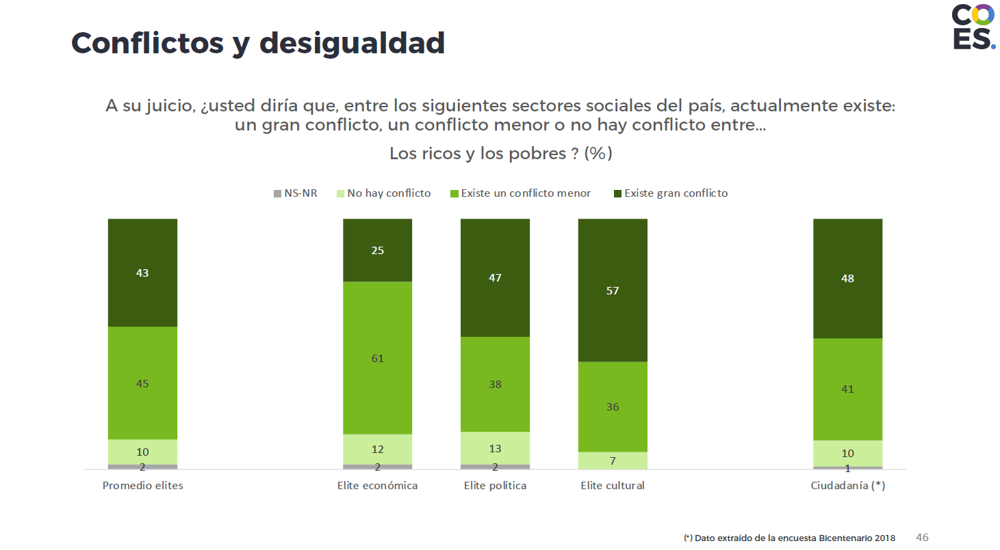
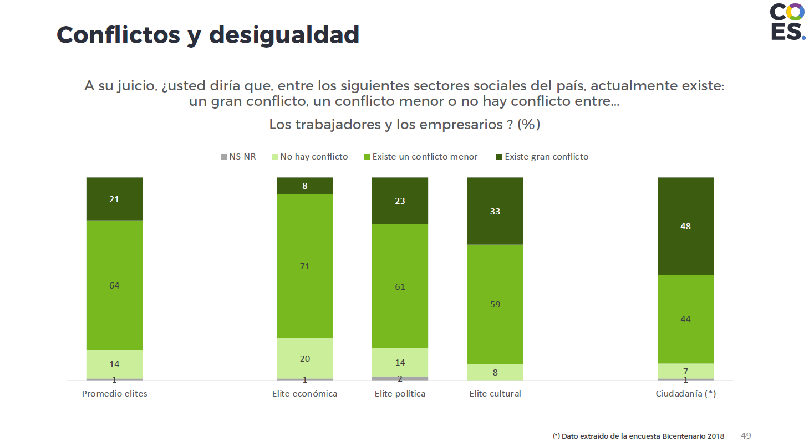
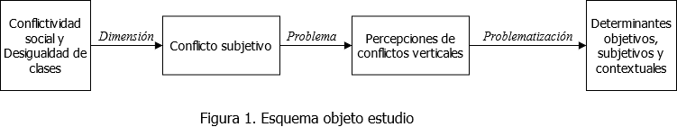
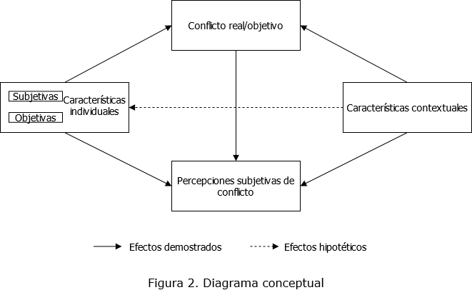

class: center, middle

```{r setup, include=FALSE,eval=TRUE}
options(htmltools.dir.version = FALSE)
```

```{r xaringan-themer, include=FALSE, warning=FALSE}
library(xaringanthemer)
style_duo(primary_color = "#1F4257", secondary_color = "#F97B64")
```
# _Coloquio de investigación en desigualdad y ciudadanía - 1er Sem 2021_
.class-info[

</br>

**Propuesta de tema para Seminario de Grado**

.light[Andreas Lafferte Tamayo<br>
.small[Facultad de Ciencias Sociales, Universidad de Chile<br>
Abril 2021]
]
]
.right.tiny[Profesor Guía: Juan Carlos Castillo</br>
]
---
class: inverse, center, middle

# Estructura de presentación

1. Tema y contexto investigativo
2. Problematización
3. Algunos antecedentes
4. Concepto principal y tipo de estudio
5. Pregunta de investigación
6. Datos, variables y método
7. Discusión
---
class: inverse, middle, center

# 1. Tema y contexto investigativo

---
# 1.1. Campo temático 

## Conflictividad social

Dentro del amplio espectro del _conflicto social_, destaca la **conflictividad social entre grupos y clases** como fenómeno histórico. Por un lado, debido al desarrollo de estas teorías junto a la estratificación y desigualdades en el capitalismo contemporáneo, y por el otro, por ser considerada la contradicción principal en la sociedad moderna (Callinicos, 2004). 

Además, la conflictividad social vincula a sus explicaciones tópicos como la desigualdad social, las condiciones económicas y la acción colectiva. Este cerco temático ha sido conceptualizado de diversas maneras, sin embargo, desde la literatura de las desigualdades y las clases sociales se releva las _dimensiones objetivas (i.e. protestas) y subjetivas (i.e. polarización de actitudes o percepciones)_ del conflicto social (Kelley & Evans, 1995). 

Esta investigación se preocupa por esta última dimesión subjetiva del conflicto, entendida como la **percepción de conflictos verticales en la sociedad**.  
---
# 1.2. Contexto disciplinar
## ¿Qué dice la literatura? 
- Esta temática cobra especial relevancia en países con altos niveles de _desigualdad económica y ciclos de protestas recurrentes_, buscando comprender qué factores inciden en la ocurrencia del conflicto o su percepción/actitud hacia el mismo (Hadler, 2017).

- Se continúa sosteniendo que el conflicto vertical ocurre por intereses contradictorios, no obstante, esto debate con las tesis del fin de las clases y de la preponderancia de sus conflictos.

- Estos conflictos se ven influenciados tanto por características individuales de sus participantes así como por las condiciones contextuales (político, económicas e ideológicas) en las que se desarrollan (Callinicos, 2004; Edlund & Lindh, 2015). 

---
# 1.2. Contexto disciplinar

## Chile en perspectiva comparada

A nivel mundial, con los movimientos sociales y de protesta en los últimos años (Occupy Wall Street, Indignados, Gilets Jaunes etc.) y el aumento progresivo de las desigualdades, se ha demostrado una mayor **percepción de conflicto** entre clases y grupos (Hadler, 2017). 

En Chile, las percepciones de conflicto social han variado en la última década, a razón de eventos políticos como por la agudización de desigualdades económicas (Olivos, Mackenna, Castillo & Bargsted, 2015; Pérez, 2020). Un estudio reciente de [COES sobre las elites chilenas](https://drive.google.com/file/d/1q0MH4aE4PwTlZcdWJV29P9Dtz4w6nTRp/view) refleja lo anterior. Además, existen índices de conflictividad social sostenida en Chile en las últimas decadas, tales como las huelgas laborales, movilizaciones estudiantiles, y previsionales (COES, 2020).

---
# 1.2. Contexto disciplinar

.center[

]

---
# 1.2. Contexto disciplinar

.center[

]
---
class: inverse, middle, center

# 2. Problematización

---
# 2.1. Problema  
</br>
A raíz de la conflictividad social en Chile y el mundo en las últimas décadas y la creciente desigualdad económica, emergen preguntas como: 

+ ¿Cómo los conflictos reales se traducen en las percepciones de los sujetos?, ¿quiénes, cuánto?
+ ¿Se reavivan los conflictos de clases?, ¿se han polarizado las actitudes?
+ ¿Qué tienen que ver factores objetivos, subjetivos y contextuales en las percepciones? 

Así, dentro de este campo identifiqué un _problema particular: el ámbito subjetivo del conflicto de clases y grupos_. En ese ámbito subjetivo existe lo que se llama polarización de actitudes, percepciones de conflicto, conciencia de clase, actitudes hacia instituciones etc. (Hertel & Schöneck, 2019; Wright, 1997). 

---
# 2.2. Problematización

Dentro de este problema (las percepciones subjetivas del conflicto social) realice una _problematización sobre sus principales determinantes a nivel objetivo/estructural, subjetivo/individual y contextual/institucional-económico_. 

+ Identificar vacíos de investigación
+ Cuestionar bases explicativas de teorías y hallazgos anteriores (contribuir a debates internos)

</br>
.center[

]

---
# 2.2. Problematización

### Vacíos 
- No aparece como una agenda de primera importancia en la investigación nacional (Olivos et al. 2015).

### Críticas y debates 
- Por un lado, se debate sobre la preponderancia de **determinantes subjetivos/individuales u objetivos/estructurales** sobre las percepciones, como la posición de clase o la desigualdad percibida (Epstein et al. 2003; Whitefield & Loveless, 2013).
- Por otro, son escasos los esfuerzos por estudiar las percepciones de conflicto desde un enfoque que rescate los **vínculos micro-macro a nivel comparado**, considerando sus estructuras institucionales (Wright, 1997).
-  No se han considerado factores económico-laborales como el grado de coordinación salarial o la tasa de desempleo (Hadler, 2003; Ringqvist, 2016). 

---
# 2.2. Problematización

.center[

]

---
# 2.3. Contribución/relevancia
## Relevancia
+ Actitudes, opiniones y valores que desarrollan los individuos respecto a una estructura social jerárquica y la posesión desigual de recursos (Whitefield & Loveless, 2013).
+ Diagnosticar diferencias de percepción estructuralmente formadas -"desconexión social"- (Lasch, 1996).

## Contribución:
+ Teórica:problematizar bases explicativas sobre las dicotomías micro/macro y objetivo/subjetivo.
+ Práctica/política:comprender quiénes, cómo y por qué perciben más o menos conflicto.
+ Metodólogica:perspectiva comparada de contextos económico-institucionales entre países.
---
class: inverse, middle, center

#  3. Algunos antecedentes

---
# 3.1. Enfoques teóricos dominantes

## Conflicto social
- Teoría del conflicto social como una relación de posiciones contradictorias sobre determinado recurso/valor identificado por las partes (Callinicos, 2004; Collins, 2009). 
- Resolución del conflicto (Zagórski, 2006).

## Desigualdad y clases 
- Importancia de la clase social en la configuración de opiniones y actitudes (Svallfors, 2006; Wright, 1997).
- La desigualdad percibida y las preferencias distributivas como mediador de la percepción de conflicto (Verwiebe & Wegener, 2000).
- Desigualdad económica real y redistribución de ingresos (Edlund & Lindh, 2015).
- Grado de concertación política, desempleo y sindicalización (Hadler, 2003; Wright, 1997).

---
# 3.2. Estudios empíricos 

## Principales hallazgos y variables
- Tienen que ser antecdentes sobre tu problematización en especifico!!

---
class: inverse, middle, center

# 4. Concepto principal y tipo de estudio

---
# 4.1. Percepciones de conflicto social

## Definición
Las percepciones son un ejercicio subjetivo de describir la realidad social **-thoughts about _what is_-** (Castillo et al. 2019). Se refiere a una estimación subjetiva de las desigualdades existentes, o bien, sobre determinados órdenes estructurales.

Por su parte, **las percepciones de conflicto social** se refiere a _cómo los sujetos captan/describen un conflicto social determinado entre dos clases o grupos verticalmente organizados_ presente en su entorno (Hadler, 2017). 

Según Hertel y Schöneck: "Los conflictos sociales percibidos (PSC) señalan el grado en que los individuos experimentan sus entornos como caracterizados por tales relaciones antagónicas" (2019, p.2 _traducción propia_). 

---
# 4.2. Tipo de estudio 
</br>
- Énfasis explicativo, relacional y comparado 
- Cuantitativo con datos secundarios 
- Análisis multinivel y series de tiempo/tendencia (primario)
- Análisis multinivel transversal (secundario)

---
class: inverse, middle, center
# 5. Pregunta de investigación

---
# 5.1. Preguntas 
## Principal
¿De qué manera determinantes económico-laborales, institucionales e individuales afectan las percepciones de conflicto social en Chile y otros países entre 1999-2019? 

## Secundarias
- ¿Existen diferencias significativas de las percepciones de conflicto según los contextos institucionales y económico-laborales de los países? 
- ¿Las características de clase de los individuos poseen un efecto distinto sobre las percepciones de conflicto según el contexto de cada país?
---
class: inverse, middle, center 
# 6. Datos, variables y método

---
# 6.1. Datos
</br>
**International Social Survey Programm (ISSP)**. Module of Social Inequality 1999/2009/2019. Se estima la publicación del modulo 2019 para el resto de los países a mediados del 2021. 

Otras fuentes:
- OCDE
- ILO STATS
- ICTWSS (Visser, 2019)
---
# 6.2. Variables

### Dependiente

Índice de Percepción de Conflicto (IPC): índice sumativo de escalas sobre percepción de distintos conflictos.

|Q. In all countries, there are differences or even conflicts between different social groups. In your opinion, in <R's country> how much conflict is there between ...?|
|-----------------------------------------------------------------------------------------------------------------------------------------|
| Q9a.Conflicts: between poor people and rich people?                                                                                     |
| Q9b.Conflicts: between the working class and the middle class?                                                                          |
| Q9c.Conflicts: between management and workers?                                                                                          |
| Q9d.Conflicts: between people at the top of society and people at the bottom?                                                           | 
                                                                                                                                          |
---
# 6.2. Variables
## Dependiente

Índice de Percepción de Conflicto (IPC): índice sumativo de escalas sobre percepción de distintos conflictos.

| Values | Categories               |
|--------|:------------------------:|
| 1      | Very strong conflicts    |
| 2      | Strong conflicts         |
| 3      | Not very strong conflicts|
| 4      | There are no conflicts   |
| 8      | Cant choose              |
| 9      | NA                       |

---
# 6.2. Variables
## Independientes

|Variable    |Descripción |Fuente       |
|------------:|-----------:|------------:|
| *Nivel 1*   |            |             |
| Posición de clase | Esquema E.G.P o E.O. Wright| ISSP |
| Clas social subjetiva | Autoposición del individuo en la sociedad | ISSP |
| Tipo de sociedad | Descripción de un diagrama social | ISSP | 
| Desigualdad percibida | Escala desigualdad de ingreso | ISSP |
| Preferencias redistributivas | Índice de preferencias rol del gobierno en ingresos | ISSP |
| Afiliación sindical | Miembro sindicato | ISSP |
| Posición política | Posicionamiento en el espectro político | ISSP | 
| Sociodemográficas | Ingreso/Nivel educación/Sexo | ISSP | 

---
# 6.2. Variables
## Independientes 
|Variable    |Descripción |Fuente       |
|------------:|-----------:|------------:|
| *Nivel 2*   |            |             |
| Desigualdad ecónomica | Índice de GINI | OCDE |
| Coordinación salarial | Esquema de coordinación salarial por país | ICTWSS |
| Desempleo | Tasa de desempleo por país | ILO |
| Densidad sindical | Tasa de sindicalización neta por país | ILO |

---
# 6.3. Método

## Modelos Multinivel 

Permiten analizar y especificar el efecto de variables contextuales sobre variables individuales (relaciones micro/macro). Es decir, plantea hipótesis sobre la relación entre las variables de contexto, en este caso  económico-laborales e institucionales, con variables individuales como el índice de percepciones de conflicto (IPC). Además, permite plantear interacción entre niveles para determinar variaciones específicas según características de los contextos (DiPrete and Forristal, 1994). 

**Por ejemplo:** 
 + Estimar el efecto de la desigualdad económica sobre las percepciones de conflicto entre países 1999-2019. 
 + Cambios en el efecto de la desigualdad perciba sobre las percepciones de conflicto según el grado de coordinación salarial entre países 1999-2019.

---
class: inverse, middle, center
# 7. Discusión

---
# 7. Discusión

## Enfoque comparado
¿Se sostiene un enfoque comparado? ¿Delimitar solo en Chile? ¿Integrar otro enfoque en Chile tal como el longitudinal (ELSOC)?

## Clase social
¿La clase como un determinante pero con un supuesto de diferencias en intereses materiales?

## Otros
¿Algún otro factor relevante a incluir/problematizar?

---
# Referencias

Callinicos, A. (2004). Making history: Agency, structure, and change in social theory (Vol. 3). Brill. 

Castillo, J. C., Torres, A., Atria, J., & Maldonado, L. (2019). Meritocracia y desigualdad económica: Percepciones, preferencias e implicancias. Revista Internacional De Sociología, 77(1), e117. https://doi.org/10.3989/ris.2019.77.1.17.114 

Castillo, Juan C., Bargsted, M., Olivos, F., & Mackenna, B. (2015). Percepción del conflicto en Chile: Un análisis desde la opinión pública, 2006-2013. En M. Castillo & C. Maldonado (Eds.), Desigualdades. Tolerancia, legitimación y conflicto en las sociedades latinoamericanas. RIL

COES (2020). Informe anual Observatorio de Conflictos 2020. https://coes.cl/wp-content/uploads/Informe-Anual-Observatorio-de-Conflictos-2020-COES.pdf 

Collins, R. (2009). Conflict sociology: A Sociological Classical Update. Paradigm Publishers.

Edlund, J., & Lindh, A. (2015). The democratic class struggle revisited: The welfare state, social cohesion and political conflict. Acta Sociologica, 58(4), 311-328.
---
# Referencias
Hadler, M. (2003). Ist der Klassenkonflikt überholt? Die Wahrnehmung von vertikalen Konflikten im internationalen Vergleich. Soziale Welt, 175-200.

Hadler, M. (2017). Social Conflict Perception Between Long-term Inequality and Short-term Turmoil: A Multilevel Analysis of Seven Countries Between 1987 and 2009. 57225, 17, 35-49.

Hertel, F. R., & Schöneck, N. M. (2019). Conflict perceptions across 27 OECD countries: The roles of socioeconomic inequality and collective stratification beliefs. Acta Sociologica, 0001699319847515.

Kelley, J., & Evans, M. D. R. (1995). Class and class conflict in six western nations. American Sociological Review, 60(2), 157-178.

Lasch, C. (1996). La rebelión de las élites y la traición a la democracia. Paidós. 

Lewin-Epstein, N., Kaplan, A., & Levanon, A. (2003). Distributive justice and attitudes toward the welfare state. Social Justice Research, 16(1), 1-27.
---
# Referencias
Pérez, P. (2020). Percepciones de conflicto y confianza en el empresariado: Chile en perspectiva comparada. Fábrica de Datos Laborales: https://fabricadedatoslaborales.cl/percepciones-conflicto-con-empresariado/ 

Ringqvist, J. (2016). Three dimensions of class conflict: A cross-country comparison of individual perceptions of class conflict and their contextual determinants.

Svallfors, S. (2006). The moral economy of class: Class and attitudes in comparative perspective. Stanford University Press.

T. A. DiPrete and J. D. Forristal. "Multilevel Models: Methods and Substance". In: Annual Review of Sociology 20.1 (ago. 1994), pp. 331-357. ISSN: 0360-0572. DOI: 10.1146/annurev.so.20.080194.001555.

Verwiebe, R., & Wegener, B. (2000). Social inequality and the perceived income justice gap. Social Justice Research, 13(2), 123-149.
---
# Referencias
Whitefield, S., & Loveless, M. (2013). Social inequality and assessments of democracy and the market: Evidence from central and eastern Europe. Europe-Asia Studies, 65(1), 26-44.

Wright, E. O. (1997). Class counts: Comparative studies in class analysis. Cambridge University Press.

Zagórski, K. (2006). The perception of social conflicts and attitudes to democracy. International Journal of sociology, 36(3), 3-34.

---
class: inverse, middle, center

# ¡Muchas Gracias!
.center[

</br>
Andreas Lafferte Tamayo<br>

.light[Facultad de Ciencias Sociales, Universidad de Chile<br>
Abril 2021]
]