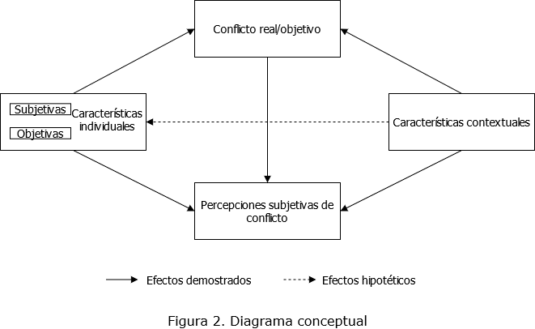

class: center, middle

```{r setup, include=FALSE,eval=TRUE}
options(htmltools.dir.version = FALSE)
```

```{r xaringan-themer, include=FALSE, warning=FALSE}
library(xaringanthemer)
style_duo(primary_color = "#1F4257", secondary_color = "#F97B64")
```
# _Coloquio de investigación en desigualdad y ciudadanía - 1er Sem 2021_
.class-info[

</br>

**Avance Seminario de Grado**

.light[Andreas Lafferte Tamayo<br>
.small[Facultad de Ciencias Sociales, Universidad de Chile<br>
Junio 2021]
]
]
.right.tiny[Profesor Guía: Juan Carlos Castillo</br>
]
---
class: inverse, center, middle

# Estructura de presentación

1. Introducción
2. Problematización
3. Algunos antecedentes
4. Pregunta y objetivos de investigación
5. Hipótesis
6. Datos, variables y método
7. Discusión
---
class: inverse, center, middle

# 1. Introducción

---
# 1.1. Campo temático 

## Conflictividad social: ¿Dónde y quiénes? 

El conflicto como una relación de oposición en los objetivos/intereses/deseos de partes interdependientes, en la que a medida que la probabilidad de consecución de los objetivos de uno crece, disminuye las de otro (Oberschall, 1978).

El conflicto social es un tipo particular de conflicto que se define por:
+ ¿Dónde? Dentro de las sociedades y/o intergrupal
+ ¿Quiénes? Grupos organizados por la estratificación -nivel de estructura-
+ ¿Cómo? Dinámicas que adquiere el conflicto -manifiestas/latentes- y su enfoque -política contenciosa, deprivación relativa, resolucionista, ruptura, entre otros- (Fink, 1968).

Desde la literatura de las desigualdades y la estratificación se relevan las _dimensiones objetivas (i.e. protestas) y subjetivas (i.e. polarización de actitudes o percepciones)_ del conflicto social (Kelley & Evans, 1995). 

---
# 1.1. Campo temático 
## Conflictividad social: ¿Cómo? 

Esta investigación se preocupa por esta última _dimesión subjetiva del conflicto_, entendida como la **percepción de conflictos verticales en la sociedad**.  

### Definición 

> _La percepción de conflicto social se refiere a cómo los sujetos captan/describen un conflicto social determinado entre dos clases o grupos verticalmente organizados (Hertel & Schöneck, 2019, p.2)_

Las PCS son situaciones de oposición psicológica, es decir, se basan en un antagonismo de intereses (Fink, 1968; Infante, 1998; Pondy, 1967)

---
# 1.2. Contexto disciplinar

## Chile en perspectiva comparada

- A nivel mundial, con los movimientos sociales y de protesta en los últimos años (Occupy Wall Street, Indignados, Gilets Jaunes etc.) y el aumento progresivo de las desigualdades, se ha demostrado una mayor **percepción de conflicto** entre clases y grupos (Hadler, 2017). 

- Chile es un país donde ha aumentado la protesta colectiva y la política contenciosa, tales como las huelgas laborales, movilizaciones estudiantiles y previsionales (COES, 2020).

- En Chile, las percepciones de conflicto social han variado en la última década, a razón de eventos políticos como por la agudización de desigualdades económicas (Olivos, Mackenna, Castillo & Bargsted, 2015; Pérez, 2020). Un estudio reciente de [COES sobre las elites chilenas](https://drive.google.com/file/d/1q0MH4aE4PwTlZcdWJV29P9Dtz4w6nTRp/view) refleja lo anterior. 

---
# 1.2. Contexto disciplinar

.center[

]

---
# 1.2. Contexto disciplinar

.center[

]
---
class: inverse, middle, center

# 2. Problematización

---
# 2.1. Problema  
</br>
A raíz de la conflictividad social en Chile y el mundo en las últimas décadas y la creciente desigualdad económica, emergen preguntas como: 

+ ¿Los conflictos reales se traducen en las percepciones de los sujetos?, ¿quiénes, por qué y cómo?
+ ¿Se reavivan los conflictos de clases?, ¿se han polarizado las actitudes?
+ ¿Qué tienen que ver factores objetivos, subjetivos y contextuales en las percepciones? 

Dentro de este campo identifiqué un _problema particular: las percepciones subjetivas del conflicto de clases y grupos_. Este se inscribe en una corriente subjetiva del estudio de las desigualdades (como la conciencia de clase, polarización de actitudes, preferencias etc.)(Hertel & Schöneck, 2019; Wright, 1997). 

---
# 2.2. Problematización

Dentro de este problema (las percepciones subjetivas del conflicto social) realicé una _problematización sobre cómo la clase social afecta las percepciones de conflicto social en Chile para luego determinar cómo esta relación cambia según los contextos económicos-laborales e institucionales_ en perspectiva comparada (45 países). 

+ Identificar vacíos de investigación -gap research-
+ Cuestionar bases explicativas de teorías y hallazgos anteriores -They Say, I Say-

</br>
.center[

]
---
# 2.2. Problematización

### Vacíos 
- No aparece como una agenda de primera importancia en la investigación nacional (Olivos et al. 2015).
- Poco se dice sobre la importancia de la clase social en el conflicto social (Pérez, 2013)

### Críticas y debates 
- Existe un consenso sobre la preponderancia de determinantes subjetivos sin estimar la posición de clase sobre las PCS (Epstein et al. 2003; Whitefield & Loveless, 2013).
- No se ha considerado cómo condiciones contextuales -político, económicas e ideológicas- producen cambios en la relación entre la clase y las PCS (Edlund & Lindh, 2015; Wright, 1997). 
-  No se han considerado factores económico-laborales como la densidad sindical o la tasa de desempleo, ni tampoco factores institucionales como el grado de coordinación salarial (Hadler, 2003; Ringqvist, 2016). 
---
# 2.2. Problematización

.center[

]

---
# 2.3. Relevancia/contribución
## Relevancia
+ Actitudes, opiniones y valores que desarrollan los individuos respecto a una estructura social jerárquica y la posesión desigual de recursos (Whitefield & Loveless, 2013).
+ Diagnosticar diferencias de percepción estructuralmente formadas -"desconexión social"- (Lasch, 1996).

## Contribución:
+ Teórica: aportar al debate del efecto de la clase sobre las PCS considerando factores contextuales. 
+ Práctica/política: comprender quiénes, cómo y por qué perciben más o menos conflicto.
+ Metodólogica: caso chileno y perspectiva comparada de contextos económico-institucionales entre países.
---
class: inverse, middle, center

#  3. Algunos antecedentes

---
# 3.1. Estudios empíricos: ¿Qué se sabe? 

## Determinantes objetivos-estructurales

- La posición de clase delimita los intereses materiales de los individuos, generando que las PCS varien según la posición de clase (Andersen & Curtis, 2015; Delhey & Keck, 2008; Edlund & Lindh, 2015; Hertel & Schöneck, 2019; Pérez, 2013). 

- El ingreso y la educación afectan las PCS (Hadler, 2003; Hertel & Schöneck, 2019)

- Ser mujer y el estar afiliado a sindicato aumenta las PCS (Hadler, 2017; Ringqvist, 2020)

---
# 3.1. Estudios empíricos: ¿Qué se sabe? 

## Determinantes subjetivos-individuales

- La desigualdad percibida -medida en las imagenes del tipo de sociedad y la desigualdad de ingresos percibida- demuestra ser el factor más explicativo de las PCS (Hadler, 2017; Hertel & Schöneck, 2019; Whitefield & Loveless, 2013). 

- La clase social subjetiva o el ESS son importantes predictores de las PCS (Hertel & Schöneck, 2019; Kelley & Evans, 1995; Olivos et al. 2015).

- Actitudes subjetivas predicen mejor otras percepciones subjetivas. No se ha explorado moderar el efecto de la desigualdad percibida con la justificación de la misma y factores económicos (Bussolo et al. 2018; Wegener & Verwiebe, 2000).  
---
# 3.1. Estudios empíricos: ¿Qué se sabe?

## Determinantes contextuales
- La desigualdad económica real y el nivel de riqueza son determinantes (Delhey & Dragolov, 2013; Edlund & Lindh, 2015; Hadler, 2017; Hertel & Schöneck, 2019). 

- La distribución de la riqueza, la tasa de desempleo y la tasa de pobreza son relevantes (Delhey & Keck, 2008; Hadler, 2017).

- Factores institucionales tales como el grado de concertación política, la densidad sindical y la cobertura de la negociación colectiva son relevantes (Delhey & Keck, 2008; Hadler, 2003; Ringqvist, 2020)

---
# 3.1. Estudios empíricos: ¿Qué se sabe? 

## Clase y determinantes contextuales

- Andersen & Curtis (2015) establecen un hallazgo de convergencia de las posiciones de clase sobre el rol del gobierno cuando la desigualdad económica es alta.

- Edlund & Lindh (2015) sostienen que las diferencias de clase sobre las PCS son menores cuando hay baja desigualdad económica y estructuras institucionales corporativas. 

---
class: inverse, middle, center

# 4. Pregunta y objetivos de investigación

---
# 4.1 Pregunta y sistema de objetivos

### Pregunta de investigación 

*¿Cómo cambia la relación entre la clase social y las percepciones de conflicto social a partir del rol del contexto económico-laboral e institucional entre 1999-2019?*

### Objetivo 

Analizar cómo cambia la relación entre la clase social y las percepciones de conflicto social de acuerdo con las variaciones contextuales de determinantes económicos-laborales e institucionales entre 1999-2019.

---
# 4.1 Pregunta y sistema de objetivos

### Objetivos específicos 

*O.E.1* – Analizar la relación entre la posición de clase y las percepciones de conflicto social entre 1999-2019.

*O.E.2* – Analizar el rol de la desigualdad económica sobre la relación entre la posición de clase y las percepciones de conflicto social entre 1999-2019.

*O.E.3* – Analizar el rol del grado de coordinación salarial sobre la relación entre la posición de clase y las percepciones de conflicto social entre 1999-2019. 

---
# 4.2 Algunas certezas

## Decisiones
- Doble objetivo: estudiar el caso chileno (1) y realizar una comparación internacional de contextos económicos e institucionales sobre las PCS (2). 
- Factor temporal como variable de control por investigaciones previas (Hadler, 2017)
- Dejar la pregunta sin "sujeto" a fin de poder abarcar ambos objetivos. 

## Tipo de estudio
- Énfasis explicativo, relacional y comparado
- Cuantitativo con datos secundarios
- Análisis multinivel y series de tiempo/tendencia entre países
- Análisis multivariado en caso chileno

---
class: inverse, middle, center

# 5. Hipótesis

---
# 5.1. Hipótesis principales

## Hipótesis en Chile

- $H_{1a}$ Individuos de clase trabajadora tenderán a percibir mayores conflictos, en cambio, individuos de clase alta tenderán a percibir menores conflictos en Chile.  

## Hipótesis comparación

- $H_{2a}$ Individuos de clase trabajadora tenderán a percibir mayor conflicto, en cambio individuos de clase alta tenderán a percibir menor conflicto.  

- $H_{2b}$ Mayores niveles de desigualdad económica aumentarán las percepciones de conflicto social 

---
# 5.1. Hipótesis principales

## Hipótesis comparación
- $H_{2c}$ Mayores niveles de desigualdad económica implicará que los individuos de clase trabajadora perciban mayores conflictos e individuos de clase alta percibirán menores conflictos. Es decir, las diferencias de clase se acrecentarán. 

- $H_{2d}$ En países con baja coordinación salarial (LME's) individuos de clase trabajadora percibirán mayor conflicto que individuos de clase alta. 

- $H_{2e}$ En países con baja coordinación salarial (LME's) y altos niveles de desigualdad económica las percepciones de conflicto social serán mayores que en países con alta coordinación salarial (CME's). 

---
class: inverse, middle, center 
# 6. Datos, variables y método

---
# 6.1. Datos
</br>
**International Social Survey Programm (ISSP)**. Module of Social Inequality 1999/2009/2019. Se estima la publicación del modulo 2019 para el resto de los países a mediados del 2021. 

Otras fuentes:
- OCDE
- ILO STATS
- ICTWSS (Visser, 2019)
---
# 6.2. Variables

### Dependiente

Índice de Percepción de Conflicto (IPC): índice sumativo de escalas sobre percepción de distintos conflictos.

|Q. In all countries, there are differences or even conflicts between different social groups. In your opinion, in <R's country> how much conflict is there between ...?|
|-----------------------------------------------------------------------------------------------------------------------------------------|
| Q9a.Conflicts: between poor people and rich people?                                                                                     |
| Q9b.Conflicts: between the working class and the middle class?                                                                          |
| Q9c.Conflicts: between management and workers?                                                                                          |
| Q9d.Conflicts: between people at the top of society and people at the bottom?                                                           | 
                                                                                                                                          |
---
# 6.2. Variables
## Dependiente

Índice de Percepción de Conflicto (IPC): índice sumativo de escalas sobre percepción de distintos conflictos.

| Values | Categories               |
|--------|:------------------------:|
| 1      | Very strong conflicts    |
| 2      | Strong conflicts         |
| 3      | Not very strong conflicts|
| 4      | There are no conflicts   |
| 8      | Cant choose              |
| 9      | NA                       |

---
# 6.2. Variables
## Independientes

|Variable    |Descripción |Fuente       |
|------------:|-----------:|------------:|
| *Nivel 1*   |            |             |
| Posición de clase | Esquema E.G.P o E.O. Wright| ISSP |
| Clase social subjetiva | Autoposición del individuo en la sociedad | ISSP |
| Tipo de sociedad | Descripción de un diagrama social | ISSP | 
| Desigualdad percibida | Escala desigualdad de ingreso | ISSP |
| Preferencias redistributivas | Índice de preferencias rol del gobierno en ingresos | ISSP |
| Afiliación sindical | Miembro sindicato | ISSP |
| Sociodemográficas | Ingreso/Nivel educación/Sexo | ISSP | 

---
# 6.2. Variables
## Independientes 
|Variable    |Descripción |Fuente       |
|------------:|-----------:|------------:|
| *Nivel 2*   |            |             |
| Desigualdad ecónomica | Índice de GINI | OCDE |
| Coordinación salarial | Esquema de coordinación salarial por país | ICTWSS |
| Desempleo | Tasa de desempleo por país | ILO |
| Densidad sindical | Tasa de sindicalización neta por país | ILO |

---
# 6.3. Método

## Regresión multivariada (OLS)

Para el caso chileno se estimarán modelos de regresión lineal para conocer la influencia de los predictores de hipotesis y control sobre el índice de percepciones de conflicto (IPC). Además, se introduce el año de aplicación de la encuesta para conocer cambios en el tiempo. 
## Modelos Multinivel 

Permiten analizar y especificar el efecto de variables contextuales sobre variables individuales (relaciones micro/macro). Es decir, plantea hipótesis sobre la relación entre las variables de contexto, en este caso  económico-laborales e institucionales, con variables individuales como el índice de percepciones de conflicto (IPC). Además, permite plantear interacción entre niveles para determinar variaciones específicas según características de los contextos (DiPrete and Forristal, 1994). 
---
class: inverse, middle, center
# 7. Discusión

---
# 7. Discusión

## Enfoque comparado
¿Observaciones sobre las decisiones metodólogicas? ¿Se plantea correctamente ambos objetivos?

## Otros
¿Algún otro factor relevante a incluir/problematizar?

---
# Referencias
Andersen, R., & Curtis, J. (2015). Social class, economic inequality, and the convergence of policy preferences: Evidence from 24 modern democracies. Canadian Review of Sociology/Revue canadienne de sociologie, 52(3), 266-288.

Bussolo, M., Ferrer-i-Carbonell, A., Giolbas, A., & Torre, I. (2018). Change of Perceptions of Inequality and Demand for Redistribution. Forthcoming Working Paper.

Castillo, Juan C., Bargsted, M., Olivos, F., & Mackenna, B. (2015). Percepción del conflicto en Chile: Un análisis desde la opinión pública, 2006-2013. En M. Castillo & C. Maldonado (Eds.), Desigualdades. Tolerancia, legitimación y conflicto en las sociedades latinoamericanas. RIL

COES (2020). Informe anual Observatorio de Conflictos 2020. https://coes.cl/wp-content/uploads/Informe-Anual-Observatorio-de-Conflictos-2020-COES.pdf 

Delhey, J., & Keck, W. (2008). The perception of group conflicts Different challenges for social cohesion in new and old member states. In Alber, J., Fahey, T., & Saraceno, C. (Eds.). (2008). Handbook of quality of life in the enlarged European Union. Routledge.
---
# Referencias

Delhey, J., & Dragolov, G. (2014). Why inequality makes Europeans less happy: The role of distrust, status anxiety, and perceived conflict. European sociological review, 30(2), 151-165.

Edlund, J., & Lindh, A. (2015). The democratic class struggle revisited: The welfare state, social cohesion and political conflict. Acta Sociologica, 58(4), 311-328.

Hadler, M. (2003). Ist der Klassenkonflikt überholt? Die Wahrnehmung von vertikalen Konflikten im internationalen Vergleich. Soziale Welt, 175-200.

Hadler, M. (2017). Social Conflict Perception Between Long-term Inequality and Short-term Turmoil: A Multilevel Analysis of Seven Countries Between 1987 and 2009. 57225, 17, 35-49.

Hertel, F. R., & Schöneck, N. M. (2019). Conflict perceptions across 27 OECD countries: The roles of socioeconomic inequality and collective stratification beliefs. Acta Sociologica, 0001699319847515.

Kelley, J., & Evans, M. D. R. (1995). Class and class conflict in six western nations. American Sociological Review, 60(2), 157-178.

---
# Referencias

Lasch, C. (1996). La rebelión de las élites y la traición a la democracia. Paidós. 

Lewin-Epstein, N., Kaplan, A., & Levanon, A. (2003). Distributive justice and attitudes toward the welfare state. Social Justice Research, 16(1), 1-27.

Pérez. P. (2013). Encontrando lo que nunca estuvo perdido. Conciencia de clase y conflicto de clases en el régimen neoliberal chileno. Revista de Sociología, (28).

Ringqvist, J. (2016). Three dimensions of class conflict: A cross-country comparison of individual perceptions of class conflict and their contextual determinants.

Ringqvist, J. (2020). How do union membership, union density and institutionalization affect perceptions of conflict between management and workers?. European Journal of Industrial Relations, 0959680120963546.

T. A. DiPrete and J. D. Forristal. "Multilevel Models: Methods and Substance". In: Annual Review of Sociology 20.1 (ago. 1994), pp. 331-357. ISSN: 0360-0572. DOI: 10.1146/annurev.so.20.080194.001555.
---
# Referencias

Verwiebe, R., & Wegener, B. (2000). Social inequality and the perceived income justice gap. Social Justice Research, 13(2), 123-149.

Whitefield, S., & Loveless, M. (2013). Social inequality and assessments of democracy and the market: Evidence from central and eastern Europe. Europe-Asia Studies, 65(1), 26-44.

Wright, E. O. (1997). Class counts: Comparative studies in class analysis. Cambridge University Press.

Zagórski, K. (2006). The perception of social conflicts and attitudes to democracy. International Journal of sociology, 36(3), 3-34.

---
class: inverse, middle, center

# ¡Muchas Gracias!
.center[

</br>
Andreas Lafferte Tamayo<br>

[Tesis abierta](https://github.com/Andreas-Lafferte/tesis)

.light[Facultad de Ciencias Sociales, Universidad de Chile<br>
Abril 2021]
]

