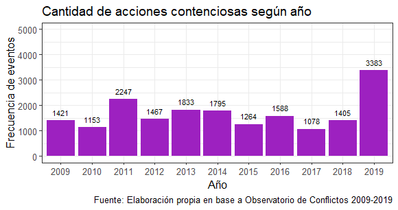

class: center, middle

```{r setup, include=FALSE,eval=TRUE}
options(htmltools.dir.version = FALSE)
```

```{r packages-data, include=FALSE}
#1. Packages
if (!require("pacman")) install.packages("pacman") 
pacman::p_load(tidyverse, sjlabelled, ggplot2, sjmisc, summarytools, sjPlot, ggthemes, 
               plotly, lubridate, RColorBrewer, htmlwidgets, kableExtra, withr,            
               haven,ggsci,
               hrbrthemes,
               gganimate, broom, plotly, magick,
               png,gifski, dygraphs, showtext) #interactive 


#2. Data
load("../input/data/swiid9_1.rda")
```

```{r xaringan-themer, include=FALSE, warning=FALSE}
library(xaringanthemer)
style_duo(primary_color = "#1F4257", secondary_color = "#F97B64")
```

```{r xaringanExtra, echo=FALSE}
xaringanExtra::use_xaringan_extra(c("tile_view", "animate_css", "share_again", "scribble"))
```

# _Coloquio de investigación en desigualdad y ciudadanía - 2do Sem 2021_
.class-info[

</br>

**Seminario de Título**

.light[Andreas Lafferte Tamayo<br>
.small[Facultad de Ciencias Sociales, Universidad de Chile<br>
Octubre 2021]
]
]
.right.tiny[Profesor Guía: Dr. Juan Carlos Castillo</br>
]

---

layout: true
class: animated, fadeIn

---

class: inverse, center, middle, slideInRight

# Estructura de presentación

1. Introducción
2. Pregunta y objetivos de investigación
3. Antecedentes e hipótesis
4. Datos, variables y métodos
5. Discusión
---
class: inverse, center, middle, slideInRight

# 1. Introducción

---
# 1.1. Contexto disciplinar

## Resurgimiento de la conflictividad social

- Creciente interés por su estudio en los últimos años debido al *regreso* de las movilizaciones sociales y la política contenciosa en varios países. Ejemplos de ello son las movilizaciones de Wall Street en Estados Unidos, los Indignados en España, los Giles Jaunes en Francia o el Estallido Social en Chile (Della Porta et al., 2017; Somma, 2020).

- Caracterizada por una fuerte y renovada crítica contra las desigualdades sociales, especialmente hacia la desigualdad económica, posterior a la crisis financiera del 2008. 

- Múltiples fuentes del conflicto social: desigualdades y exclusiones.

- Las desigualdades se han re-politizado y los clivajes verticales han vuelto a la palestra al contrastarse los altos niveles de desigualdad económica y la excesiva concentración de la riqueza en el 1% de la población (Blühdorn & Deflorian, 2021).

---
# 1.1. Contexto disciplinar

## Chile en perspectiva comparada

- Chile no es la excepción: país caracterizado por (i) una alta frecuencia de  movilizaciones sociales y acciones contenciosas, tales como huelgas, protestas estudiantiles o previsionales, en las últimas décadas; y (ii) altos niveles de desigualdad económica (COES, 2020).

.center[

]

---
# 1.1. Contexto disciplinar

## ¿Cómo se ha estudiado el conflicto social? 

.center[

]

---
# 1.2. Problema de investigación

Esta investigación se preocupa por esta última _dimesión subjetiva del conflicto_, entendida como la **percepción de conflictos verticales en la sociedad**.  

### Definición 

> _La percepción de conflicto social se refiere a cómo los sujetos captan/describen un conflicto social determinado entre dos grupos verticalmente organizados (Hertel & Schöneck, 2019, p.2)_

+ Percepciones se refieren al ejercicio subjetivo de describir lo observado (Bercovitch et al., 2018; Janmaat, 2013).
+ Las PCS son situaciones de oposición psicológica, es decir, se basan en un antagonismo de intereses (Kelley & Evans, 1995). 

---
# 1.2. Problema de investigación

## Percepciones de conflicto social

- Recientes investigaciones han demostrado que las percepciones de conflicto vertical están presentes en varios países y que sus niveles tienden a ser moderados y/o fuertes (Atria & Rovira Kaltwasser, 2021; Castillo et al., 2015; Delhey & Keck, 2008; Hadler, 2017; Hertel & Schöneck, 2019; Pérez, 2013).

- En Chile, las percepciones de conflicto social han variado en la última década, a razón de eventos políticos como por la agudización de desigualdades económicas (Castillo et al., 2015; Pérez, 2013, 2020). Un estudio reciente de [COES sobre las elites chilenas](https://drive.google.com/file/d/1q0MH4aE4PwTlZcdWJV29P9Dtz4w6nTRp/view) refleja lo anterior. 

---
# 1.3. Problematización

- Existe un consenso en que las percepciones de conflicto social serían mayormente explicadas por factores subjetivos, tales como opiniones sobre la desigualdad o preferencias políticas (Castillo et al., 2015; Hadler, 2017; Hertel & Schöneck, 2019; Zagórski, 2006). 
- Sin embargo, esto no está excento de debates.

> _Surge la pregunta: ¿en qué medida las percepciones de conflicto social son afectadas por factores socioeconómicos?_ 

Esta literatura sugiere que tanto las **desigualdades de clase, la participación en organizaciones intermedias, los niveles de desigualdad económica y los marcos institucionales** de los países son importantes condicionantes de las percepciones de conflicto (cf. Delhey & Dragolov, 2014; Edlund & Lindh, 2015; Hadler, 2017; Oddsson, 2016; Ringqvist, 2020, 2016; Wright, 1997).

---
# 1.3. Problematización

## Críticas y vacíos
- 1) La pregunta empírica por los mecanismos a través de los cuales las desigualdades de clase conducen a distintas percepciones de conflicto social ha sido relegada a un rol secundario.
</br>

- 2)  No se ha considerado cómo condiciones contextuales -institucionales y económicas- producen cambios en la relación entre la clase social y las PCS. 
</br>

- 3) No se han considerado factores institucionales como la densidad sindical o el grado de concertación política. 

---
# 1.4. Relevancia/contribución
## Relevancia
+ Actitudes, opiniones y valores que desarrollan los individuos respecto a una estructura social jerárquica y la posesión desigual de recursos.
+ Diagnosticar diferencias de percepción estructuralmente formadas.
+ Elevadas PCS pueden asociarse con actitudes negativas hacia instituciones democráticas.

## Contribución:
+ Teórica/práctica: comprender quiénes, cómo y por qué perciben más o menos conflicto.
+ Metodólogica: caso chileno y perspectiva comparada de contextos económico-institucionales entre países.

---
class: inverse, middle, center, slideInRight

# 2. Pregunta y objetivos de investigación

---
# 2.1 Pregunta y sistema de objetivos

### Pregunta de investigación 

*¿Cuál es la relación entre la clase social y las percepciones de conflicto social entre 1999-2019?*

*¿Cómo cambia la relación entre la clase social y las percepciones de conflicto social a partir del rol del contexto económico-laboral e institucional entre 1999-2019?*

### Objetivo 

- Analizar la relación entre la clase social y las percepciones de conflicto social entre 1999-2019.

- Analizar cómo cambia la relación entre la clase social y las percepciones de conflicto social de acuerdo con las variaciones contextuales de determinantes económicos-laborales e institucionales entre 1999-2019.

---
# 2.1 Pregunta y sistema de objetivos

### Objetivos específicos 

*O.E.1* – Analizar la relación entre la posición de clase y las percepciones de conflicto social entre 1999-2019.

*O.E.2* – Analizar el rol de la desigualdad económica sobre la relación entre la posición de clase y las percepciones de conflicto social entre 1999-2019.

*O.E.3* – Analizar la relacion entre el nivel de concertación política y las percepciones de conflicto social entre 1999-2019. 

---

class: inverse, middle, center, slideInRight

#  3. Antecedentes e hipótesis

---
# 3.1. ¿Qué dice la literatura? 

## Posición de clase

- La posición de clase delimita los intereses materiales de los individuos, generando que las PCS varien según la posición de clase (Andersen & Curtis, 2015; Delhey & Keck, 2008; Edlund & Lindh, 2015; Hertel & Schöneck, 2019; Pérez, 2013; Robinson & Stubager, 2017). 

- Existiría una tendencia a que las percepciones de conflicto social aumenten a medida que se desciende por la estructura de clases (cf. Delhey & Keck, 2008; Edlund & Lindh, 2015; Hadler, 2003, 2017; Kelley & Evans, 1995; Pérez, 2013). Investigaciones sobre la conciencia de clase confirman estos hallazgos (Pérez, 2014; Wright, 1997).

> $H_{1}$: Individuos de clase trabajadora y aquellos pertenecientes a las clases medias tenderán a percibir mayor conflicto social que individuos de clases capitalistas. 


---
# 3.1. ¿Qué dice la literatura? 

## Organizaciones intermedias

- La participación en organizaciones intermedias, tales como los partidos políticos o sindicatos, tiende a aumentar las percepciones de conflicto social (Hadler, 2003; Kumlin & Svallfors, 2008; Pérez, 2013; Ringqvist, 2020).
 + Individuos miembros de sindicatos son más propensos a percibir mayor conflicto social que aquellos que no lo son (Hadler, 2003; Pérez, 2013; Ringqvist, 2020). 
 + La afiliación a partidos políticos tiende a aumentar las actitudes subjetivas de carácter conflictivo (Kumlin & Svallfors, 2008; Tilly & Tarrow, 2015).
 
> $H_{2a}$: Individuos miembros de sindicatos tenderán a percibir mayor conflicto social que individuos que no lo son.

> $H_{2b}$: Individuos afiliados a partidos políticos tenderán a percibir mayor conflicto social que aquellos que no están afiliados.

---
# 3.1. ¿Qué dice la literatura? 

## Desigualdad económica

- Las **teorías del conflicto social** sostienen que altos niveles de desigualdad económica se asocian con mayor polarización social.

- Tres hallazgos principales: (i) un aumento general de las percepciones de conflicto social, (ii) variaciones contextuales entre países y (iii) variaciones dentro de los países como efecto de moderación sobre la relación entre la clase social y la percepción de conflicto (Delhey & Dragolov, 2014; Delhey & Keck, 2008; Edlund & Lindh, 2015; Hadler, 2017; Hertel & Schöneck, 2019).

> $H_{3a}$: Mayores niveles de desigualdad económica aumentarán las percepciones de conflicto social en los individuos.

---
# 3.1. ¿Qué dice la literatura? 

## Interacción 

- Las distintas categorías de clase perciben de diferente manera el conflicto social (Hadler, 2003, 2017), pero existen pocas investigaciones que hagan dialogar esta relación con la influencia del contexto.

- Estudios sobre preferencias redistributivas permiten plantear ciertos antecedentes (Andersen & Curtis, 2015; Edlund & Lindh, 2015). 

- Derivada de las teorías del conflicto social se plantea la siguiente hipótesis de interacción: 

> $H_{3b}$: A mayores niveles de desigualdad económica los individuos de clase trabajadora percibirán más conflicto social e individuos de clase capitalista percibirán menores niveles. En suma, las diferencias de clase se acrecentarán. 

---
# 3.1. ¿Qué dice la literatura? 

## Marcos institucionales

- Edlund & Lindh (2015) demuestran que a medida que el tamaño del Estado de Bienestar es más extenso (el nivel agregado del ingreso fiscal, el gasto social y la redistribución gubernamental) las percepciones de conflicto social disminuyen. 

- Contrario a los indicadores económicos de la política corporativista, otras investigaciones enfatizan que las distintas formas de participación de la sociedad civil, como la densidad sindical y el grado de concertación política, disminuyen en mayor medida las percepciones de conflicto social (Delhey & Keck, 2008; Hadler, 2003; Ringqvist, 2020).

- Derivada del marco teórico de los Power Resource Approach (PRA), se testea si: 
> $H_{4}$: Mayores niveles de concertación política disminuirán las percepciones de conflicto social en los individuos.

---
class: inverse, middle, center, slideInRight 
# 4. Datos, variables y métodos

---
# 4.1. Datos

Módulo de Desigualdad Social de la [International Social Survey Programme (ISSP)](https://www.gesis.org/en/issp/modules/issp-modules-by-topic/social-inequality) en sus tres olas que contemplan a Chile, realizadas en los años 1999, 2009 y 2019.

+ Se sustenta en la aplicación de cuestionarios en 45 países en secciones transversales de tiempo.
+ Diseño muestral complejo de tipo probabilístico, estratificado según el tamaño de los países y multietápico.
+ Unidad de análisis individuos mayores de 18 años en 45 países encuestados en diferentes olas.
+ 32.178 casos para el año 1999, 56.021 para 2009 y 25.847 para el 2019.

Otras fuentes de datos contextuales:
- [OCDE](https://data.oecd.org/economy.htm#profile-GDP%20and%20spending)   
- [SWIID](https://fsolt.org/swiid/) 
- [ICTWSS](https://www.ictwss.org/)
---
# 4.2. Variables

### Dependiente

Índice de conflictos sociales percibidos (Perceived Social Conflict Index - $PSCi$): índice sumativo de escalas sobre la percepción de distintos conflictos. 

| Indicador | Categorías de respuesta              |
|--------|:------------------------:|
| Q9a.Conflictos: ¿entre los pobres y los ricos?     | (1) Conflictos muy fuertes a (4) No existen conflictos    |
| Q9b.Conflictos: ¿entre la clase obrera y la clase media?      | (1) Conflictos muy fuertes a (4) No existen conflictos        |
| Q9c.Conflictos: ¿entre la dirección y los trabajadores?     | (1) Conflictos muy fuertes a (4) No existen conflictos|
| Q9d.Conflictos: ¿entre la gente de arriba y la gente de abajo?     | (1) Conflictos muy fuertes a (4) No existen conflictos  |

---
# 4.2. Variables
## Independientes

|Variable    |Descripción |Fuente       |
|------------:|-----------:|------------:|
| *Nivel 1*   |            |             |
| Posición de clase | Esquema E.O. Wright| ISSP |
| Afiliación sindical | Pertenencia a sindicato | ISSP |
| Afiliación partidaria | Afiliación a partido político izquierda/derecha | ISSP | 
| *Nivel 2*   |            |             |
| Desigualdad económica | Índice de Gini | SWIID |
| Concertación política | Nivel de participación en la política económica por país | ICTWSS |

---
# 4.2. Variables
## Control 

|Variable    |Descripción |Fuente       |
|------------:|-----------:|------------:|
| *Nivel 1*   |            |             |
| Sexo | Sexo encuestado | ISSP |
| Ingreso | Ingreso individual | ISSP |
| Tiempo | Año aplicación encuesta | ISSP | 
| *Nivel 2*   |            |             |
| Riqueza país | GDP bruto por país | OCDE |
| Densidad sindical | Tasa de sindicalización neta por país | ICTWSS |


---
# 4.3. Método

## Regresión Lineal (OLS)

Para el caso chileno se estiman modelos de regresión lineal con mínimos cuadrados ordinarios (OLS). Estos modelos permiten especificar la razón de cambio de la relación lineal entre variables independientes, como la posición de clase, sobre una dependiente continua, como el $PSCi$. 

## Modelos Multinivel

Para el análisis comparado se estiman modelos multinivel de tres niveles en series de tiempo o tendencia para 45 países entre 1999/2009/2019. Se anidarán en: individuos = nivel 1; año-país = nivel 2; y país = nivel 3. Estos modelos permiten plantear hipótesis sobre la relación entre las variables de contexto, en este caso económicas e institucionales, con variables individuales como el $PSCi$. Además, permite plantear moderación entre niveles para determinar variaciones específicas según características de los contextos.
---
class: inverse, middle, center, slideInRight 
# 5. Discusión

---
# 5. Discusión

## Enfoque comparado
¿Observaciones metodólogicas?

## Otros
¿Algún otro factor relevante a incluir/problematizar?

---
class: inverse, middle, center, slideInRight 

# ¡Muchas Gracias!
.center[

</br>
Andreas Lafferte Tamayo<br>

[Tesis abierta](https://github.com/Andreas-Lafferte/tesis)

.light[Facultad de Ciencias Sociales, Universidad de Chile<br>
Octubre 2021]
]

