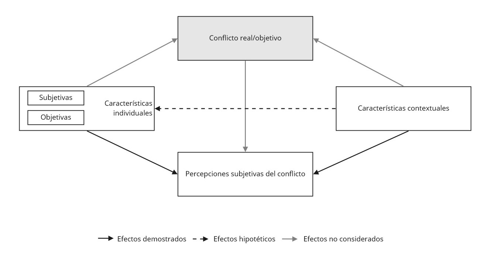

class: center, middle

```{r setup, include=FALSE,eval=TRUE}
options(htmltools.dir.version = FALSE)
```

```{r packages-data, include=FALSE}
#1. Packages
if (!require("pacman")) install.packages("pacman") 

pacman::p_load(tidyverse, ggplot2, sjmisc, summarytools, sjPlot,
               kableExtra, withr, magick, png, gifski, dygraphs, 
               showtext, htmlTable, gridExtra, gtsummary)


#2. Data
load("../output/data/db-proc.RData")

```

```{r xaringan-themer, include=FALSE, warning=FALSE}
library(xaringanthemer)
style_duo(primary_color = "#1F4257", secondary_color = "#F97B64")
```

```{r xaringanExtra, echo=FALSE}
xaringanExtra::use_xaringan_extra(c("tile_view", "animate_css", "share_again", "scribble"))
```

# _Coloquio de investigación en desigualdad y ciudadanía - 1er Sem 2022_
.class-info[

</br>

**Seminario de Título**

.light[Andreas Lafferte Tamayo<br>
.small[Facultad de Ciencias Sociales, Universidad de Chile<br>
Abril 2022]
]
]
.right.tiny[Profesor Guía: Dr. Juan Carlos Castillo</br>
]

---

layout: true
class: animated, fadeIn

---

class: inverse, center, middle, slideInRight

# Estructura de presentación

1. Introducción
2. Pregunta y objetivos de investigación
3. Antecedentes e hipótesis
4. Método
5. Resultados descriptivos
6. Discusión
---
class: inverse, center, middle, slideInRight

# 1. Introducción

---
# 1.1. Contexto y motivación

### Resurgimiento de la conflictividad social

.pull-left[

]


.pull-right[
.large[
- Tiempos contenciosos (Della Porta et al., 2017; Somma, 2020)

- Múltiples fuentes del conflicto social: desigualdades y exclusiones (Della Porta & Diani, 2006)

- Re-politización de las desigualdades y revitalización de los clivajes verticales (Blühdorn & Deflorian, 2021; Bernburg, 2016; Evans & Tilley, 2017; Hertel & Schöneck, 2019)
]
]


---
# 1.1. Contexto y motivación

### ¿Cómo se ha estudiado el conflicto social? 

.center[

]

---

# 1.2. Problema de investigación

Esta investigación se preocupa por las **percepciones subjetivas de los conflictos verticales en la sociedad**, entendidas como el nivel de tensión social entre distintos grupos reportado por los individuos (Delhey & Keck, 2008; Hertel & Schöneck, 2019)

- Estudios recientes han mostrado una percepción entre moderada y fuerte del conflicto social en diferentes sociedades, además de una asociación positiva con la desigualdad económica (Hadler, 2003; Delhey & Keck, 2008; Hadler, 2017; Hertel & Shöneck, 2019)
     
.small[

### Relevancia

- Conocer las actitudes, valores y opiniones que desarrollan los individuos respecto a una estructura social jerárquica y los grupos que la componen
- Elevadas PCS pueden asociarse con actitudes negativas hacia instituciones democráticas
- Diagnosticar diferencias de percepción estructuralmente formadas
]
---

# 1.3. Problematización

Existe un relativo consenso en que las percepciones de conflicto social serían mayormente explicadas por factores subjetivos, como las opiniones sobre la desigualdad o las preferencias políticas (Castillo et al., 2015; Hadler, 2017; Zagórski, 2006).

.content-box-purple[
Sin embargo: 
- Desestimado la pregunta empírica por cómo **las desigualdades de clase** conducen a diferentes percepciones de conflicto social

- No se ha considerado cómo el **rol del contexto** -institucionales y económicas- producen cambios en la relación entre la clase social y las PCS

- No se han considerado otros factores contextuales que puedan dar cuenta del grado de **polarización social y del nivel de institucionalización del conflicto** social en los países
]

---
# 1.3. Problematización

### Contribución

- **Revitalizar** importancia desigualdades de clase


- Aportar a un **vacío en la investigación comparada**


- **Innovar** en la influencia de factores contextuales


---
class: inverse, middle, center, slideInRight

# 2. Pregunta y objetivos de investigación

---
# 2.1 Pregunta y sistema de objetivos

### Pregunta de investigación 

*¿En qué medida la clase social afecta a las percepciones de conflicto social y cómo esta relación cambia a partir del rol del contexto económico e institucional entre 1999-2019?*

### Objetivo 

- Analizar la influencia de la clase social sobre las percepciones de conflicto social y determinar cómo esta relación cambia a partir de las variaciones contextuales de determinantes económicos e institucionales entre 1999-2019.

---

class: inverse, middle, center, slideInRight

#  3. Antecedentes e hipótesis

---
# 3.1. ¿Qué dice la literatura? 

### Diagrama conceptual

```{r echo=FALSE}
knitr::opts_chunk$set(out.width="70%", fig.pos = "!ht", out.extra = "")
```

```{r fig1, results='asis', out.width = '70%', echo = FALSE, fig.align = 'center'}

```

---
# 3.1. ¿Qué dice la literatura? 

### Factores individuales

.small[
- **Posición de clase**: delimita un conjunto de intereses materiales, valores y preferencias disimiles entre los individuos según su ubicación subordinada/privilegiada (Andersen & Curtis, 2015; Dodson, 2017; Kelley & Evans, 1995; Pérez, 2013; Svallfors, 2006; Wright, 1997).

> $H_{1}$: Individuos de clase trabajadora y aquellos pertenecientes a las clases medias  tenderán a percibir mayor conflicto social que individuos de clases capitalistas/propietarias.

- **Afiliación sindical**: socialización de valores e identidades políticas además de brindar la oportunidad estructural de acciones políticas no convencionales (Hadler, 2003; Jo & Choi, 2019; Kerrissey & Schofer, 2018; Ringqvist, 2020).

> $H_{2}$: Individuos miembros de sindicatos tenderán a percibir mayor conflicto social que individuos que no lo son.

]

---
# 3.1. ¿Qué dice la literatura? 

### Factores contextuales

.small[
- **Desigualdad económica**: en la medida que existan altas diferencias de ingresos y concentración de la riqueza, los individuos tenderían a percibir a distintos grupos jerárquicos de forma conflictiva (Delhey & Keck, 2008; Hadler, 2017; Hertel & Schöneck, 2019).

> $H_{3a}$: Mayores niveles de desigualdad económica aumentarán las percepciones de conflicto social en los individuos.

- **Marcos institucionales**: la existencia de distintas estructuras institucionales que procesan la conflictividad social, como un mayor nivel de organización sindical o mayor codeterminación tripartita de la política económica en un país, disminuyen las percepciones de conflicto (Christiansen et al., 2020; Delhey & Keck, 2008; Hadler, 2003; Ringqvist, 2020).

> $H_{4}$: Mayores niveles de coporativismo disminuirán las percepciones de conflicto social en los individuos.

]
---
# 3.1. ¿Qué dice la literatura? 

### Interacción
.small[
**Clase social y desigualdad económica**:

- Las distintas categorías de clase perciben de diferente manera el conflicto social (Hadler, 2003, 2017).

- Estudios sobre preferencias redistributivas permiten plantear ciertos antecedentes (Andersen & Curtis, 2015; Edlund & Lindh, 2015).

- Derivada de las teorías del conflicto social se plantea la siguiente hipótesis de interacción:

> $H_{3b}$: A mayores niveles de desigualdad económica, los individuos de clase trabajadora aumentarán su percepción de conflicto social, mientras que individuos de clase capitalista mantendrán o disminuirán su percepción de conflicto social. En suma, las diferencias de clase se acrecentarán. 

]
---
# 3.1. ¿Qué dice la literatura? 

### Cambio en el tiempo 

.small[
- **Desigualdad económica**: es esperable que el aumento de la concentración de la riqueza en las últimas décadas se asocie con aumentos en el conflicto percibido (Hadler, 2017; Edlund & Lindh, 2015; Keleey, 2015).

> $H_{5a}$: El aumento de la desigualdad económica a través del tiempo incrementará las percepciones de conflicto social en los individuos durante los años

- **Corporativismo**: debido a que estas estructuras tienden a ser más estables durante el tiempo, podría presumirse que elevados niveles de corporativismo impliquen una reducción sistemática del conflicto percibido al largo plazo (Edlund & Lindh, 2015; Korpi, 2006).

> $H_{5b}$: Un nivel de elevado corporativismo disminuirá las percepciones de conflicto social en los individuos a través del tiempo. 

]
---

class: inverse, middle, center, slideInRight 
# 4. Método

---
# 4.1. Datos y método

- **Datos**: Módulo de Desigualdad Social de la [International Social Survey Programme (ISSP)](https://www.gesis.org/en/issp/modules/issp-modules-by-topic/social-inequality) en sus olas de 1999 (*N* = 12.821), 2009 (*N* = 42.616) y 2019 (*N* = 26.051) para 45 países, además de otras fuentes de datos como [OCDE](https://data.oecd.org/economy.htm#profile-GDP%20and%20spending), [WIID](https://www.wider.unu.edu/database/world-income-inequality-database-wiid#WIIDcomp) e [ICTWSS](https://www.ictwss.org/). Muestra final estratificada 81.488 individuos, anidados en 81 unidades de país por año, anidadas en 45 países.

- **Método**: Modelos multinivel de tres niveles en series de tiempo o tendencia para 45 países entre 1999/2009/2019. Diseño multinivel: *individuos* = nivel 1; *año-país* = nivel 2; y *país* = nivel 3. 
     
     + Aplicación de dos técnicas propuestas por Fairbrother (2013): centrado al promedio del grupo/país y curvas de crecimiento (*growth curves*)

Modelo:

.small[ 
$PSCi_{ijk} = \beta_{0} + \beta_{1}X_{ijk} + \beta_{2}\overline{Z}_{k} + \beta_{3}Z_{jkM} + \beta_{4}time_{jk} + \beta_{5}X_{ijk}\overline{Z}_{k} + \beta_{6}Z_{k}time_{jk} +$
$v_{0k} + u_{0jk} + e_{ijk}$


]

---
# 4.2. Variables

### Dependiente

Índice de conflictos sociales percibidos (Perceived Social Conflict Index - $PSCi$): índice sumativo de tres indicadores sobre la percepción de distintos conflictos. Sus valores oscilan entre 0 a 9. Índice internamente consistente Alpha ordinal $\alpha$ = 0.83

```{r include=FALSE}
pacman::p_load(tidyverse, kableExtra, knitr)

table_format = if(is_html_output()) {
  "html"
} else if(is_latex_output()) {
  "latex"
}
table_format2 = if(is_html_output()) {
  T
} else if(is_latex_output()) {
  F
}
```

```{r include=FALSE}
cap1 <- "Indicadores variable dependiente"
```

```{r tab-dep, echo=FALSE}
tab <- read.csv(file = "../input/tables/Tablas1.csv", header = 1, sep = ";", encoding = "UTF-8")
colnames <- c("Indicador", "Categorías de respuesta") 

kable(tab,table_format,booktabs = T, linesep = "",col.names = colnames, caption = cap1) %>%
  kable_styling(
    full_width = T,
    latex_options = c("hold_position"),
    position = "center",
    font_size = 18,
    bootstrap_options=c("striped", "bordered")) %>%
  column_spec(column = 1, width = "2 cm", ) %>%
  column_spec(column = 2,width = "7 cm") %>%
  collapse_rows(columns = 1:2,valign = "middle")

```

---
# 4.2. Variables
### Independientes

```{r include=FALSE}
cap2 <- "Variables independientes"
```

```{r tab-indep, echo=FALSE}
tab2 <- read.csv(file = "../input/tables/tabla2.csv", header = 1, sep = ";", encoding = "UTF-8")
colnames2 <- c("Variable", "Descripción", "Fuente") 

kable(tab2,table_format,booktabs = T, linesep = "",col.names = colnames2, caption = cap2) %>%
  kable_styling(
    full_width = T,
    latex_options = c("hold_position"),
    position = "center",
    font_size = 18,
    bootstrap_options=c("striped", "bordered")) %>%
  column_spec(column = 1, width = "4 cm", ) %>%
  column_spec(column = 2,width = "6 cm") %>%
  column_spec(column = 3,width = "2 cm") %>%
  collapse_rows(columns = 1:2,valign = "middle")

```


---
# 4.2. Variables
### Control 

```{r include=FALSE}
cap3 <- "Variables de control"
```

```{r tab-control, echo=FALSE}
tab3 <- read.csv(file = "../input/tables/tabla3.csv", header = 1, sep = ";", encoding = "UTF-8")

kable(tab3,table_format,booktabs = T, linesep = "",col.names = colnames2, caption = cap3) %>%
  kable_styling(
    full_width = T,
    latex_options = c("hold_position"),
    position = "center",
    font_size = 18,
    bootstrap_options=c("striped", "bordered")) %>%
  column_spec(column = 1, width = "4 cm", ) %>%
  column_spec(column = 2,width = "6 cm") %>%
  column_spec(column = 3,width = "2 cm") %>%
  collapse_rows(columns = 1:2,valign = "middle")

```


---

class: inverse, middle, center, slideInRight 
# 5. Resultados descriptivos

---
# 5. Resultados descriptivos

.center[

]

---
# 5. Resultados descriptivos

```{r include=FALSE}
reset_gtsummary_theme()
theme_gtsummary_compact(set_theme = T)
theme_gtsummary_language(language = "es", decimal.mark = ".", big.mark = ",", set_theme = T)
                          
```


``` {r echo=FALSE,  results='asis', echo=FALSE, message=FALSE, warning = FALSE}

options(kableExtra.html.bsTable = T)
options(knitr.kable.NA = '')

db %>% select(YEAR, PSCi, CLASS, UNION, SEX, DEGREE, AGE, 
              RATIO_IC, CorpAll, GDP, SOC_EXPEND, 
              UD) %>% 
  gtsummary::tbl_summary(by = YEAR,
                         missing = "no",
                         type = list(all_continuous()~ 'continuous2'),
                         statistic = all_continuous() ~ c("{mean} ({sd})", 
                                                          "{min}, {max}")) %>% 
  bold_labels() %>% 
  modify_spanning_header(c("stat_1", "stat_2", "stat_3") ~ "**Valores**") %>%
  modify_footnote(update = all_stat_cols() ~ "Media (DE); Rango (Min, Max); Frecuencia (%)") %>% 
  modify_header(update = list(
    label ~ "**Variable**")) %>% 
  add_n() %>% 
  modify_caption("Tabla 1. Estadisticos descriptivos") %>% 
  as_kable_extra(strip_md_bold = T) %>%
    kableExtra::kable_styling(latex_options = "hold_position", font_size = 18, position = "center")%>%
  kableExtra::kable_styling(bootstrap_options = c("striped", "hover", "condensed", "responsive"), full_width = F) %>% 
  kableExtra::row_spec(row = c(1,4,14,17,20,27,30,33,36,39,42),bold = T) %>% 
  kableExtra::add_footnote(label = "Fuente: Elaboracion propia en base a ISSP 1999-2019") %>% 
  pack_rows("Independiente", 1, 1) %>% 
  pack_rows("Nivel individual", 4, 29) %>%
  pack_rows("Nivel contextual", 30, 42) %>% 
  kableExtra::scroll_box(width = "800px", height = "500px")

```


---
class: inverse, middle, center, slideInRight 
# 6. Discusión

---
# 6. Discusión

### Parsimonia

- Bajo concepto de parsimonia: ¿incluir otros factores individuales-subjetivos como el sentido de (in)justicia en la distribución del ingreso o la identidad de clase?

### Otros

- ¿Gráficos/tablas que no pueden faltar en análisis multinivel?

---
class: inverse, middle, center, slideInRight 

# ¡Muchas Gracias!
.center[

</br>
Andreas Lafferte Tamayo<br>

[Tesis abierta](https://github.com/Andreas-Lafferte/tesis)

.light[Facultad de Ciencias Sociales, Universidad de Chile<br>
Abril 2022]
]

