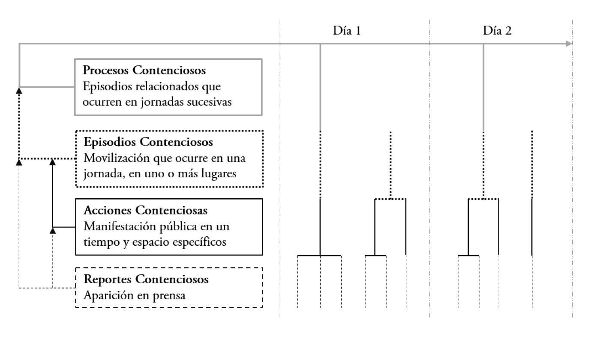
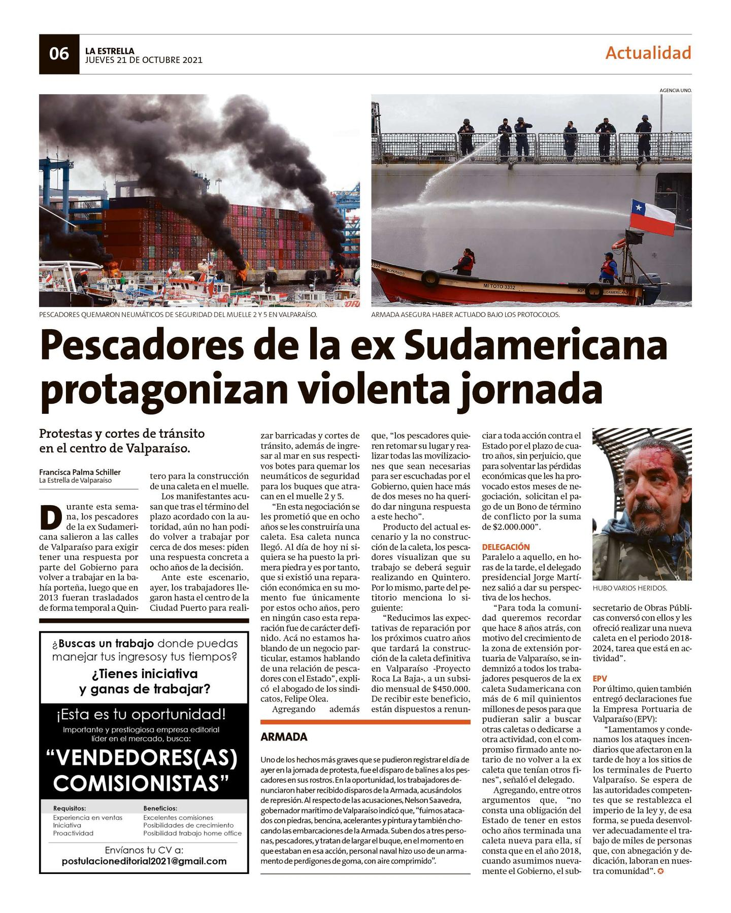
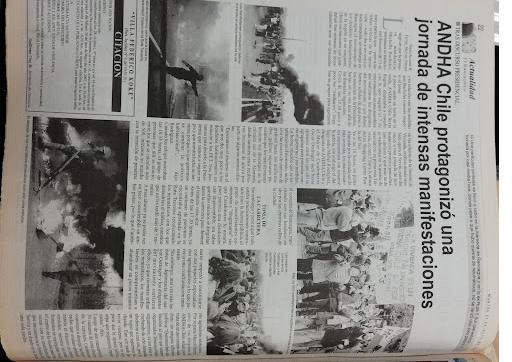
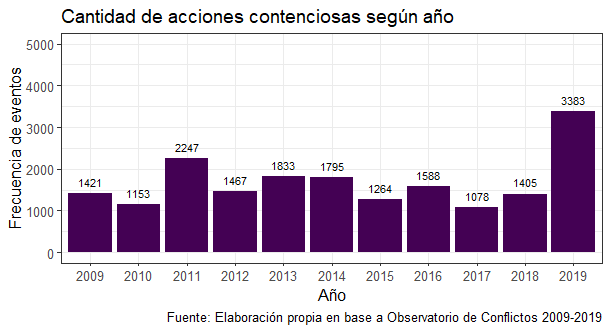
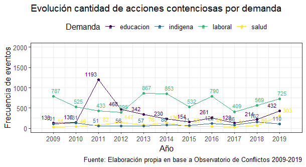

```{r setup, include=FALSE}
knitr::opts_chunk$set(echo = TRUE)
```

```{r echo=FALSE}
knitr::opts_chunk$set(out.width="80%", fig.pos = "!ht", out.extra = "")
```

## Presentación 
\doublespacing

Este informe tiene por objetivo describir y detallar el proceso de práctica profesional realizado hasta la fecha del 31 de diciembre del 2021 en el Observatorio de Conflictos del Centro de Estudios de Conflicto y Cohesión Social (COES) CONICYT/FONDAP/N° 15130009. El encargado de la institución es Felipe Olivares Rebolledo, quien es historiador y MSc. en sociología de profesión y coordinador general del Observatorio. En esta institución me he desempeñado como asistente de investigación, cumpliendo con un horario de trabajo de tres cuartos de jornada en modalidad mixta (presencial y telemática). A continuación, se describen brevemente los objetivos y lineamientos del proyecto del Observatorio de Conflictos. Luego, se consignan las actividades desarrolladas durante la práctica profesional, la forma en que se realizaron y las principales dificultades identificadas en el transcurso. Por último, se cierra con una evaluación de la formación entregada por la carrera de Sociología para el desempeño profesional junto a una evaluación de los aprendizajes adquiridos en el desarrollo de la práctica. 

## 1. Descripción de la institución y el proyecto
\doublespacing

El Observatorio de Conflictos es una iniciativa de COES nacida el año 2015, cuyo objetivo es identificar y analizar los conflictos sociales en Chile mediante el análisis de prensa. Bajo el contexto del incremento en la percepción ciudadana de que las manifestaciones públicas se multiplicaban y que los movimientos sociales se masificaron [@donosoSocialMovementsChile2017a; @sommaSocialMovementsLatin2020], se vio la necesidad de crear un proyecto que pudiera dar cuenta de la compleja dinámica de los eventos de protesta en Chile. En consecuencia, el Observatorio de Conflictos es un esfuerzo por levantar información sistemática sobre distintas características pertinentes al análisis de los eventos de protesta [@joignantInformeAnualObservatorio2020]. Entre estas características se incluyen, por ejemplo, la identificación del lugar del episodio de protesta, los participantes, los niveles de violencia involucrados y sus consecuencias, los repertorios de acción colectiva que son empleados, la presencia policial, así como datos sobre las causas de la protesta y los destinatarios de la misma. 


El trabajo del Observatorio de Conflictos se inspira en la investigación “La Protesta Social en América Latina” de la Dirección Regional del PNUD que describe la realidad de la protesta social en la región mediante el análisis de prensa, sirviendo como marco teórico para la comprensión del conflicto social y la generación de datos empíricos. Además de lo realizado por el PNUD, se utilizan dos experiencias investigativas para la medición y operacionalización de la protesta. La primera es el proyecto “Dynamics of Collective Action” de la Stanford University que aporta un instrumento de codificación útil para los objetivos del Observatorio. La segunda corresponde al Proyecto Fondecyt de Iniciación N° 11121147 “La difusión de la protesta colectiva en Chile (2000-2012)” a cargo del investigador Nicolás Somma -quien además es parte del Observatorio de Conflictos-, aportando con la inclusión de nuevas dimensiones para el análisis de los eventos de protesta en Chile.  

Los objetivos y ejes de análisis del Observatorio de Conflictos se traducen en la construcción de una base de datos propia donde se registran diversas acciones de protesta durante los años 2009 a 2021 en Chile. En términos metodológicos, esta base de datos se sustenta en el análisis de eventos de protesta (AEP), cuya estrategia consiste en codificar eventos de conflicto colectivo, en este caso definidos como ‘acciones contenciosas’, en un espacio y periodo de interés determinado mediante la revisión de 18 fuentes de prensa de circulación nacional y regional que sean representativas en su alcance y lineamientos editoriales. La unidad de análisis de la base de datos son las acciones contenciosas, las cuales se definen como: “la forma en la que un actor, grupo o movimiento social expresa un malestar colectivo, pacífica u hostilmente, frente a otro actor, grupo, movimiento, o instancia pública o privada, a través del despliegue de ciertas tácticas en el espacio público” [@coesManualMetodologicoObservatorio2018, p. 3]. Además de la cuantificación de las características propias de cada evento de protesta, el Observatorio analiza estos eventos de conflicto bajo el concepto de la “escalada del conflicto”, entendido como los niveles de alcance y duración en los que las acciones contenciosas se manifiestan  [@coesManualMetodologicoObservatorio2018; @kriesbergConstructiveConflictsEscalation2012]. Con ello, no solo se busca una descripción de las cualidades de un evento de protesta en particular, sino que también se pretende caracterizar a los ciclos de protesta en Chile desde una perspectiva procesual más amplia y completa (ver Figura 1 para detalles metodológicos). 

```{r fig1, results='asis', out.width = '80%', echo = FALSE, fig.align = 'center', fig.cap="Niveles de observación del conflicto social"}
 
```
 
Las principales actividades del Observatorio de Conflictos se centran en la mantención, mejora y ampliación de esta base de datos, así como también en la generación de análisis a partir de la misma. Por tanto, el desarrollo de la práctica profesional se enfocó en tales objetivos, desempeñando tareas de recolección de información, codificación de información, manipulación y análisis de datos, y elaboración de documentos de trabajo para el Observatorio que se detallan en la siguiente sección. 

## 2. Actividades Observatorio de Conflictos

### a) Recolección y sistematización de información
\doublespacing

Una de las principales actividades del Observatorio de Conflictos corresponde a la recolección y sistematización de información mediante la revisión de prensa. Esta es una tarea diaria que se rige bajo un plan metodológico riguroso (AEP) para identificar eventos contenciosos que luego son ordenados y posteriormente codificados. Estos lineamientos se basan en tres criterios análiticos consecutivos: i) identificar una noticia en un medio de prensa online o escrito a partir de la definición de acción contenciosa establecida por el Observatorio, ii) definir que la noticia contenga la información mínima para ser recolectada, esto es, la descripción de un evento de protesta que implique un conflicto -una relación de oposición entre al menos dos partes-, un lugar y una fecha, y iii) determinar el nivel de observación del conflicto a partir de la Figura 1. Si la noticia reúne las condiciones descritas pasa a ser recolectada y sistematizada en orden cronológico en documentos compartidos por los miembros del Observatorio. Además, cada evento que es recolectado es también fotografiado y guardado en el registro del Observatorio, siendo utilizado posteriormente para la consolidación de la base de datos mediante la revisión cruzada entre codificadores sobre un remuestreo del 10% de los casos totales de la base.

```{r fig2, results='asis', out.width = '60%', echo = FALSE, fig.align = 'center', fig.cap="Ejemplo recolección online medio La Estrella de Valparaíso"}
 
```

La recolección de información se realiza de dos maneras. Por un lado, se revisan los medios de prensa seleccionados en formato online para el año 2021. Como practicante, me correspondió revisar un total de 5 medios de prensa online: La Estrella de Arica, La Estrella de Valparaíso, Cooperativa, El Divisadero y El Rancagüino. Esta revisión se realiza mediante una búsqueda web de los respectivos medios abarcando rangos de información mensual. En el caso de los dos primeros diarios, la revisión documental es manual debido a la disponibilidad virtual del diario (ver Figura 2 de ejemplo). Mientras que para los demás diarios, se utilizan las herramientas de Google Site para la revisión. Además de la revisión de medios para el 2021 y gracias a un convenio establecido entre el Diario Cooperativa y el Observatorio de Conflictos, se facilitó el portal web de este medio de prensa para recolectar noticias de eventos contenciosos entre los años 2010 y 2009. Esto se debe a que actualmente la base de datos del Observatorio no contiene información de acciones contenciosas para dichos años en tal medio, siendo uno de los inconvenientes de la base de datos a la hora de realizar análisis comparables con la serie completa. Así, con el objetivo de ampliar la base de datos, se recolectan noticias de eventos de protesta en el portal web del diario Cooperativa entre el 2010 y 2009, pasando por el mismo proceso metodológico descrito anteriormente.  

Por otro lado, se revisan los medios de prensa seleccionados en formato impreso para el año 2007 en la Biblioteca Nacional de Chile. Como practicante, me correspondió revisar un total de 7 medios de prensa impresos: La Estrella de Arica, La Estrella de Antofagasta, La Región de Coquimbo, El Rancagüino, Austral de Temuco, Austral de Valdivia y Diario Financiero. Todos estos diarios son revisados manualmente en la Biblioteca Nacional. Para algunos casos solo fue necesario hacer el registro (fotografiar), mientras que para la mayoría de los diarios se realiza tanto la recopilación como el registro de acuerdo a las instrucciones metodológicas del Observatorio (ver Figura 3 de ejemplo). Nuevamente, con el propósito de expandir la base de datos en términos temporales, se recopila información de acciones contenciosas para los años 2007 y 2006. Además, el objetivo a largo plazo de esta actividad es que, una vez finalizada, se puedan realizar análisis que contrasten la dinámica de las acciones contenciosas en Chile antes y después del “resurgimiento” de la política contenciosa y los ciclos de protestas que datan desde el 2008 hacia adelante [@sommaSocialMovementsLatin2020].

```{r fig3, results='asis', out.width = '80%', echo = FALSE, fig.align = 'center', fig.cap="Ejemplo recolección impresa medio El Rancagüino"}
 
```

### b) Codificación de información
\doublespacing

La segunda de las actividades principales del Observatorio corresponde a la codificación de la información recolectada mediante el análisis de prensa. Esta es una actividad diaria que se realiza en paralelo a la recolección de noticias, logrando un ritmo de trabajo en donde se recolecta y codifica en una misma oportunidad. Metodológicamente, la codificación se rige bajo un Code Sheet que contiene un conjunto de indicaciones necesarias para codificar los datos que se requieren. A esto se le suma la realización de una capacitación a los practicantes sobre el proceso de codificación por parte de los miembros del Observatorio. Como practicante, me correspondió codificar únicamente la información recolectada de los medios online nombrados anteriormente. Las dimensiones de análisis que son codificadas se alinean con los objetivos propuestos por el Observatorio, abarcando elementos como: la cantidad de acciones contenciosas, el lugar y momento en el que ocurrieron, la cantidad de participantes, los actores involucrados entendidos como demandantes y demandados, la(s) institución(es) o entidad(es) a las que se dirige la protesta, los actores sociales presentes (trabajadores, estudiantes, pueblos indígenas entre otros), las organizaciones convocantes que son nombradas, las demandas presentes en la protesta (laborales, estudiantiles, ambientalistas entre otras), los campos de conflictividad a los que corresponden los eventos, las tácticas de protesta empleadas (pacíficas, disruptivas o violentas), la presencia policial y la existencia de enfrentamientos, arrestos, heridos y muertos. Esta codificación se elabora en un archivo Excel compartido entre los miembros del Observatorio. Cada medio tiene su respectiva codificación, y una vez terminados se realizan revisiones cruzadas entre los codificadores de un remuestreo del 10% de los casos totales con el fin de verificar que los criterios utilizados en la codificación sean los mismos y así consolidar la base de datos.

### c) Manipulación y análisis de datos
\doublespacing

Una tercera actividad desarrollada en el Observatorio de Conflictos es la manipulación y análisis de los datos contenidos en la base. Esto, con el objetivo de ser utilizados en los informes anuales del Observatorio y puesta en formato público para el libre acceso. Concretamente, como practicante tuve que realizar tareas de recodificación de datos, creación de variables de texto, etiquetado de variables y valores además de revisar y comparar la distribución univariada y bivariada de los datos para la serie 2009-2020. Lo anterior fue realizado mediante el software R, siendo uno de los requerimientos de la institución puesto que, hasta el momento, solo se utilizaba el software SPSS, quedando así como un primer insumo reproducible para la futura ampliación de la base de datos. El producto de esta actividad es la primera base de datos del Observatorio de Conflictos procesada y etiquetada en formato RData., la cual posteriormente formará parte del Dataverse de COES en la web de la Harvard University. 

### d) Elaboración de documentos reproducibles y abiertos
\doublespacing

Por último, y con el propósito de fomentar la política de apertura de datos e investigación propuesta por COES como por el propio Observatorio, se elaboraron dos documentos de manipulación y uso de la base de datos en formato público y reproducible. Para generar ambos documentos se utilizó la plataforma Github para trabajo colaborativo y abierto, creando un usuario del Observatorio que almacena los repositorios en donde se alojan estos documentos hechos en software R. El primer documento corresponde a un manual que enseña cómo manipular y visualizar los datos del Observatorio en Rstudio (ver Figuras 4 y 5 de ejemplos). Si bien este manual tiene por primer objetivo el ilustrar al público general sobre cómo usar y graficar variables de la base de datos del Observatorio, también pretende ser un primer insumo que familiarice a los mismos integrantes del Observatorio sobre la manipulación de datos en R. Así también, un segundo objetivo de este documento es que sirva como base para que el Observatorio pueda crear sitios web con aplicaciones interactivas (Shiny Apps) que permitan manipular y exportar datos de manera sencilla y pública. Este manual se encuentra finalizado y publicado en la plataforma RPubs para su acceso[^1].

```{r fig4, results='asis', out.width = '90%', echo = FALSE, fig.align = 'center', fig.cap="Ejemplo de gráfico evolución cantidad de acciones contenciosas 2009-2019"}
 
```

El segundo documento corresponde a un libro de códigos de la base de datos del Observatorio de Conflictos. Apuntando a la masificación del uso de los datos del Observatorio, se me encomienda la tarea de generar un libro de códigos de la base de datos mediante el software R y el paquete ‘codebook’. Este libro de códigos busca suplir la ausencia de un documento metodológico que describa las variables contenidas en la base de datos del Observatorio, además de ser un documento público, interactivo y de fácil manejo para investigadores e investigadoras. Este libro de códigos se encuentra finalizado y publicado en la plataforma RPubs para su libre acceso[^2], y posteriormente será enlazado al Dataverse de COES en la web de la Harvard University. 

```{r fig5, results='asis', out.width = '90%', echo = FALSE, fig.align = 'center', fig.cap="Ejemplo de gráfico evolución cantidad de acciones contenciosas según demanda 2009-2019"}
 
```

## 3. Principales problemas identificados
\doublespacing

Los principales obstáculos encontrados en la institución para desarrollar las actividades anteriormente descritas son mínimos, aunque pueden destacarse particularmente dos. En primer lugar, y si bien no es algo que dependa de la institución, la tarea de recolección de noticias impresas en la Biblioteca Nacional se ha visto truncada por la situación sociosanitaria del país. Esto ha implicado que dicha tarea de recolección se haya retrasado gran parte de este semestre, logrando comenzar a realizarce recien a fines del mes de octubre. Además, debido a las propias lógicas de funcionamiento y cuidado de la Biblioteca Nacional, tanto la asistencia a la Biblioteca como la solicitud del material de prensa es restringido, implicando que esta labor no se desarrolle regularmente. En segundo lugar, se encontraron algunas dificultades relacionadas con aspectos específicos de la organización del trabajo dentro de la institución. Por un lado, debido a la naturaleza de la práctica profesional y a los objetivos del Observatorio, se facilitaba la realización de múltiples tareas al mismo tiempo. En específico, al no existir un ordenamiento de actividades prioritarias dentro del Observatorio y debido a que el trabajo se organiza por la obtención de productos, la jornada de trabajo se distribuía en múltiples tareas simultáneas (recolección/codificación/manipulación de datos entre otras) que terminaban desorientando a los practicantes sobre qué era lo prioritario o esencial en términos de plazos. Por otro lado, y en relación a esto último, la otra dificultad encontrada en la institución fue la ausencia de planes o plazos definidos para la organización del trabajo y la entrega de los productos solicitados, lo cual devino en confusiones para los practicantes y, en determinados ocasiones afectó el rendimiento y calidad del trabajo. Sin embargo, estas dificultades fueron conversadas al interior del Observatorio a solicitud de los practicantes, llegando a buen puerto con una solución de jerarquización de tareas y planteamiento de plazos. 


## 4. Evaluación de la formación entregada por la carrera de Sociología
\doublespacing

La formación entregada por la carrera de Sociología resultó ser sumamente útil para el desarrollo de la práctica profesional, resaltando en dos aspectos: uno teórico y otro metodológico. No obstante lo anterior, a partir de la experiencia profesional en esta institución se pueden destacar ciertos aspectos a profundizar en la formación académica de la carrera que pueden ser de utilidad para futuros egresados. A continuación, se exponen los principales aportes teóricos y metodológicos brindados por la carrera de Sociología para el desempeño de esta práctica profesional, así como también ciertas recomendaciones a considerar.

En primer lugar, las diversas herramientas y conocimientos teóricos adquiridos durante la carrera fueron fundamentales para la comprensión del objeto de estudio del Observatorio, esto es, el conflicto social. Por un lado, pueden destacarse los aportes de la teoría sociológica por sí misma. Las perspectivas clásicas para comprender los motivos y definir al conflicto social de autores como Marx [-@marxCapital1975] y Simmel [-@simmelGeorgSimmelIndividuality2011] resultaron relevantes para observar la conflictividad social chilena en la actualidad, especialmente en lo a que los motivos y dinámicas del conflicto refieren [@oberschallTheoriesSocialConflict1978]. Así también, más importante aún fueron los aportes más modernos de la teoría del conflicto que derivan de los postulados clásicos, como lo son el marco interpretativo del conflicto de Collins [-@collinsConflictSociologySociological2009a] o Dahrendorf [-@dahrendorfTheorySocialConflict1958a] desde una sociología más weberiana, los postulados del funcionalismo con Lewis Coser [-@coserSocialConflictTheory1957a], o las miradas materialistas del conflicto con Tilly y Tarrow [-@tillyContentiousPolitics2015a]. Por otro lado, cabe mencionar los aportes de la sociología política y la literatura de los movimientos sociales. Desde los giros “post-materialistas” con autores como Touraine [-@touraineIntroductionStudySocial1985] o Melucci [-@melucciSymbolicChallengeContemporary1985], hasta el resurgimiento de la política contenciosa y los conflictos redistributivos en Europa [@dellaportaSocialMovementsIntroduction2006] y América Latina [@donosoSocialMovementsChile2017a; @sommaSocialMovementsLatin2020], estos cursos sirvieron para poder identificar y comprender las características que han adquirido los movimientos y conflictos sociales en las últimas décadas. De tal modo, tanto los aportes de la teoría sociológica como los aportes de los cursos sobre historia social, sociología política y movimientos sociales fueron centrales para comprender las distintas perspectivas y consensos sobre el conflicto social, permitiendo que el desarrollo de la práctica profesional fuera más óptimo al poseer distintas herramientas teóricas para examinar el objeto de estudio.

En segundo lugar, las herramientas y conocimientos metodológicos entregados por la carrera resultaron centrales para el desempeño de las actividades en la práctica profesional. Desde una vereda cuantitativa, los cursos al respecto aportan con los saberes y habilidades necesarias para el campo laboral. En específico, durante esta práctica profesional tuve la oportunidad de construir una base de datos a partir de una metodología de análisis de eventos de protesta (AEP) en diversos medios de prensa. A este respecto, no haber contado con cursos como Metodologías Cuantitativas hubiera dificultado enormemente la generación de indicadores, la comprensión del ejercicio de medición, la clasificación de variables y la formulación de diseños de investigación. Asimismo, los cursos de estadística impartidos por la carrera fueron más que claves en, al menos, dos direcciones: por un lado, para contar con los conocimientos estadísticos necesarios para realizar los análisis requeridos por la institución y, por el otro, para contar con una intensa experiencia en la manipulación y análisis de datos en el software Rstudio. Por último y no menos importante, fueron sumamente útiles los conocimientos entregados por el curso de Ciencia Social Abierta de la carrera. Este tipo de herramientas son de algún modo escasas, por lo que contar con ellas permitieron abrir nuevas opciones y actividades dentro del Observatorio, tales como la apertura de datos e investigación, la generación de documentos libres y reproducibles, el trabajo colaborativo e incluso el desarrollo de sitios web. Con todo, los saberes y herramientas metodológicas transmitidas por la carrera fueron determinantes para el desarrollo de esta práctica profesional. 

Ahora bien, a pesar de que la formación de la carrera en términos teóricos y metodológicos fueron fundamentales, también hay algunos aspectos que pueden ser potenciados para el beneficio de los futuros egresados en Sociología. En el desarrollo de esta práctica profesional tuve que aplicar conocimientos que fueron aprendidos por fuera de la carrera, aunque tomando como base lo aportado por la misma. En específico, cursos de ciencia abierta y manipulación de datos deberían potenciarse. Como se mencionó, las habilidades entregadas por el curso de Ciencia Social Abierta no solo fueron útiles para las tareas del Observatorio, sino que aportaron una ventaja comparativa relevante dentro del mismo y, posiblemente, dentro del ámbito laboral en la disciplina. De tal modo, potenciar más cátedras en esta materia con nuevos tópicos y modalidades aportarían al perfil metodológico de los futuros egresados. Así también, puede resultar provechoso que la carrera imparta cursos dedicados exclusivamente a la manipulación de datos ya que no es el objetivo central de los cursos de estadística. En este sentido, potenciar cursos como el de Ciencias Sociales Computacionales o vincular cátedras similares de otras facultades a la carrera son fundamentales para los requerimientos del mercado laboral en la actualidad y el desarrollo de la investigación empírica.

## 5. Evaluación de los aprendizajes adquiridos
\doublespacing

Los aprendizajes adquiridos durante el desarrollo de esta práctica profesional son de orden principalmente metodológico. Por un lado, se puede mencionar la aplicación de técnicas de recolección y revisión documental en el Observatorio, siendo una experiencia totalmente nueva y un gran aporte para el futuro profesional. Por otro lado, destaca el uso de metodologías rigurosas e innovadoras para la construcción de datos. En detalle, el análisis de eventos de protestas (AEP) mediante el análisis de prensa me permitió expandir mis conocimientos sobre la generación o recolección de datos, así como también en la construcción de indicadores. Además, aporta con una buena primera experiencia en la introducción de metodologías que son comúnmente utilizadas en ámbitos de investigación sobre los movimientos sociales, la participación en protestas y la desigualdad política. Por último, la pasada en esta institución también me brindó la posibilidad de profundizar mis conocimientos y habilidades en la manipulación, análisis y visualización de datos utilizando software estadísticos de código abierto, todo ello con el fin de generar insumos tanto para el propio Observatorio de Conflictos como para el público general mediante documentos abiertos y reproducibles. 

[^1]: https://rpubs.com/Andreas-Lafferte/visualization-coes 

[^2]: https://rpubs.com/Andreas-Lafferte/codebook-oc 

## Referencias bibliográficas
\doublespacing