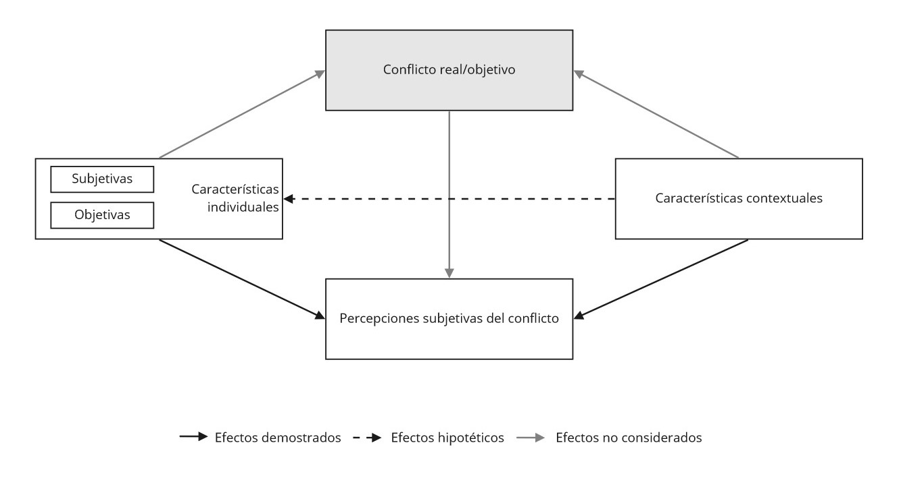

```{r set up2, echo= F, message=FALSE,warning=F}
#1. Packages
if (!require("pacman")) install.packages("pacman") 
pacman::p_load(tidyverse, sjlabelled, ggplot2, sjmisc,summarytools, sjPlot, ggthemes, 
               plotly, lubridate, RColorBrewer, htmlwidgets, kableExtra, withr, scales,
               GGally, broom)

options(kableExtra.html.bsTable = T)
options(knitr.kable.NA = '')

#2. Data
load("../input/data/swiid9_1.rda")
```

<div style="text-align: justify">
# Desigualdades y conflicto social: un marco analítico {#literature}

```{r echo=FALSE}
knitr::opts_chunk$set(out.width="80%", fig.pos = "!ht", out.extra = "")
```


## Percepciones subjetivas del conflicto social
<div style="text-align: justify">

> *"The distinction between «up» and «down» -or, as the English say, «Them» and «Us»- is one of the fundamental experiences of most men in society, and, moreover, it appears that this distinction is intimately connected with unequal distribution of power" ---(Dahrendorf, 1958, p. 176).* 


A lo largo de la historia de la humanidad, una característica principal de todas las sociedades ha sido la existencia del conflicto [@collinsConflictSociologySociological2009a]. El problema del conflicto social, al igual que el de la integración social, ha ocupado un lugar primordial en la sociología desde sus comienzos, desarrollando distintas perspectivas para analizarlo [@wieviorkaSocialConflict2013a]. Por un lado, se encuentran las perspectivas consensualistas, las cuales poseen un especial interés por las normas y lazos sociales que permiten la integración social y política, y que han tendido a obviar o minimizar el conflicto al concebirlo como una patología [@cadarsoFundamentosTeoricosConflicto2001; @coserSocialConflictTheory1957a]. Por el otro lado, se sitúan las perspectivas conflictivistas que han enfatizado el rol ubicuo o inherente del conflicto en la vida social, siendo comprendido como un motor de progreso, solidaridad interna y de cambio [@cadarsoFundamentosTeoricosConflicto2001; @dahrendorfTheorySocialConflict1958a]. En un punto intermedio entre estas dos perspectivas normativas opuestas y lejos de pretender ser una teoría general, la sociología del conflicto se ha concentrado en explicar las causas estructurales de los conflictos sociales a partir de las diferencias en los intereses y valores de los actores participantes, los niveles en donde ocurren y las condiciones que los posibilitan, además de interesarse por describir las dinámicas y consecuencias que adquieren los conflictos [@collinsConflictSociologySociological2009a; @wieviorkaSocialConflict2013a].

A pesar de que es un concepto controversial, varios autores coinciden en una definición mínima del conflicto social como una relación entre partes interdependientes con objetivos incompatibles o antagónicos[^4], en la que impera un principio de bienestar inverso para la consecución de estos objetivos -el logro de uno supone el detrimento del otro- [@finkConceptualDifficultiesTheory1968a; @kriesbergSociologySocialConflicts1973]. Complementario a esto, Wieviorka [-@wieviorkaSocialConflict2013a] enfatiza que el conflicto social es siempre una relación entre oponentes que comparten referencias culturales, por lo que es necesario que al menos exista una esfera de acción compartida por los actores, un principio de oposición en la que cada parte se define en relación con la otra y, en consecuencia, un principio de autoidentificación. Esto permite diferenciar al conflicto social de otras formas de conflicto, como la competencia o los conflictos bélicos, ya que se desarrolla esencialmente dentro de las sociedades o Estados naciones y las partes involucradas siempre son grupos o colectividades sociales [@oberschallTheoriesSocialConflict1978;  @finkConceptualDifficultiesTheory1968a]. Esta última característica se asocia fuertemente con las teorías de la estratificación social puesto que, generalmente, la clasificación de las unidades en pugna depende del lugar que ocupen en la estructura social [@collinsConflictSociologySociological2009a]. 

Los conflictos sociales poseen múltiples expresiones, las cuales pueden ser analíticamente diferenciadas a partir de los motivos que originan el conflicto [@kriesbergConstructiveConflictsEscalation2012]. En la literatura, los motivos del conflicto social se han separado en dos grandes grupos [@cadarsoFundamentosTeoricosConflicto2001]. Por un lado, se encuentran los conflictos motivados por intereses distributivos, en donde las desigualdades materiales, de poder o de status juegan un rol central en la definición de pugnas en el eje vertical de la estructura social [@bercovitchSageHandbookConflict2008; @collinsConflictSociologySociological2009a]. Por otro lado, se sitúan los denominados conflictos «postmaterialistas o culturalistas», en donde priman las desigualdades y discriminaciones sobre características sociales adscriptivas, tales como la etnia, la raza o el género, que se ven expuestas a distintas situaciones de exclusión en el eje horizontal de la estructura social [@inglehartCultureShiftAdvanced2018]. Esta división general de los motivos del conflicto ha generado una dicotomía entre los apodados conflictos tradicionales y los nuevos conflictos sociales. Sin embargo, esta distinción es de un carácter más bien análitico antes que empírico puesto que los conflictos poseen, en distintos grados de predominancia, motivos tanto ‘viejos’ como ‘nuevos’ que los caracterizan [@dellaportaSocialMovementsIntroduction2006].

Con el resurgimiento de la conflictividad social en las últimas décadas, los conflictos relativos a temáticas redistributivas o materiales han vuelto a adquirir relevancia, especialmente a luz del aumento de la desigualdad económica y las transformaciones tecnológicas y productivas en varios países [@silverForcesLaborWorkers2003; @robertsChangingCourseLatin2014; @dellaportaSocialMovementsTimes2015]. A pesar de que gran parte de los estudios recientes se han centrado en las desigualdades y discriminaciones horizontales [@wieviorkaSocialConflict2013a], un número no menor de investigaciones continúan destacando la importancia de los conflictos distributivos en las sociedades capitalistas contemporáneas, sobre todo en aquellos países donde los niveles de tensión entre grupos sociales han desembocado en ciclos de movilización y protesta [@dellaportaSocialMovementsTimes2015; @evansNewPoliticsClass2017; @kerboSocialStratificationInequality2012]. Por ello, los conflictos verticales o distributivos son el centro de análisis de esta investigación, los cuales a su vez han ocupado un lugar primordial en las diversas corrientes y teorías sociológicas del conflicto social.

Las teorías del conflicto social difícilmente son autónomas, ya que tienden a formar parte de una concepción global de la realidad y su funcionamiento [@cadarsoFundamentosTeoricosConflicto2001]. Desde el funcionalismo, Coser [-@coserSocialConflictTheory1957a] enfatiza que el conflicto no es algo estrictamente negativo, sino que al contrario forma parte de las estructuras sistémicas brindando solidaridad, innovación y estabilidad. Para Coser [-@coserContinuitiesStudySocial1967, p. 232] el conflicto social “es una lucha por los valores o las reivindicaciones de estatus, poder y recursos escasos,” distinguiéndose de los sentimientos de hostilidad ya que siempre es una interacción real [@coserFunctionsSocialConflict1956]. En la tradición marxista, el conflicto social forma parte de su núcleo explicativo sobre las relaciones de clase y de producción; “la historia de todas las sociedades que han existido hasta nuestros días es la historia de las luchas de clases” [@marxManifestoCommunistParty1848, p. 31]. Los aportes de Marx han servido como fundamento de la teoría moderna del conflicto en la medida que define su origen a partir de los intereses contradictorios que se forman por las distintas relaciones de propiedad sobre los medios de producción [@marxCapital1975]. Así, la base socioeconómica del conflicto, sustentada en la dominación y explotación del trabajo que engendra la opresión de clases, da pie al reconocimiento de intereses antagónicos y la movilización [@wrightFoundationsNeoMarxistClass2005]. Por último, más cercano a la sociología weberiana, Dahrendorf [-@dahrendorfTheorySocialConflict1958a] sostiene que el conflicto no se reduce meramente a la producción, sino que descansa en toda relación social que implique una asimetría en la estructura de autoridad. De este modo, el conflicto social emerge de la relación entre dominantes y dominados, distinción íntimamente conectada con la distribución desigual del poder [@dahrendorfTheorySocialConflict1958a]. ¿Qué tienen en común estas corrientes?, que comprenden la raíz del conflicto social como la distribución estructuralmente desigual del poder [@kriesbergSociologySocialConflicts1973].

El vínculo entre la desigualdad y el conflicto social es ciertamente estrecho. Todas las sociedades modernas se caracterizan por poseer, en algún grado, una desigual distribución de recompensas materiales y simbólicas entre sus miembros [@cromptonClassStratification2008]. La desigualdad implica que distintas unidades sociales poseen diferentes cantidades o accesos sobre esos atributos, los cuales pueden ser riqueza, poder u otros recursos de valor [@wrightInterrogatingInequalityEssays1994]. El concepto de estratificación social permite describir estas estructuras sistemáticas de la desigualdad [@cromptonClassStratification2008], o en otros términos, refiere al examen del proceso distributivo que busca responder a la pregunta sobre ¿quién tiene qué y por qué? [@lenskiPowerPrivilegeTheory1966]. Uno de los principales elementos que origina la institucionalización de la desigualdad es la distribución diferencial del poder[^5] [@lukesPowerRadicalView2004]. La organización del poder establece distintas localidades y jerarquías en la estructura social, en la medida que unos poseen la capacidad de ejercer poder para controlar las acciones de otro -autoridad- y/o para controlar la propiedad sobre determinados recursos estratégicos -como los medios de producción- y excluir a otros [@callinicosMakingHistoryAgency2004a]. Estas distintas posiciones, basadas en una relación de desigualdad, generan en consecuencia diferencias en los intereses, objetivos y valores de quienes las ocupan, los cuales son susceptibles de entrar en conflicto cuando la estructura de dominación es deslegitimada -por ejemplo, ante la deprivación económica- [@kriesbergSociologySocialConflicts1973], o bien, cuando estos intereses son incompatibles y solo pueden realizarse mediante cursos de acción que hagan chocar a los agentes -por ejemplo, el interés de controlar ciertos recursos o posiciones de prestigio que son escasas- [@callinicosMakingHistoryAgency2004a]. De este modo, considerando al poder como un recurso desigualmente distribuido pero fundamental para definir las posiciones, capacidades e intereses en la estructura social, la relación entre la desigualdad y el conflicto social puede resumirse de la siguiente manera: “el conflicto es orgánico a la estructura de los mecanismos generadores de desigualdad” [@wrightInterrogatingInequalityEssays1994, p. 57].

Considerando este vínculo entre el conflicto y la desigualdad, es admisible introducir el marco general en el cual se sitúa esta investigación. Este marco se compone de dos premisas analíticas: primero, que el conflicto social puede expresarse en formas latentes [@kriesbergSociologySocialConflicts1973; @finkConceptualDifficultiesTheory1968a], y segundo, que su estudio descriptivo puede realizarse a escala subjetiva [@pondyOrganizationalConflictConcepts1967a; @kelleyClassClassConflict1995a]. Sobre lo primero, la distinción entre las expresiones objetivas y subjetivas del conflicto social ha dado paso a la formulación de dos perspectivas para analizarlo: las que se enfocan en las ‘acciones’ y las que se enfocan en los ‘motivos’ [@finkConceptualDifficultiesTheory1968a]. De acuerdo con estas últimas, el campo de observación de los conflictos engloba a todas aquellas relaciones sociales en donde exista una incompatibilidad de intereses tanto manifiestos como latentes [@finkConceptualDifficultiesTheory1968a]. La dimensión latente del conflicto social refiere a las incompatibilidades o antagonismos subyacentes entre grupos sociales, sin implicar un reconocimiento plenamente consciente por parte de los individuos puesto que se sostienen en las expectativas asociadas a determinados roles e intereses en la estructura social [@kelleyClassClassConflict1995a]. La integración de la dimensión subjetiva del conflicto agrega un grado de complejidad a su definición inicial, por ello, en esta investigación entenderé conceptualmente al conflicto social como todas aquellas relaciones de oposición en los objetivos, intereses o valores “en el que dos o más entidades sociales están vinculadas por al menos una forma de relación psicológica antagónica o al menos una forma de interacción antagónica” [_traducción propia_] [@finkConceptualDifficultiesTheory1968a, p. 456]. Respecto a lo segundo, el estudio empírico del conflicto social a nivel descriptivo se ha enfocado en sus expresiones manifiestas a partir de, por ejemplo, la acción colectiva [@tillyContentiousPolitics2015a], pero también puede enfocarse en sus expresiones latentes, alusivas al ámbito subjetivo de las relaciones antagónicas en la sociedad que pueden ser analizadas a través de las percepciones de los individuos [@hadlerIstKlassenkonfliktUeberholt2003a].


```{r fig1, results='asis', out.width = '90%', echo = FALSE, fig.align = 'center', fig.cap="(ref:fig1)"}

```
(ref:fig1) Diagrama conceptual. Adaptado en base a Hadler [-@hadlerIstKlassenkonfliktUeberholt2003a, p. 176]


El concepto de percepción se refiere al proceso cognitivo mediante el cual los individuos reciben o captan información sobre su entorno, la organizan mentalmente y la expresan como descripción de lo captado [@bercovitchSageHandbookConflict2008, p. 8]. En ese sentido, las percepciones refieren al ejercicio subjetivo de describir lo observado, o en palabras de Janmaat [-@janmaatSubjectiveInequalityReview2013, p. 359]: “percepciones se refieren a las estimaciones subjetivas de la desigualdad existente (*i.e.* pensamientos sobre lo que *es*).” La idea de percepción puede asociarse con el concepto de ‘etapas’ del conflicto [@finkConceptualDifficultiesTheory1968a]. Teóricamente, un conflicto pasaría por distintos estadios que van desde las condiciones estructurales de desigualdad que lo posibilitan, la fase cognitiva asociada a las creencias de los individuos sobre su entorno, hasta la ocurrencia o manifestación abierta del mismo [@kriesbergSociologySocialConflicts1973]. Siguiendo a Pondy [-@pondyOrganizationalConflictConcepts1967a], el conflicto social en un estado latente se asocia a las condiciones estructurales de desigualdad que generan intereses contradictorios entre los individuos, y la percepción de este conflicto se sitúa en el ámbito o fase cognitiva de su desarrollo. Así, autores como Collins [-@collinsConflictSociologySociological2009a] o Kriesberg [-@kriesbergSociologySocialConflicts1973] sostuvieron que un aspecto fundamental para la ocurrencia de los conflictos es la previa percepción del mismo, la cual puede darse cuando existan situaciones objetivas de conflicto, o bien, cuando la incompatibilidad de intereses exista pero las partes no sean plenamente conscientes de ello (*i.e.* conflicto latente). 

Lo anterior implica que el estudio de la percepción subjetiva del conflicto se sustenta en la descripción del conflicto social captado por los sujetos y, por ende, hace referencia a la realidad objetiva -remota e impersonal- de los intereses opuestos de los grupos sociales en pugna [@kelleyClassClassConflict1995a]. Por lo tanto, y conectando esta explicación con las definiciones expuestas anteriormente, podemos definir que la percepción de conflicto social se refiere a cómo los sujetos captan/describen un conflicto social determinado entre dos grupos que poseen intereses contrapuestos. De tal manera, las percepciones de conflicto social indican, en un sentido sociológico, “la medida en que los individuos experimentan su entorno como caracterizado por tales relaciones antagónicas” [@hertelConflictPerceptions272019a, p. 2]. 

Las percepciones de conflicto social son la variable dependiente de esta investigación y serán medidas como una agregación de distintas escalas de conflicto percibido entre grupos sociales *verticalmente* estructurados. Las investigaciones relacionadas generalmente utilizan categorías sociales contrapuestas como: ricos y pobres, trabajadores y empresarios, clase media y clase trabajadora, los de abajo y los de arriba. El sentido de orden vertical es fundamental para dar cuenta de que hay grupos poseedores y grupos desposeídos -o grupos que dan órdenes y grupos que las reciben-, mientras que el elemento de conflicto social permite enfatizar oposiciones de intereses manifiestos o subyacentes entre estos grupos [@kelleyClassClassConflict1995a, p. 164]. Esta forma de medición de las percepciones de conflicto social se ha utilizado frecuentemente en la literatura, sea como variable dependiente principal o bien como un componente de un concepto teórico más grande, como por ejemplo, la conciencia de clase [cf. @hadlerSocialConflictPerception2017a; @wrightClassCountsComparative1997a].

De acuerdo con el cuerpo teórico y empírico de la literatura de las percepciones de conflicto social, estas se verían influenciadas por tres dimensiones: (i) la ocurrencia de conflictos reales[^6], (ii) las características individuales y (iii) las características contextuales [@hadlerIstKlassenkonfliktUeberholt2003a], tal como indica la Figura \@ref(fig:fig1). A nivel individual, se establece que las actitudes subjetivas de las personas, como la desigualdad percibida, y sus condiciones objetivas, como su nivel de ingreso, determinan en buena medida las percepciones de conflicto 
[@hadlerIstKlassenkonfliktUeberholt2003a; @hertelConflictPerceptions272019a]. De igual manera, las características contextuales de los países, como por ejemplo el nivel de desigualdad económica o el grado de redistribución del gobierno, influyen en las percepciones de conflicto social en tanto dan forma al desarrollo y carácter del conflicto [@edlundDemocraticClassStruggle2015a; @hadlerSocialConflictPerception2017a]. Estas perspectivas de análisis a nivel individual y contextual orientan la presente investigación, enfocándose empíricamente en la clase social y la participación en organizaciones intermedias a nivel individual, y en la desigualdad económica y los marcos institucionales de los países a nivel contextual. Ahora, resta comprender cómo estas dimensiones afectan a las percepciones de conflicto social en los apartados siguientes.


[^4]: En esta investigación no estableceré distinciones conceptuales entre antagonismo y oposición en vista de que la primera es de un contenido filosófico-político más diverso. Para discusiones y definiciones sobre estos conceptos ver Mouffe, C. [-@mouffeTornoPolitico2007]. En torno a lo político. Buenos Aires: Fondo de cultura económica

[^5]: Entenderé el concepto de poder bajo la noción clásica de Max Weber [-@weberEconomiaSociedad1944], quien realiza una distinción entre: (i) el *poder sobre* como la probabilidad de imponer la propia voluntad sobre una relación social, aún contra toda resistencia y cualquiera sea el fundamento de esa probabilidad, y (ii) el *poder para* concebido como la capacidad de realizar determinados intereses y deseos. 

[^6]: El posible efecto de los conflictos objetivos o manifiestos no será considerado en esta investigación, como se detalla en la Figura \@ref(fig:fig1), debido a que se escapa del marco de análisis presentado. 


## Determinantes individuales de las percepciones de conflicto social
### Posición de clase

<div style="text-align: justify">

> *"To say that «class counts», then, is to claim that the distribution of rights and powers over the basic productive resources of a society have significant, systematic consequences at both the micro and macro levels of social analysis" ---(Wright, 2005, p. 22).* 

A pesar de que en las últimas décadas se ha cuestionado profundamente la pertinencia del análisis de clase para explicar los conflictos contemporáneos [@kingstonClasslessSociety2000; @pakulskiDeathClass1996a], un amplio conjunto de investigaciones han puesto en duda tales hipótesis al demostrar que las desigualdades de clase siguen siendo relevantes para analizar, al menos desde un plano subjetivo, diversos fenómenos asociados al conflicto social [cf. @dodsonEconomicChangeClass2017; @edlundDemocraticClassStruggle2015a; @lindhClassPositionPolitical2020a; @wrightClassCountsComparative1997a]. Para la literatura de las percepciones de conflicto, las tensiones entre grupos verticalmente estructurados aluden, principalmente, a conflictos por motivos distributivos sobre dos áreas de la vida social: en el mercado y la producción [@hertelConflictPerceptions272019a; @kelleyClassClassConflict1995a; @hadlerSocialConflictPerception2017a]. Desde los estudios sobre desigualdades y estratificación social, las perspectivas relaciones del análisis de clase se han enfocado precisamente en estas dos áreas para dar cuenta de cómo las desigualdades de clase se vinculan con los conflictos, destacando las escuelas neoweberianas y neomarxistas [@cromptonClassStratification2008]. Los primeros hacen un énfasis en las oportunidades de vida para la definición de las clases y los consiguientes conflictos en la esfera del mercado [@breenFoundationsNeoWeberianClass2005]. Mientras que los segundos, además de considerar las oportunidades de vida y las disputas en el mercado, dan más importancia a las relaciones de explotación para la determinación de las clases y a los conflictos desarrollados en la producción [@wrightUnderstandingClass2015]. Por ello, en esta investigación adoptaré una perspectiva de clases neomarxista debido a su mayor capacidad explicativa para abordar el conflicto social.

En la tradición de análisis de clase neomarxista, las divisiones de clase se definen primordialmente en términos del vínculo entre las relaciones de propiedad sobre recursos productivos y las pautas de explotación inscritas en ellas [@wrightClassCountsComparative1997a]. Las relaciones de propiedad se entienden como la desigual distribución de poderes y derechos de propiedad jurídica que permiten a algunos grupos el control efectivo sobre determinados bienes productivos mediante la exclusión de otros de su acceso [@wrightClases1994]. Estas relaciones de propiedad actúan como mecanismos que definen, por tanto, diferentes *condiciones* o posiciones económicas según la posesión de determinados recursos productivos, los cuales Wright [-@wrightClases1994] caracteriza como: (i) medios de producción, (ii) bienes de cualificación y (iii) bienes de organización o autoridad. No obstante, para los marxistas no es suficiente con que existan diferentes relaciones de propiedad puesto que el mecanismo principal que define a las clases sociales son las relaciones de dominación y explotación que se derivan de ellas [@wrightFoundationsNeoMarxistClass2005]. Tanto la dominación -la capacidad de controlar la actividad de un otro- como la explotación -el logro de beneficios económicos a partir de la actividad laboral de las personas dominadas- son elementos constitutivos de las relaciones de clase ya que se enfocan en las *actividades* que realizan las personas favorecidas o desfavorecidas por las relaciones de propiedad [@wrightUnderstandingClass2015]. De tal modo, Wright [-@wrightClases1994, p.80] define a las clases sociales como “las posiciones dentro de las relaciones sociales de producción que se derivan de las relaciones de propiedad determinantes de las pautas de explotación”. Esto quiere decir que las clases sociales se originan por las distintas formas de explotación que emanan de determinadas relaciones de propiedad sobre los activos productivos, dando lugar a distintas posiciones de clase polarizadas y medias en las sociedades capitalistas contemporáneas [@wrightClases1994].

Existen distintos medios a través de los cuales las desigualdades de clase afectan la vida de las personas, como las economías morales o las identidades de clase, pero uno de los que mayor atención ha recibido por distintas perspectivas corresponde a los intereses materiales [@botteroClassIdentitiesIdentity2004; @langsaetherMoreSelfinterestWhy2020; @svallforsMoralEconomyClass2006a]. Los intereses materiales se entienden como la búsqueda del bienestar económico -es decir, la mejora de las opciones de consumo, trabajo y ocio- que cada individuo realiza bajo un supuesto racional [@wrightClassCountsComparative1997a]. Los intereses materiales se derivan de la posición de clase de los individuos, y estas posiciones imponen una serie de dilemas y estrategias alternativas a las que estos se enfrentan en la consecución de su bienestar económico [@wrightFoundationsNeoMarxistClass2005]. Desde una perspectiva marxista[^7], esto implica que los mecanismos que hay detrás de las desigualdades de clase estructuran o determinan, en parte, las maneras en las que los individuos realizan sus intereses. En efecto, las relaciones de propiedad estructuran lo que la gente *posee* para poder realizar sus intereses materiales, mientras que las relaciones de explotación, al sustentarse en las interrelaciones continuas de las actividades de las personas, define lo que estas tienen que *hacer* para lograr obtener lo que quieren [@wrightFoundationsNeoMarxistClass2005]. 

El enfoque en las relaciones de explotación es lo que diferencia fundamentalmente a la tradición marxista de la weberiana [@wrightUnderstandingClass2015]. En la tradición weberiana, las clases sociales se originan a partir de mecanismos de exclusión y control sobre recursos económicos en el mercado, y este vínculo define diferentes situaciones de clase, oportunidades de vida e intereses compartidos por sus miembros [@breenFoundationsNeoWeberianClass2005]. Bajo este esquema, las oportunidades de vida estructuran los intereses de las personas, las cuales pueden entrar en conflictos por la redistribución de recursos materiales y simbólicos en el mercado en tanto es la fuente de las desigualdades de acaparamiento de oportunidades [@breenFoundationsNeoWeberianClass2005]. En cambio, para la tradición marxista las clases sociales -y por consiguiente los intereses de los individuos- no se estructuran solamente por las relaciones de exclusión, sino que también por la explotación. Para que exista explotación debe ocurrir que las posiciones favorecidas por los mecanismos de exclusión se apropien de los frutos de la actividad laboral de las posiciones desfavorecidas por tales mecanismos [@wrightUnderstandingClass2015]. Esto produce una relación de interdependencia causal inversa entre los intereses materiales de las personas puesto que la consecución del bienestar de los grupos favorecidos se obtiene a *expensas* de los desfavorecidos. Este principio de bienestar inverso da cuenta del carácter potencialmente conflictivo de la explotación ya que define una estructura de “intereses antagónicos e interdependientes en la que los logros de los intereses de los explotadores dependen de su capacidad de perjudicar a los explotados” [@wrightFoundationsNeoMarxistClass2005, p. 28]. La integración de ambos mecanismos de exclusión y explotación es, según Wright [-@wrightFoundationsNeoMarxistClass2005], una de las principales fortalezas del esquema marxista pues permite analizar los conflictos sociales en sus ámbitos de mercado y de producción. 

¿Cómo las desigualdades de clase afectan percepciones subjetivas? El argumento central de este vínculo es que, si la clase es explicativa de una serie de fenómenos empíricos, lo es por cómo los mecanismos de clase generan intereses materiales, experiencias de vida y acciones de clase que los afectan [@wrightClassCountsComparative1997a; @oddssonClassIceland2021]. En la explicación neomarxista se sostiene que la posición de clase delimita un conjunto de oportunidades y experiencias compartidas por sus miembros, las cuales influyen en sus visiones subjetivas sobre el mundo [@wrightFoundationsNeoMarxistClass2005]. Esto se debe a un conjunto de micro mecanismos que al combinarse producen tales efectos, estos son: (i) los intereses materiales derivados de la posición de clase, (ii) las experiencias de vida compartidas de clase, entendidas como las formas en que los intereses materiales asientan un conjunto de experiencias sistemáticas que configuran activamente su comprensión común subjetiva, y (iii) las prácticas o acciones pertinentes de clase [@wrightClassCountsComparative1997a, p. 389]. Centrándose en la relación entre los primeros dos mecanismos, puede sostenerse que el puente que conecta a la posición de clase con fenómenos subjetivos, tales como actitudes y percepciones, son los intereses materiales que portan los individuos y que se derivan, precisamente, de las relaciones de propiedad y explotación que dan origen a las clases [@wrightFoundationsNeoMarxistClass2005]. Dado que la posición subordinada o privilegiada que ocupan los individuos en la estructura de clases genera intereses materiales que son disímiles, las percepciones de las personas tenderían a variar según su posición de clase [@langsaetherMoreSelfinterestWhy2020]. En ese sentido, y siguiendo la perspectiva marxista de Wright [-@wrightClassCountsComparative1997a], la posición de clase sería un factor explicativo de las percepciones de conflicto no solo en la medida que define intereses materiales que son diferentes, sino que también potencialmente antagónicos por la explotación, generando variaciones significativas en el nivel de conflicto percibido según la posición de clase que ocupen los individuos. 

Las investigaciones empíricas que han analizado la relación entre la posición de clase y las percepciones de conflicto social han llegado a una conclusión relativamente similar: las percepciones de conflicto tienden a aumentar a medida que se “desciende” por la estructura de clases [@edlundDemocraticClassStruggle2015a; @perezClassUnionMembership2022]. Las investigaciones comparadas más actuales corresponden a los trabajos de Edlund & Lindh [-@edlundDemocraticClassStruggle2015a] y de Pérez [-@perezClassUnionMembership2022] quienes utilizan distintas adaptaciones de los esquemas neoweberianos y neomarxistas, respectivamente. Analizando 20 países entre 1999 y 2009, Edlund & Lindh [-@edlundDemocraticClassStruggle2015a] demuestran que los individuos que pertenecen a las posiciones de clases más bajas (como los trabajadores manuales y trabajadores no calificados) perciben mayor conflicto social en comparación a las demás clases. Por su parte, las posiciones típicamente asociadas a las clases medias (profesionales menos cualificados y trabajadores no manuales), también perciben mayor conflicto que las clases altas (profesionales cualificados y propietarios), pero esta percepción es menor en comparación a las clases más bajas. Un elemento a destacar es el caso de la clase de autoempleados puesto que, a diferencia de la tendencia general, los individuos pertenecientes a esta clase perciben mayores conflictos sociales que aquellos pertenecientes a posiciones de clase media como los profesionales bajamente cualificados [@edlundDemocraticClassStruggle2015a]. Más recientemente, Pérez [-@perezClassUnionMembership2022] analiza el rol de la posición de clase en la percepción de conflicto laboral en 28 países, encontrando que los individuos pertenecientes a las clases subordinadas (trabajadores no calificados, calificados y supervisores no calificados) tienden a percibir mayor conflicto laboral que las clases privilegiadas (propietarias y pequeños empleadores), mientras que los individuos pertenecientes a las clases medias (supervisores calificados y expertos directivos) perciben mayor conflicto que las clases privilegiadas pero menor que las subordinadas. No obstante, en esta investigación también es particularmente llamativo el caso de la clase de expertos no directivos ya que tienden a percibir mayor conflicto laboral que los supervisores calificados y no calificados.

La percepción de mayor conflicto social por parte de las clases bajas/subordinadas se debería a que las principales ventajas de las clases altas/privilegiadas se da por la exclusión y explotación de las primeras [@perezClassUnionMembership2022]. A esto se suma que los individuos en las posiciones más bajas de la estructura social tienden a exagerar los contrastes entre grupos dicotómicos, mientras que los individuos en las posiciones más altas se inclinarían a percibir su propia situación como resultado de su esfuerzo y cualificación antes que por la exclusión y menoscabo sobre otras clases [@lindhClassPositionPolitical2020a]. Por su parte, las posiciones de clases medias tendrían un rol más ambivalente a la hora de identificar conflictos en comparación a las clases más bajas debido a que sus intereses materiales las sitúan en una posición contradictoria que las acerca a la movilidad e inestabilidad en la estructura social [@hertelConflictPerceptions272019a].

Otras investigaciones complementarias sobre las preferencias redistributivas y la conciencia de clase respaldan estas hipótesis. Si bien el estudio de las preferencias redistributivas es más cercano a las investigaciones sobre la “política de clases”, forma parte de las expresiones políticas de los conflictos sociales [@oddssonClassIceland2021]. Estos estudios han demostrado reiteradamente que, guiados por su interés económico propio, los individuos pertenecientes a las clases más bajas y también medias tienden a preferir mayor redistribución del ingreso que aquellos ubicados en clases más altas [cf. @andersenSocialClassEconomic2015; @edlundDemocraticClassStruggle2015a; @dodsonEconomicChangeClass2017; @lindhClassPositionPolitical2020a]. Similarmente, investigaciones sobre la conciencia de clase han demostrado que la percepción de oposición de clase se estructura consistentemente según la posición de clase de los individuos. Investigaciones como las de Wright & Shin [-@wrightTemporalityClassAnalysis1988] en Suecia y Estados Unidos, la de Pérez [-@perezClassConsciousnessMature2014] en Chile o la de Wallace & Junisbai [-@wallaceFindingClassConsciousness2003] en Indiana han dado cuenta de que la conciencia de oposición de clase es más fuerte entre individuos pertenecientes a las clases bajas/subordinadas en comparación a aquellos pertenecientes a las clases medias, y en especial respecto a los individuos de clases capitalistas/propietarias. En consecuencia, considerando estos antecedentes teóricos y empíricos, se plantea como primera hipótesis de nivel individual de esta investigación que:

$H_{1}$: Individuos de clase trabajadora (trabajadores no calificados, calificados y supervisores no calificados) tenderán a percibir mayor conflicto social que individuos de clases capitalistas (propietarios, pequeños empleadores y pequeña burguesía)

[^7]: Una posible crítica a esta aproximación es que existe cierta complejidad en analizar fenómenos subjetivos desde una perspectiva marxista, más aún cuando se observan intereses materiales [@brennerWorkRelationsFormation1988]. Esto se debe, principalmente, a la explicación contrafáctica de los intereses de los individuos y a la imputación teleológica de lo que serían sus "verdaderos intereses con una misión histórica" que se ha realizado en la tradición marxista [@bertilssonInterestProblematicConcept1979]. Sin embargo, el concepto de intereses materiales empleado por Wright logra superar estos problemas puesto que se refiere, únicamente, a los distintos dilemas que enfrentan los sujetos en la consecución de su bienestar económico, independientemente de si ello involucra un grado de fidelidad con supuestos intereses "reales" [@wrightClassCountsComparative1997a, p. 385]. Así, Wright comprende que el análisis de las implicancias subjetivas de las desigualdades de clase integra a todos aquellos elementos subjetivos que son pertinentes a los intereses materiales generados por la posición de clase, superando estas complicaciones en la tradición marxista [@perezComoEntenderEstudiar2014]. 

### Organizaciones intermedias

<div style="text-align: justify">

> *"The structural location of individuals translates into action thanks largely to the influence networks exert over the perception of their own possibilities as well as of their social and political environment" ---(Passy and Giugni, 2001, p.130).*


Los estudiosos de los movimientos sociales han destacado en varias ocasiones el rol movilizador o potenciador que pueden tener las organizaciones sociopolíticas en el conflicto social, tales como los sindicatos, los partidos políticos y otros grupos o redes de la sociedad civil [@dianiSocialMovementsNetworks2003c]. Buena parte de la literatura del conflicto social ha sostenido que el vínculo entre las deprivaciones generadas por la desigualdad y la ocurrencia de los conflictos no es automático, sino que más bien se encontraría mediado por diferentes apoyos sociales, costos y recursos que poseen los individuos [@mccarthyEnduringVitalityResource2002]. Concretamente, esto se asocia con la pregunta sobre: si las tensiones sociales son constantes, ¿por qué algunos grupos tienden al conflicto mientras que otros no? [@oberschallTheoriesSocialConflict1978]. Al respecto, perspectivas como la teoría de movilización de recursos (resource mobilization theory - RMT) sostienen que las organizaciones colectivas de los individuos juegan un rol fundamental en el desarrollo de los conflictos sociales al monopolizar distintos recursos materiales, culturales y socio-organizacionales que facilitan la movilización y/o polarización de los grupos involucrados [@edwardsResourceMobilizationTheory2013]. En este sentido, los individuos que participan en organizaciones sociopolíticas, además de verse expuestos con mayor frecuencia a situaciones conflictivas, experimentarían la socialización de determinados marcos cognitivos, lo cual puede influenciar en gran medida sus percepciones subjetivas sobre distintas temáticas y grupos sociales, e inclusive conducirlos a demostraciones manifiestas de conflicto [@hadlerIstKlassenkonfliktUeberholt2003a; @dianiSocialMovementsNetworks2003].

Existen distintas explicaciones sobre cómo las organizaciones intermedias se vinculan con las percepciones subjetivas. Por un lado, se sitúa el argumento frecuente de que los individuos que perciben a determinados grupos como potencialmente conflictivos se inclinarán a participar o formar organizaciones sociopolíticas con el fin de canalizar sus demandas e intereses, enfatizando una relación que va desde el individuo hacia la organización [@devydtLinkingConsensusAction2020]. Tal vez el ejemplo más clásico de ello sea la formación de asociaciones sindicales por parte de los trabajadores para defender sus intereses en la relación antagónica entre capital y trabajo [@wrightUnderstandingClass2015], pero estas organizaciones intermedias pueden abarcar distintas formas con diferentes grados de formalidad, como los grupos de interés o los movimientos sociales [@dianiSocialMovementsNetworks2003]. En cualquier caso, la premisa básica es que aquellos individuos que comparten condiciones de vida o destinos similares tenderían a ‘alinearse’ en una causa común [@devydtLinkingConsensusAction2020], por lo que se presume que quienes poseen actitudes más conflictivas sobre diferentes temáticas formen o participen en estas organizaciones para canalizar sus demandas y actuar colectivamente [@dianiSocialMovementsNetworks2003].

Por otro lado, se encuentran las perspectivas que enfatizan la dirección contraria al argumento anterior, esto es, que las mismas organizaciones intermedias pueden influir en las percepciones de sus miembros [@dianiSocialMovementsNetworks2003; @passySocialNetworksIndividual2001]. Al respecto, la teoría de las redes sociales sostiene que las diferencias en las percepciones subjetivas entre quienes son miembros de organizaciones y quienes no lo son se explicaría por razones tanto estructurales como cognitivas [@passySocialNetworksIndividual2001]. Primero, los individuos que son parte de organizaciones o cercanos a redes sociales contarían con la oportunidad estructural de involucrarse en distintas situaciones de conflicto, tales como la asistencia a protestas u otras acciones contenciosas [@dianiSocialMovementsNetworks2003]. En ese sentido, el término estructural se refiere a la oportunidad de contar con lazos sociales que conecten a los individuos a situaciones de conflicto [@passySocialNetworksReally2014]. Segundo, los individuos miembros de organizaciones experimentan distintos mecanismos de socialización, tales como la entrega de información [@limSocialNetworksPolitical2008], el reforzamiento de identidades y valores políticos [@schussmanProcessProtestAccounting2005], interacciones y emociones cotidianas [@sommaHowVoluntaryOrganizations2010], campos morales [@hegtvedtDoingJusticeGroup2005], entre muchos otros, que configuran un ‘marco cognitivo’ que influye en la definición de las percepciones y preferencias subjetivas de los individuos [@passySocialNetworksIndividual2001]. En esa dirección, el término cognitivo se refiere al conjunto de marcos de significados que son socializados por las organizaciones hacia sus miembros, los cuales pueden ser de un contenido conflictivo [@passySocialNetworksIndividual2001]. Así, de acuerdo a esta teoría es esperable que los miembros de organizaciones sociopolíticas como los sindicatos, además de estar conectados a oportunidades de conflicto social, experimenten la socialización de intereses, identidades y valores que los incentiven a percibir a distintos grupos sociales de manera conflictiva [@kerrisseyUnionMembershipPolitical2013].

Las investigaciones empíricas que han considerado esta dimensión se han centrado generalmente en los sindicatos como organizaciones sociopolíticas que históricamente han potenciado la percepción del conflicto de clases [@hadlerIstKlassenkonfliktUeberholt2003a]. En un estudio pionero, Hadler [-@hadlerIstKlassenkonfliktUeberholt2003a] demostró que quienes son miembros de sindicatos tenderían a percibir casi tres veces más conflicto social que los no miembros en 30 países de Europa, América y Asia. Más recientemente, Ringqvist [-@ringqvistHowUnionMembership2020a] y Pérez [-@perezClassUnionMembership2022] confirman estos hallazgos en distintos países al concluir que quienes son miembros de sindicatos tienden a percibir mayor conflicto entre trabajadores y directivos de empresa en comparación a quienes no lo son. Similarmente, estudios como los de Pérez [-@perezClassConsciousnessMature2014], Wallace & Junisbai [-@wallaceFindingClassConsciousness2003] o Wright [-@wrightClassCountsComparative1997a] muestran que los afiliados a sindicatos tienen mayores probabilidades de percibir oposición de intereses de clases -o mayor conciencia de clase- entre trabajadores y empresarios en distintos países. Esto se debería a que los sindicatos representan una de las tantas formas del poder asociativo que poseen los trabajadores para defender sus intereses materiales y amenazar los intereses de los empleadores [@wrightUnderstandingClass2015]. Además, los sindicatos buscan representar la “voz” de sus afiliados en el reconocimiento de sus privaciones compartidas y juegan un rol clave en la construcción de solidaridad como base para la acción colectiva [@dixonUnionsSolidarityStriking2004]. En ese sentido, los sindicatos pueden ser vistos como ‘escuelas de guerra’ [@hymanUnderstandingEuropeanTrade2001] en la medida que, por un lado, articulan los intereses y demandas de los trabajadores y, por el otro, cultivan en ellos el desarrollo de identidades, valores y habilidades políticas que potencian su percepción de conflicto en los lugares de trabajo y los movilizan directamente hacia acciones conflictivas [@kerrisseyLaborUnionsPolitical2018; @ringqvistHowUnionMembership2020a].

Para los estudios de la revitalización sindical, esto puede asociarse con los distintos planos sobre los cuales los sindicatos emplean sus estrategias y recursos para revitalizarse [@turnerWhyRevitalizeLabour2004]. Si bien es innegable la pérdida de centralidad que ha experimentado el sindicalismo desde 1980 con las grandes transformaciones productivas y la globalización [@hodderDoesStrikeAction2017], ello no implica que su rol en el conflicto social haya desaparecido puesto que distintos estudios han demostrado desde los años 2000 una revitalización de la actividad sindical y de la conflictividad laboral en diversos países [@dorreOrganizingStrategicOption2009]. Estas investigaciones han entregado evidencia respecto a que, adaptándose a sus propios contextos nacionales, las estrategias que emplean los sindicatos para su revitalización contribuyen a fomentar sus recursos de poder en diferentes planos y direcciones; algunos centrados en el lugar de trabajo, otros en el mercado, otros con la sociedad y la opinión pública, y otros en la esfera política y las instituciones [@fregeUnionRevitalizationStrategies2003]. El grado de alcance de la influencia de los sindicatos en estos distintos planos dependerá, en parte, de su capacidad para integrar a sus agendas otras problemáticas y conflictos sociales que se escapan de los confines del lugar de trabajo [@hymanUnderstandingEuropeanTrade2001], así como también de su fortaleza asociativa en la socialización de valores y actitudes hacia sus miembros [@fregeUnionRevitalizationStrategies2003].

Desde una perspectiva complementaria a las investigaciones específicas sobre las percepciones de conflicto, diversos estudios acerca de los movimientos sociales han demostrado que la afiliación sindical se asocia con mayores grados de participación política convencional y no convencional, como la asistencia a protestas y otras acciones contenciosas [cf. @joEnigmasGrievancesInequality2019; @kerrisseyLaborUnionsPolitical2018; @kittsMobilizingBlackBoxes2000]. Siguiendo la teoría de las redes sociales, distintos estudios sugieren que los sindicatos actúan como organizaciones intermedias que, además de disponer estructuralmente a sus miembros a la acción colectiva, socializan en ellos habilidades e identidades políticas que los conducen a involucrarse en un amplio rango de actividades políticas y civiles [@kerrisseyUnionMembershipPolitical2013]. Por ejemplo, Kerrissey & Schofer [-@kerrisseyLaborUnionsPolitical2018] muestran que la afiliación sindical, en algunos casos, puede llegar a triplicar las probabilidades de que los individuos participen en acciones contenciosas así como en otras formas convencionales de participación política en 60 países. Esto puede relacionarse con lo sostenido por Hyman [-@hymanUnderstandingEuropeanTrade2001] sobre el grado de alcance de la influencia de los sindicatos ya que, al extenderse hacia otros planos o niveles de participación política, sobrepasa las problemáticas y conflictos limitados a los lugares de trabajo. De tal modo, y debido a su disposición estructural hacia el conflicto social [@wrightClassCountsComparative1997a], las distintas oportunidades y marcos cognitivos que los sindicatos entregan a sus miembros facilitan que estos perciban a determinados grupos sociales de manera conflictiva, ya sea al identificarlos como responsables de su propia situación, o bien, como aliados u oponentes en la consecución de sus intereses [@vanstekelenburgSocialPsychologyProtest2013]. Sobre la base de estos antecedentes, y adoptando la direccionalidad del argumento planteado por la teoría de las redes sociales, se propone la siguiente hipótesis respecto al efecto de la membresía sindical en las percepciones de conflicto social:


$H_{2}$: Individuos miembros de sindicatos tenderán a percibir mayor conflicto social que individuos que no lo son.


## Determinantes contextuales de las percepciones de conflicto social
### Desigualdad económica
<div style="text-align: justify">

> *"A conflict relationship occurs within a specific social context; it affects it, and is in turn affected by it" ---(Bercovitch, Kremenuik and Zartman, 2008, p.7).*


El resurgimiento de la conflictividad social en los últimos años, especialmente después de la crisis financiera del 2008, se ha caracterizado por una fuerte y renovada crítica contra las desigualdades sociales en varios países del mundo, como las movilizaciones de Wall Street en Estados Unidos, los Indignados en España, los Giles Jaunes en Francia o el Estallido Social en Chile [@sommaNoWaterOasis2020a; @dellaportaLateNeoliberalismIts2017a]. Un elemento común a estos conflictos es que, en base al descontento, las desigualdades se han re-politizado y los clivajes verticales han vuelto a la palestra al contrastarse los altos niveles de desigualdad económica y la excesiva concentración de la riqueza en el 1% de la población; “We are the 99%” fue el famoso slogan de Wall Street [@bluhdornPoliticisationPostPoliticsNew2021a]. Como han destacado varios analistas, desde 1980 hasta la fecha (ver Figura \@ref(fig:fig3)) la desigualdad económica se ha incrementado dramáticamente tanto dentro como entre países [@milanovicGlobalInequalityNew2016a; @keeleyIncomeInequalityGap2015; @kenworthyRisingInequalityPolitics2005]. La base de este crecimiento ha sido la ampliación de las diferencias de ingresos promedios dentro de los países y el acaparamiento de la riqueza por pequeños segmentos de la población en países desarrollados como en aquellos en vías de desarrollo [@milanovicGlobalInequalityNew2016a]. Esto ha conducido, entre otras razones, a una preocupación generalizada en la investigación sociológica por las polarizaciones sociales, los grados de desconfianza social y de deslegitimación política que produce la desigualdad económica [@andersenPolarizingEffectEconomic2012a]. Así también, la desigualdad económica se ha vuelto un punto común para analizar los conflictos sociales, ya sea en sus formas manifiestas, como por ejemplo mediante las acciones contenciosas ante las deprivaciones materiales [@tillyContentiousPolitics2015a], o en sus formas latentes a través de las percepciones subjetivas sobre la desigualdad y el conflicto [@hadlerSocialConflictPerception2017a; @hertelConflictPerceptions272019a].


```{r fig3, results='asis', out.width = '75%', echo = FALSE, fig.cap="(ref:fig3)"}

my_pretty_theme2 <- theme_minimal(base_size = 11) +
  theme(panel.grid.minor = element_blank(),
        # Bold, bigger title
        plot.title = element_text(face = "bold", size = rel(1.7)),
        # Plain, slightly bigger subtitle that is grey
        plot.subtitle = element_text(face = "plain", size = rel(1.3), color = "grey70"),
        # Italic, smaller, grey caption that is left-aligned
        plot.caption = element_text(face = "italic", size = rel(0.7), 
                                    color = "grey70", hjust = 0),
        # Bold, slightly larger facet titles that are left-aligned for the sake of repetition
        strip.text = element_text(face = "bold", size = rel(0.9), hjust = 0.5),
        # Bold axis titles
        axis.title = element_text(face = "bold", size = rel(1.1)),
        # Add some space above the x-axis title and make it left-aligned
        axis.title.x = element_text(margin = margin(t = 5), hjust = 0),
        # Add some space to the right of the y-axis title and make it top-aligned
        axis.title.y = element_text(margin = margin(r = 5), hjust = 1),
        # Add a light grey background to the facet titles, with no borders
        strip.background = element_rect(fill = "grey90", color = NA),
        # Add a thin grey border around all the plots to tie in the facet titles
        panel.border = element_rect(color = "grey90", fill = NA))


swiid_summary <- swiid_summary %>% 
  mutate(continent = case_when(country %in% c("United States", "Canada") ~ "Norte América",
                               country %in% c("Chile", "Argentina", "Venezuela") ~ "Latinoamérica",
                               country %in% c( "Austria", "Belgium", 
                                               "Bulgaria", "Croatia", "Cyprus", 
                                               "Czech Republic", "Denmark","Estonia", 
                                               "Finland", "France", "Germany", 
                                               "United Kingdom", "Hungary",
                                               "Italy", "Latvia", "Netherlands", 
                                               "Norway", "Poland", "Portugal", "Slovakia", 
                                               "Slovenia",
                                               "Spain", "Sweden", "Switzerland", "Turkey", 
                                               "Ukraine") ~ "Europa",
                               country %in% c("China", "Japan", "Philippines", "Taiwan", "Russia", 
                                              "Israel") ~ "Asia",
                               country %in% c("Iceland", "New Zealand", "Australia") ~ "Oceanía",
                               country == "South Africa" ~ "África",
                               TRUE ~ NA_character_))

swiid_summary <- swiid_summary %>% filter(!is.na(continent))
swiid_summary <- rename_variables(swiid_summary, country = "País")
swiid_summary <- rename_variables(swiid_summary, gini_disp = "Gini")
swiid_summary <- rename_variables(swiid_summary, year = "Año")

g <- swiid_summary %>%  
  group_by(continent) %>% 
  ggplot(aes(x=Año, y=Gini, color = País)) +
  geom_line() + 
  scale_x_continuous(breaks=seq(1960, 2020, 20)) +
  facet_wrap(.~continent) +
  geom_vline(aes(xintercept = 1980), linetype = "dashed", color = "gray47")+
  my_pretty_theme2 +
  theme(legend.position='none') +
  labs(x = "",
       y = "Índice de Gini",
       color = "País") +
  scale_linetype_manual(values = c("dashed", "solid"), guide = "none") 

ggplotly(g)
```
(ref:fig3) Evolución de la desigualdad de ingresos 1960-2020. Fuente: Elaboración propia en base a [SWIID (2019)](https://fsolt.org/swiid/). Solo 45 países seleccionados en base a [ISSP (1999-2019)](https://www.gesis.org/en/issp/modules/issp-modules-by-topic/social-inequality).


Las principales causas del incremento de la desigualdad económica se han asociado a la expansión de la globalización, a los cambios tecnológicos y productivos con la flexibilización y precarización laboral, y a una retirada generalizada de las políticas de seguridad social en varios países [@bradyEconomicGlobalizationIncreasing2009a; @milanovicGlobalInequalityNew2016a; @salverdaIntroduction2011b]. La investigación específica sobre la desigualdad económica se ha concentrado en dos componentes para definirla: por un lado, las diferencias de ingresos entre los núcleos familiares y, por el otro, la repartición/concentración de la riqueza entre segmentos poblacionales [@salverdaIntroduction2011b]. Al respecto, un diagnóstico compartido es que a pesar del crecimiento económico sostenido por varios países luego de la introducción de políticas neoliberales [@bradyEconomicGlobalizationIncreasing2009a; @coburnIncomeInequalitySocial2000], se han incrementado las distancias sociales entre los grupos más ricos y el resto de la población dentro de los países [@andersenPolarizingEffectEconomic2012a]. Sin embargo, en las últimas décadas lo que ha caracterizado a la desigualdad económica no es solo su incremento *dentro* de las naciones, sino más bien *entre* ellas, llegando a constituirse como un fenómeno de desigualdad global [@milanovicGlobalInequalityNew2016a; @bradyConsequencesEconomicGlobalization2007]. Así, por ejemplo, para el 2014 menos del 50% de la población global poseía conjuntamente menos del 1% de la riqueza mundial, mientras que el 10% más rico poseía el 87% de los activos y el 1% casi la mitad de todos los activos del mundo [@keeleyIncomeInequalityGap2015]. Con todo, la desigualdad económica es un fenómeno a escala global que ha incrementado las diferencias de ingresos dentro de los países generando distancias entre grupos sociales, y también ha crecido extensivamente entre países adaptándose a sus estructuras económicas e institucionales [@keeleyIncomeInequalityGap2015].

Si bien no existe un consenso para explicar el efecto de la desigualdad económica sobre diversos fenómenos subjetivos ya que se cuestiona su causalidad, distintas teorías sociológicas han postulado ciertos mecanismos para explicitar un vínculo estructural entre el contexto y las percepciones subjetivas [cf. @andersenPolarizingEffectEconomic2012a; @soltEconomicInequalityDemocratic2008]. Al respecto, destacan las teorías del riesgo y del conflicto social, las cuales subrayan las condiciones económicas/objetivas como importantes puntos de referencia para las percepciones. Como postula la teoría del riesgo, los individuos poseen cierta racionalidad inmediata sobre sus condiciones económicas, y cuando estas se ven amenazadas o dispuestas a sufrir cambios abruptos, como por ejemplo ante la ampliación de la desigualdad económica, la aversión al riesgo aumenta derivando en que los individuos defiendan sus intereses materiales [@fraileCorrespondenceObjectiveSubjective2014]. Esto es especialmente relevante para los grupos que se sitúan en lo alto de la estructura social puesto que, debido a lo que poseen, experimentarían un coste marginal mucho mayor ante el detrimento económico en comparación a los grupos más bajos que se encuentran estructuralmente en desventaja [@soltEconomicInequalityDemocratic2008]. Por su parte, las teorías del conflicto social -como la de la deprivación relativa [@gurrWhyMenRebel1970]- enfatizan que a medida que las condiciones materiales (lo que es) desfavorecen los intereses y expectativas de ciertos grupos o afectan su estabilidad económica (lo que debería ser) se generan discordancias que los impulsan a realizar acciones o mantener estados conflictivos entre poseedores y desposeídos [@karakocEconomicInequalityIts2013]. Así, por ejemplo, cuanto más grande es la disparidad económica mayor sería la incompatibilidad de intereses y visiones conflictivas sobre la distribución de recursos entre grupos como los ricos y los pobres [@karakocEconomicInequalityIts2013]. En resumidas cuentas, según estos enfoques los individuos responderían a las condiciones de desigualdad económica cuando afecta la realización de sus intereses, o bien, cuando sus condiciones materiales se ven mermadas [@kriesbergSociologySocialConflicts1973; @salverdaIntroduction2011b]. De tal modo, al establecer que la desigualdad económica posee una influencia estructural o condicionante sobre visiones subjetivas, se sostiene el argumento sociológico respecto a que las percepciones de los individuos reflejan los contextos en los que viven [@andersenPublicOpinionIncome2012].

En la medida que existan altas diferencias de ingresos y concentración de la riqueza, los individuos tenderían a percibir a distintos grupos jerárquicos de forma conflictiva [@hertelConflictPerceptions272019a; @delheyPerceptionGroupConflicts2008b; @hadlerSocialConflictPerception2017a]. Esto se debe a que, en tanto la desigualdad económica posibilita o dificulta la capacidad de realizar ciertos intereses y afecta las condiciones materiales [@salverdaIntroduction2011b], cuando se presentan amplias brechas económicas entre grupos sociales la oposición de intereses sería más palpable, facilitando la polarización social [@andersenPolarizingEffectEconomic2012a; @hertelConflictPerceptions272019a; @milanovicHavesHaveNotsBrief2011a]. Asimismo, la desigualdad económica reproduce las ventajas y desventajas sociales, afectando las expectativas de igualdad y reconocimiento [@fraserRedistributionRecognitionPoliticalphilosophical2003]. Siguiendo el enfoque de la teoría del conflicto, la desigualdad económica actuaría como una fuerza o constricción social que permitiría a los individuos asociar a determinados grupos o instituciones como responsables de su condición económica [@karakocEconomicInequalityIts2013]. Por tanto, puede sostenerse que a medida que aumentan las desigualdades económicas, el contexto generado por las dificultades materiales asociadas al consumo, la deprivación material y la distancia entre grupos sociales puede influir en la estimación subjetiva del conflicto social [@hertelConflictPerceptions272019a; @hadlerIstKlassenkonfliktUeberholt2003a; @kelleyClassClassConflict1995a].

En las investigaciones empíricas sobre las percepciones de conflicto, el nivel de desigualdad económica es una dimensión habitual de análisis debido a las conexiones teóricas expuestas [@hadlerIstKlassenkonfliktUeberholt2003a], generando dos hallazgos principales. Primero, se ha demostrado en reiterados estudios una asociación positiva entre mayores niveles de desigualdad económica y mayores niveles de conflicto percibido [@hertelConflictPerceptions272019a; @delheyPerceptionGroupConflicts2008b; @hadlerSocialConflictPerception2017a; @edlundDemocraticClassStruggle2015a]. Sin embargo, y como se mencionó anteriormente, casi todas estas investigaciones han utilizado el índice de Gini como medición de la desigualdad económica, siendo solo una de las formas de cuantificar las disparidades económicas en una sociedad, además de ser un indicador mayormente sensible a variaciones en la parte intermedia de la distribución del ingreso [@milanovicGlobalInequalityNew2016a]. Otra manera de observar los contextos económicos desiguales en los países es a partir de la concentración del ingreso en la población [@keeleyIncomeInequalityGap2015], lo cual estratifica las ventajas y desventajas de manera más notoria o reconocible para los individuos [@hertelConflictPerceptions272019a] y se enfoca en la participación de los grupos ubicados en los extremos de la distribución del ingreso [@milanovicHavesHaveNotsBrief2011a]. En este sentido, la forma en que se distribuyen los ingresos en una sociedad podría asociarse con mayores niveles de conflicto percibido en tanto una alta concentración del ingreso incrementa las distancias entre los más ricos y el resto de la población, además de facilitar el desarrollo de la polarización social y de los conflictos redistributivos [@andersenSocialClassEconomic2015; @dellaportaLateNeoliberalismIts2017a]. Con el propósito de innovar en los hallazgos de la literatura comparada, en esta investigación utilizaré la concentración del ingreso como medida de la desigualdad económica de los países. En base a estos antecedentes se establece la siguiente hipótesis de nivel contextual:

$H_{3a}$: Mayores niveles de desigualdad económica aumentarán las percepciones de conflicto social en los individuos.

Segundo, si bien el efecto de la desigualdad económica es transversal, también se han demostrado variaciones importantes entre países [@hertelConflictPerceptions272019a; @delheyPerceptionGroupConflicts2008b; @hadlerSocialConflictPerception2017a; @whitefieldSocialInequalityAssessments2013a]. En aquellos países donde hay baja desigualdad económica las percepciones de conflicto social tienden a ser menores, mientras que en países donde existen altos niveles de desigualdad económica estas percepciones son mucho mayores [@edlundDemocraticClassStruggle2015a; @hadlerSocialConflictPerception2017a]. Esto sugiere que buena parte de la variación observada entre países respecto a las percepciones de conflicto se debe a sus diferencias sobre la desigualdad económica, la cual es cercana al 29% según un estudio reciente de Edlund & Lindh [-@edlundDemocraticClassStruggle2015a]. En esta línea, Delhey & Keck [-@delheyPerceptionGroupConflicts2008b] señalan que el efecto de la desigualdad económica sobre las percepciones de conflicto no es parejo entre los países europeos[^8], puesto que naciones como Dinamarca poseen bajos niveles de percepción de conflicto y de desigualdad económica, mientras que países como Hungría perciben altos grados de conflicto social a pesar de su baja desigualdad económica. Algunas de las principales razones de estas variaciones se deben a los distintos niveles de desigualdad de ingresos y concentración de la riqueza que experimentan los individuos dentro de los países, así como también por los marcos institucionales que mitigan el efecto de la desigualdad económica y dan forma a la traducción institucional del conflicto -sección siguiente- [@edlundDemocraticClassStruggle2015a; @hadlerSocialConflictPerception2017a].

Un fenómeno que no ha sido estudiado hasta ahora en la investigación comparada corresponde al posible efecto que puede tener el nivel de desigualdad económica en la relación entre la clase social y las percepciones de conflicto social. Algunos estudios han demostrado que las distintas categorías de clase perciben de diferente manera el conflicto social [@edlundDemocraticClassStruggle2015a; @perezClassUnionMembership2022], pero no existen investigaciones que hagan dialogar esta relación con la influencia del contexto económico de los países. Ante este vacío, los antecedentes que aportan las investigaciones sobre preferencias redistributivas ayudan a plantear posibles hipótesis [@andersenSocialClassEconomic2015; @edlundDemocraticClassStruggle2015a; @dodsonEconomicChangeClass2017]. Gran parte de estos estudios analizan el rol moderador de la desigualdad económica en las preferencias redistributivas de las clases sociales en diferentes países, constatando que en sociedades en donde existen altos grados de desigualdad económica las distintas clases sociales tienden a converger en sus preferencias redistributivas, mientras que cuando la desigualdad económica es baja se pueden observar nítidamente las diferencias entre clases [@andersenSocialClassEconomic2015; @edlundDemocraticClassStruggle2015a]. Sin embargo, Edlund & Lindh [-@edlundDemocraticClassStruggle2015a] demostraron que en países con alta desigualdad económica tienden a haber mayores percepciones de conflicto social en vez de político (*i.e.* preferencias redistributivas) y vice versa. En tal sentido, parece admisible plantear que, a diferencia de lo que ocurre con el conflicto político/redistributivo, las clases sociales tenderán a divergir en sus percepciones de conflicto social a medida que aumenta la desigualdad económica. En efecto, los individuos pertenecientes a la clase trabajadora tenderán a aumentar su percepción de conflicto ante la agudización de la deprivación económica, mientras que las clases medias también aumentarán su percepción -elevando el promedio- debido a que un incremento en la desigualdad económica supone un detrimento en sus condiciones materiales y afecta sus posibilidades de movilidad social [@dellaportaSocialMovementsTimes2015; @hertelConflictPerceptions272019a]. Por su parte, individuos de clases capitalistas mantendrán o disminuirán su percepción de conflicto debido a sus menores niveles de deprivación económica, además de que en contextos de alta desigualdad su posición en la estructura social les permitiría mantener sus privilegios y acumular riquezas [@dellaportaSocialMovementsTimes2015; @cepalIneficienciaDesigualdad20182018; @azzelliniClassStruggleCovid192021]. En consecuencia, se plantea la siguiente hipótesis de interacción derivada de la teoría del conflicto social:

$H_{3b}$: A mayores niveles de desigualdad económica, los individuos de clase trabajadora aumentarán su percepción de conflicto social, mientras que individuos de clase capitalista mantendrán o disminuirán su percepción de conflicto social. En suma, las diferencias de clase se acrecentarán. 


[^8]: Delhey & Keck [-@delheyPerceptionGroupConflicts2008b] estudiaron países como: Dinamarca, Finlandia, Suecia, Irlanda, Reino Unido, Países Bajos, Austria, Bélgica, Francia, Alemania, Luxemburgo, Grecia, Italia, Portugal, España, Chipre, Malta, Eslovenia, República Checa, Hungría, Polonia, Eslovaquia, Estonia, Letonia, Lituania, Bulgaria, Rumanía y Turquía.

### Marcos institucionales
<div style="text-align: justify">

> *"Institutions may be understood as a non-deterministic context for action" ---(Jackson, 2010, p. 80).*


El desarrollo y carácter que adquiere el conflicto social también depende de las estructuras institucionales que lo engloban [@bercovitchSageHandbookConflict2008]. A pesar de que algunos analistas han diagnosticado que desde 1980 las diferencias institucionales entre países se han difuminado producto de la globalización neoliberal, convergiendo en una trayectoria común hacia la desregulación y el apaciguamiento de los conflictos industriales [@baccaroCommonNeoliberalTrajectory2011a], no es de extrañar que los niveles de conflictividad social varíen sustancialmente entre países [@dellaportaSocialMovementsTimes2015]. Así, por ejemplo, en países latinoamericanos como Chile o Argentina la frecuencia de movilizaciones sociales y acciones contenciosas son mucho mayores que en los países nórdicos, como Suecia, Noruega o los Países Bajos, en donde existen los denominados Estados de Bienestar [@dellaportaLateNeoliberalismIts2017a; @almeidaHandbookSocialMovements2015]. Esto puede asociarse, entre otros motivos, a los marcos institucionales propios de cada contexto que constriñen o facilitan determinadas formas del conflicto social, logrando traducir o elevar las polaridades sociales y el descontento [@edlundDemocraticClassStruggle2015a]. En esa dirección, las investigaciones sobre las percepciones de conflicto social por lo general han utilizado indicadores y teorías provenientes del análisis institucional, especialmente de la literatura del neo-corporativismo, para explicar el vínculo entre el conflicto percibido, las estructuras institucionales y su variación entre países [@hadlerSocialConflictPerception2017a; @ringqvistHowUnionMembership2020a].

En el análisis institucional no solo se busca comparar determinadas instituciones o tipologías normativas, sino que también se procura analizar cómo tales contextos institucionales se relacionan con los individuos en un sentido bidireccional, es decir, la forma en que las instituciones constriñen pero a la vez son transformadas por los individuos [@jacksonActorsInstitutions2010]. En este ámbito, existen distintas teorías institucionales que buscan dar cuenta de la relación entre individuos e instituciones, destacando las perspectivas provenientes de la economía, la ciencia política y la sociología. La primera perspectiva se basa en los supuestos del “rational choice,” entendiendo a las instituciones como productos de un juego económico determinado por los intereses y acciones estratégicas de los actores [@jacksonActorsInstitutions2010]. La segunda, más cercana al institucionalismo histórico, concibe a las instituciones y a los actores como mutuamente constitutivos: los actores poseen elecciones estratégicas sobre las instituciones pero definen sus intereses y posibilidades en una situación histórica determinada, basada en las normas y poderes institucionalizados [@thelenComparativeStaticsHistorical2010b]. La última, concibe a las instituciones en un sentido esencialmente exógeno aunque no determinista de la acción. En el enfoque sociológico, las instituciones encarnan reglas, normas y marcos interpretativos compartidos que actúan como “contextos para la acción,” ofreciendo un conjunto de posibilidades y experiencias establecidas que interactúan con la subjetividad de los individuos e influyen en sus intereses [@jacksonActorsInstitutions2010; @erbringIndividualsSocialStructure1979; @scottInstitutionalTheoryContributing2005]. En base a lo anterior, en esta investigación adoptaré una perspectiva sociológica del análisis institucional para explicar el vínculo entre el conflicto percibido y los marcos institucionales.

El corporativismo ha sido el ámbito comúnmente utilizado en la investigación empírica para analizar la relación entre las percepciones de conflicto y los marcos institucionales [cf. @edlundDemocraticClassStruggle2015a; @hadlerIstKlassenkonfliktUeberholt2003a; @ringqvistHowUnionMembership2020a]. Siguiendo a Jahn [-@jahnChangingGuardTrends2016], el corporativismo es un fenómeno complejo que se compone de tres dimensiones: i) una estructural, ii) una funcional y iii) una de alcance. Las dos primeras dimensiones hacen referencia a las dos formas en que el corporativismo ha sido comúnmente definido en la literatura [@siaroffCorporatism24Industrial1999]. En la dimensión estructural, el corporativismo supone un sistema altamente centralizado y jerarquizado de representación de intereses en donde los mayores actores económicos (trabajadores y empresarios) coordinan sus comportamientos a través de, por ejemplo, la centralización de la negociación salarial [@siaroffCorporatism24Industrial1999]. En la dimensión funcional, el corporativismo implica un patrón institucionalizado de organizar los procesos de toma de decisiones o consultas sobre distintas políticas sociales y económicas (*policy making*) a partir de la participación o acción asociativa de grupos organizados y el Estado, también conocido como concertación política [@driffillSocialCorporatismSuperior1994]. Por último, en la dimensión de alcance el corporativismo es visto como un tipo de sistema económico en donde los efectos producidos por estos arreglos institucionales tienen una amplia penetración en la sociedad, generalmente examinados a partir del nivel de la coordinación salarial o la extensión de los beneficios de la negociación colectiva [@kenworthyQuantitativeIndicatorsCorporatism2003a]. Los países en donde se presentan estos marcos institucionales tripartitos suelen ser denominados como “corporativistas democráticos” (e.g. Austria, Noruega o Suecia), en contraposición a los arreglos institucionales “pluralistas” o liberales predominantes en los países anglosajones, donde los sistemas de representación son descentralizados y las relaciones entre los grupos de interés y el Estado son informales, competitivas y segmentadas [@siaroffCorporatism24Industrial1999].

Dentro de la literatura del corporativismo, el conflicto social ha ocupado un lugar prominente, a menudo bajo el concepto de institucionalización del conflicto [@driffillSocialCorporatismSuperior1994]. Para el enfoque de los recursos de poder (power resource approach - PRA), el corporativismo no es únicamente un tipo de sistema económico, sino que principalmente representa las formas institucionalizadas de regular el conflicto de clases o de establecer compromisos entre ellas, en donde tales instituciones surgen como resultado de conflictos pasados y sirven como un marco para la codeterminación o negociación entre los mayores representantes de los trabajadores, los empresarios y el Estado [@wrightUnderstandingClass2015; @driffillSocialCorporatismSuperior1994]. Bajo este sentido, el corporativismo estaría íntimamente vinculado con el conflicto social en tanto la institucionalización del conflicto se refiere al proceso mediante el cual distintas estructuras institucionales, como la centralización de la negociación colectiva o la concertación política, trasladan o constriñen los conflictos sociales al plano político [@korpiPowerResourcesEmployerCentered2006a]. Esta forma de concebir al corporativismo como resultado de la institucionalización del conflicto de clases puede asociarse con las dimensiones estructurales y funcionales del mismo ya que, para que tales marcos tripartitos de negociación se mantengan, debe existir un soporte estructural que les permita a los principales grupos de interés (trabajadores y empresarios) movilizar sus recursos de poder e influir en la esfera institucional [@korpiPowerResourcesEmployerCentered2006a; @jahnChangingGuardTrends2016]. De este modo, y desde un enfoque sociológico, la presencia o ausencia de estas instituciones corporativistas establecería determinados “contextos para el conflicto social” al proporcionar mecanismos que permiten su traducción o exclusión de la esfera política-institucional, lo que a su vez puede influir en el nivel de conflicto percibido por parte de los individuos [@hadlerIstKlassenkonfliktUeberholt2003a].

La literatura de las percepciones de conflicto se ha enfocado en dos aspectos del corporativismo para explicar el efecto de sus estructuras institucionales. Por un lado, se encuentran las consecuencias macroeconómicas que suponen ciertas instituciones corporativistas, generalmente vinculadas a los Estados de Bienestar, que permitirían sofocar las tensiones sociales mediante el gasto social, la redistribución de la riqueza o la protección social [@edlundDemocraticClassStruggle2015a; @hadlerSocialConflictPerception2017a]. Al respecto, Edlund & Lindh [-@edlundDemocraticClassStruggle2015a] demuestran que a medida que el tamaño del Estado de Bienestar es más extenso, esto es, el nivel agregado del ingreso fiscal, el gasto social y la redistribución gubernamental, las percepciones de conflicto social disminuyen en 3.1 puntos promedio en 20 países entre 1999-2009. Investigaciones comparadas como las de Delhey & Keck [-@delheyPerceptionGroupConflicts2008b], Hadler [-@hadlerSocialConflictPerception2017a] y Hertel & Schöneck [-@hertelConflictPerceptions272019a] confirman la dirección de estos hallazgos. Estos tres estudios constatan que a medida que crece la redistribución per cápita del GDP disminuyen las percepciones de conflicto en el eje vertical de la sociedad. Además, Delhey & Keck [-@delheyPerceptionGroupConflicts2008b] dan cuenta de que cuando aumenta el gasto social como proporción del GDP de un país, las percepciones de conflicto social también disminuyen aunque no tan marcadamente en 28 países europeos. Al contrario, en los países donde los Estados de Bienestar son más limitados o en los que predominan economías orientadas hacia el mercado, las tensiones sociales percibidas por los individuos son más pronunciadas debido a que en estos países las desigualdades materiales tienden a ser relativamente altas y las diferencias de clases se encuentran más polarizadas [@edlundDemocraticClassStruggle2015a; @hadlerSocialConflictPerception2017a].

Por el otro lado, se sitúa el grado de organización e involucramiento de los grupos de interés en la políticas económicas de los países, destacando la centralización de la negociación colectiva, la densidad sindical o el nivel de concertación política, que permitirían la traducción institucional de las desigualdades sociales hacia el plano político [@christiansenOxfordHandbookDanish2020; @hadlerIstKlassenkonfliktUeberholt2003a]. Contrario a los indicadores macroeconómicos de la política corporativista, estas investigaciones enfatizan que los niveles de centralización de los grupos de interés y sus distintas formas de participación junto al Estado en la definición de la política económica disminuyen en mayor medida las percepciones de conflicto [@delheyPerceptionGroupConflicts2008b; @hadlerIstKlassenkonfliktUeberholt2003a; @ringqvistHowUnionMembership2020a]. Por ejemplo, Delhey & Keck [-@delheyPerceptionGroupConflicts2008b] y Ringqvist [-@ringqvistHowUnionMembership2020a] demuestran que mientras más alto es el poder sindical en un país menores serían las percepciones de conflicto social ya que, en teoría, existirían menores diferencias de ingresos y mayor protección del empleo en tanto estos han sido objetivos históricos de los sindicatos cuando logran influir en la esfera institucional. Estos hallazgos robustecen la tesis de la doble naturaleza del sindicalismo, puesto que en determinados contextos los sindicatos funcionan como amortiguadores en vez de potenciadores del conflicto social [@hymanUnderstandingEuropeanTrade2001]. Para el enfoque del PRA, este fenómeno es esperable ya que, mientras más fuerte sea el movimiento laboral en un país mayores recursos de poder institucional movilizará, trayendo por consecuencia que los conflictos sociales tiendan a reducirse al trasladarse al ámbito político-institucional [@schmalzPowerResourcesApproach2018]. Por su parte, y en esta misma dirección, Ringqvist [-@ringqvistHowUnionMembership2020a] constata que cuanto más elevado es el nivel de concertación política en un país menores serán las percepciones de conflicto entre trabajadores y directivos de empresa, siendo además el factor institucional más relevante en comparación a la centralización de la negociación colectiva o la densidad sindical [@delheyPerceptionGroupConflicts2008b; @hadlerIstKlassenkonfliktUeberholt2003a].

Lo que han demostrado estas investigaciones es que, mientras mayor sea la fuerza del movimiento sindical o mayor sea la codeterminación tripartita de la política económica en un país, menores serán las percepciones de conflicto social. Como se mencionó, ambos elementos hacen referencia a lo que tanto la literatura del corporativismo como la teoría de los recursos de poder han definido como la institucionalización del conflicto social, en donde además de originarse diseños institucionales que canalizan los conflictos hacia el plano político, los principales actores colectivos cuentan con la capacidad o poder suficiente para movilizar sus recursos e influir en la esfera institucional [@driffillSocialCorporatismSuperior1994; @korpiPowerResourcesApproach1985]. Ambos factores, estrechamente interrelacionados, dan cuenta de variaciones institucionales significativas entre países corporativistas y países no-corporativistas o liberales en la medida que estos últimos poseen débiles o inexistentes canales institucionales para la resolución de conflictos  [@perezClassUnionMembership2022; @ringqvistHowUnionMembership2020a]. En este sentido, y en línea con los antecedentes mencionados, mientras mayor sea el grado de corporativismo entendido como la institucionalización del conflicto social en un país, menores serán las percepciones subjetivas del mismo. En consecuencia, se plantea la siguiente hipótesis de investigación:


$H_{4}$: Mayores niveles de corporativismo disminuirán las percepciones de conflicto social en los individuos. 

Por último, junto a los efectos de los factores contextuales de los países descritos hasta aquí, cabe preguntarse por si el paso del tiempo se ha asociado en alguna medida con posibles incrementos en el nivel de conflicto percibido. Ciertamente, los cambios experimentados por diversos países en las últimas décadas respecto a sus niveles de desigualdad económica o el resurgimiento de las protestas sociales podrían asociarse con mayores grados de percepción de conflicto social en los individuos [@hadlerIstKlassenkonfliktUeberholt2003a]. Gracias a la disponibilidad de datos longitudinales y comparativos, además del desarrollo de distintos métodos [@fairbrotherTwoMultilevelModeling2014], algunas investigaciones han demostrado que el nivel de conflicto percibido ha variado significativamente a través del tiempo [@edlundDemocraticClassStruggle2015a; @hadlerSocialConflictPerception2017a]. No obstante, estos estudios han utilizado un conjunto reducido de países que no permiten realizar conclusiones definitivas [@schmidt-catranMultilevelModelsAnalysis2019]. Además, estas investigaciones no han encontrado efectivos significativos asociados a los cambios longitudinales en el índice de Gini o el tamaño de los Estados de Bienestar, abriendo la posibilidad de examinar el efecto del cambio en el tiempo empleando otros indicadores contextuales como la concentración del ingreso o el grado de corporativismo de los países. Con el propósito de contribuir a estos hallazgos en la literatura comparada con datos actualizados al año 2019, se plantea la siguiente hipótesis exploratoria sobre el efecto del cambio en el tiempo en el nivel de conflicto percibido:


$H_{5}$: El aumento en el tiempo incrementará la percepción de conflicto social en los individuos.


[^8]: Delhey & Keck [-@delheyPerceptionGroupConflicts2008b] estudiaron países como: Dinamarca, Finlandia, Suecia, Irlanda, Reino Unido, Países Bajos, Austria, Bélgica, Francia, Alemania, Luxemburgo, Grecia, Italia, Portugal, España, Chipre, Malta, Eslovenia, República Checa, Hungría, Polonia, Eslovaquia, Estonia, Letonia, Lituania, Bulgaria, Rumanía y Turquía.
