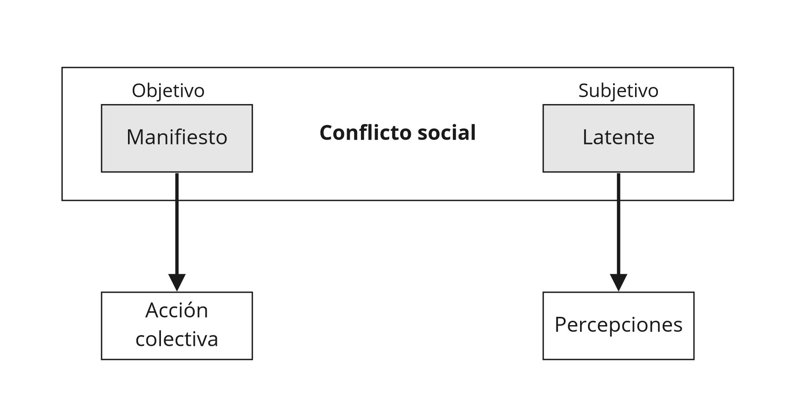
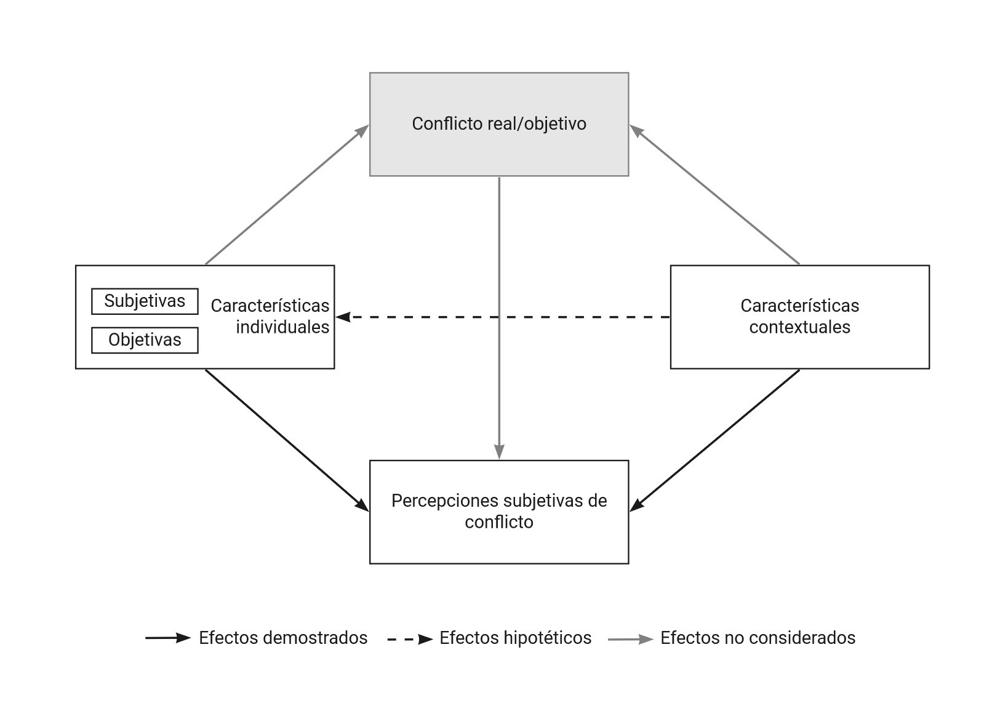

<div style="text-align: justify">
# Desigualdades y conflicto social: un marco analítico {#literature}

```{r echo=FALSE}
knitr::opts_chunk$set(out.width="80%", fig.pos = "!ht", out.extra = "")
```


## Percepciones subjetivas del conflicto social
<div style="text-align: justify">

> *"The distinction between «up» and «down» -or, as the English say, «Them» and «Us»- is one of the fundamental experiences of most men in society, and, moreover, it appears that this distinction is intimately connected with unequal distribution of power" ---(Dahrendorf, 1958, p. 176).* 

El conflicto social sin lugar a duda forma parte íntegra del pensamiento sociológico desde sus inicios, sin embargo, es un concepto controversial en su definición [@collinsConflictSociologySociological2009a]. Antes de entrar en el ámbito subjetivo del conflicto social, es preciso manejar una definición inicial del mismo. Para varios autores, el conflicto social se define estrictamente como una relación entre partes interdependientes con objetivos incompatibles o antagónicos[^5], en la que impera un principio de bienestar inverso para la consecución de estos objetivos -el logro de uno supone el detrimento del otro- [@finkConceptualDifficultiesTheory1968a; @kriesbergSociologySocialConflicts1973]. Complementario a esto, Wieviorka [-@wieviorkaSocialConflict2013a] enfatiza que el conflicto social es siempre una relación entre oponentes que comparten referencias culturales, por lo que es necesario que al menos exista una esfera de acción compartida por los actores, un principio de oposición en la que cada parte se define en relación con la otra y, en consecuencia, un principio de autoidentificación. Esto permite diferenciar al conflicto social de otras formas de conflicto, como la competencia o los conflictos bélicos, ya que se desarrolla esencialmente dentro de las sociedades o Estados naciones y las partes involucradas son grupos o colectividades sociales [@oberschallTheoriesSocialConflict1978;  @finkConceptualDifficultiesTheory1968a]. Esta última característica se vincula fuertemente con la teoría de la estratificación social en tanto la clasificación de estas unidades por lo general depende del lugar que ocupen en la estructura social [@collinsConflictSociologySociological2009a]. Así, en base a distintos consensos conceptuales, entenderé inicialmente al conflicto social como una relación de oposición en los objetivos, intereses o deseos de partes interdependientes, en la que a medida que aumentan las probabilidades de consecución de los objetivos de uno, disminuyen las de otro [@oberschallTheoriesSocialConflict1978]. Ahora bien, esta definición poco dice sobre las distintas expresiones que puede adoptar el conflicto social, por lo que es necesario revisarlas.

Los conflictos sociales poseen múltiples expresiones, las cuales pueden ser analíticamente diferenciadas a partir de los motivos o contenidos que originan el conflicto [@kriesbergConstructiveConflictsEscalation2012; @finkConceptualDifficultiesTheory1968a]. En la literatura, los motivos del conflicto social se han separado en dos grandes grupos [@bercovitchSageHandbookConflict2008; @cadarsoFundamentosTeoricosConflicto2001]. Por un lado, se encuentran los conflictos motivados por intereses distributivos, en donde las desigualdades materiales, de poder o de status juegan un rol central en la definición de pugnas en el eje vertical de la estructura social [@bercovitchSageHandbookConflict2008; @collinsConflictSociologySociological2009a]. Por otro lado, se sitúan los denominados conflictos «postmaterialistas o culturalistas», en donde priman las desigualdades y discriminaciones sobre características sociales adscriptivas, tales como la etnia, la raza o el género, que se ven expuestas a distintas situaciones de exclusión en el eje horizontal de la estructura social  [@kriesbergConstructiveConflictsEscalation2012; @inglehartCultureShiftAdvanced2018]. Esta división general de los motivos del conflicto ha generado una dicotomía entre los apodados conflictos tradicionales o verticales y los nuevos conflictos horizontales vinculados al resurgimiento de las protestas y movimientos sociales de finales de la década de 1960 [@langerHorizontalInequalitiesPostConflict2012; @touraineIntroductionStudySocial1985]. Sin embargo, la distinción entre los nuevos y viejos conflictos sociales es de un carácter más bien analítico antes que empírico puesto que los conflictos poseen, en distintos grados, una combinación de características y motivos tanto viejos como nuevos [@melucciSymbolicChallengeContemporary1985]. En ese sentido, la clasificación de los conflictos sociales responde a la predominancia de ciertos motivos -materialistas y/o valóricos- que los caracterizan [@dellaportaSocialMovementsIntroduction2006].

Con el resurgimiento de la conflictividad social en las últimas décadas, los conflictos relativos a temáticas redistributivas o materiales también han vuelto a adquirir relevancia, especialmente a luz del aumento de la desigualdad económica y las transformaciones tecnológicas y productivas en varios países [@dellaportaLateNeoliberalismIts2017a; @silverForcesLaborWorkers2003; @robertsChangingCourseLatin2014; @barkerMarxismSocialMovements2013]. A pesar de que gran parte de los estudios sociológicos recientes sobre el conflicto social se han centrado en las desigualdades y discriminaciones en el eje horizontal de la sociedad [@wieviorkaSocialConflict2013a], un número no menor de investigaciones continúan destacando la importancia de los conflictos distributivos o verticales en las sociedades capitalistas contemporáneas, sobre todo en aquellos países donde los niveles de tensión entre grupos que se organizan jerárquicamente en la estructura social han desembocado, en varias ocasiones, en ciclos de movilización y protesta [@hertelConflictPerceptions272019a; @dellaportaSocialMovementsIntroduction2006; @evansNewPoliticsClass2017; @bluhdornPoliticisationPostPoliticsNew2021a; @kerboSocialStratificationInequality2012]. Por ello, esta investigación se preocupa por analizar específicamente los conflictos verticales o distributivos, los cuales han ocupado un lugar primordial en las diversas corrientes y teorías sociológicas del conflicto social. 

Las teorías del conflicto social difícilmente son autónomas, ya que tienden a formar parte de una concepción global de la realidad y su funcionamiento [@cadarsoFundamentosTeoricosConflicto2001]. Desde el funcionalismo, Coser [-@coserSocialConflictTheory1957a] enfatiza que el conflicto no es algo estrictamente negativo, sino que al contrario forma parte de las estructuras sistémicas brindando solidaridad, innovación y estabilidad. Para Coser [-@coserContinuitiesStudySocial1967, p. 232] el conflicto social “es una lucha por los valores o las reivindicaciones de estatus, poder y recursos escasos”, distinguiéndose de los sentimientos de hostilidad o actitudes ya que siempre es una interacción real [@coserFunctionsSocialConflict1956]. En la tradición marxista, el conflicto social forma parte de su núcleo explicativo sobre las relaciones de clase y de producción; “la historia de todas las sociedades que han existido hasta nuestros días es la historia de las luchas de clases” [@marxManifestoCommunistParty1848, p. 31]. Los aportes de Marx han servido como fundamento de la teoría moderna del conflicto en la medida que define su origen a partir de los intereses contradictorios que se forman por las distintas relaciones de propiedad sobre los medios de producción [@marxCapital1975]. Así, la base socioeconómica del conflicto, sustentada en la dominación y explotación del trabajo que engendra la opresión de clases, da pie al reconocimiento de intereses antagónicos y la movilización [@wrightFoundationsNeoMarxistClass2005]. Por último, más cercano a la sociología weberiana, Dahrendorf [-@dahrendorfTheorySocialConflict1958a] sostiene que el conflicto no se reduce meramente a la producción, sino que descansa en toda relación social que implique una asimetría en la estructura de autoridad. De este modo, el conflicto social emerge de la relación entre dominantes y dominados, distinción íntimamente conectada con la distribución desigual del poder [@dahrendorfTheorySocialConflict1958a]. ¿Qué tienen en común estas corrientes?, que comprenden la raíz del conflicto social como la distribución estructuralmente desigual del poder [@kriesbergSociologySocialConflicts1973].

El vínculo entre la desigualdad y el conflicto social es ciertamente estrecho. Todas las sociedades modernas se caracterizan por poseer, en algún grado, una desigual distribución de recompensas materiales y simbólicas entre sus miembros [@cromptonClassStratification2008]. La desigualdad implica que distintas unidades sociales poseen diferentes cantidades o accesos sobre esos atributos, los cuales pueden ser riqueza, poder, propiedad u otros recursos de valor [@wrightInterrogatingInequalityEssays1994]. El concepto de estratificación social permite describir estas estructuras sistemáticas de la desigualdad [@cromptonClassStratification2008], o en otros términos, refiere al examen del proceso distributivo que busca responder a la pregunta sobre ¿quién tiene qué y por qué? [@lenskiPowerPrivilegeTheory1966]. Uno de los principales elementos que origina la institucionalización de la desigualdad es la distribución diferencial del poder[^6] [@lukesPowerRadicalView2004]. La organización del poder establece distintas localidades y jerarquías en la estructura social, en la medida que unos poseen la capacidad de ejercer poder para controlar las acciones de otro -autoridad- y/o para controlar la propiedad sobre los medios de producción y excluir a otros [@callinicosMakingHistoryAgency2004a]. Estas distintas posiciones, basadas en una relación de desigualdad, generan en consecuencia diferencias en los intereses, objetivos o deseos de quienes las ocupan, los cuales son susceptibles de entrar en conflicto cuando la estructura de dominación es deslegitimada -por ejemplo, ante la deprivación económica-  [@kriesbergSociologySocialConflicts1973], o bien, cuando estos intereses son incompatibles y solo pueden realizarse mediante cursos de acción que hagan chocar a los agentes -como por ejemplo, el uso de las capacidades estructurales de los trabajadores para movilizarse contra la explotación de los capitalistas- [@callinicosMakingHistoryAgency2004a]. De este modo, considerando al poder como un recurso desigualmente distribuido pero fundamental para definir las posiciones, capacidades e intereses en la estructura social, la relación entre la desigualdad y el conflicto social puede resumirse de la siguiente manera: “el conflicto es orgánico a la estructura de los mecanismos generadores de desigualdad” [@wrightInterrogatingInequalityEssays1994, p. 57].

Teniendo en cuenta estas definiciones básicas sobre el conflicto social y su vínculo con la desigualdad, es admisible introducir el marco general en el cual se sitúa esta investigación. Este marco se compone de dos premisas analíticas: primero, que el conflicto social puede expresarse en formas latentes [@kriesbergSociologySocialConflicts1973; @finkConceptualDifficultiesTheory1968a], y segundo, que su estudio descriptivo puede realizarse a escala subjetiva [@pondyOrganizationalConflictConcepts1967a; @kelleyClassClassConflict1995a]. Como se indica en la Figura \@ref(fig:fig1), el estudio del conflicto social a nivel descriptivo puede enfocarse en sus expresiones manifiestas, las cuales son objetivas y se han examinado, por ejemplo, en base a la acción colectiva [@tillyContentiousPolitics2015a], pero también puede enfocarse en sus expresiones latentes, alusivas al ámbito subjetivo de las relaciones antagónicas en la sociedad que pueden ser analizadas a través de las percepciones [@infanteSobreDefinicionConflicto1998a; @hadlerIstKlassenkonfliktUeberholt2003a]. 

```{r fig1, results='asis', out.width = '65%', echo = FALSE, fig.align = 'center', fig.cap="(ref:fig1)"}
 
```
(ref:fig1) Estudio descriptivo del conflicto social

El concepto de percepción se refiere al proceso cognitivo mediante el cual los individuos reciben o captan información y estimulos sobre su entorno, la cual es organizada mentalmente y expresada como descripción de lo captado [@bercovitchSageHandbookConflict2008, p. 8]. En ese sentido, las percepciones refieren al ejercicio subjetivo de describir lo observado, o en palabras de Janmaat [-@janmaatSubjectiveInequalityReview2013, p. 359]: “percepciones se refieren a las estimaciones subjetivas de la desigualdad existente (*i.e.* pensamientos sobre lo que *es*)”. Esto implica que el estudio de la percepción subjetiva del conflicto se sustenta en la descripción del conflicto social captado por los sujetos y, por ende, hace referencia a la realidad objetiva -remota e impersonal- de los intereses opuestos o antagónicos de los grupos sociales en pugna [@kelleyClassClassConflict1995a].

Como mencionó Pondy [-@pondyOrganizationalConflictConcepts1967a, p. 306], el conflicto social en un estado latente se asocia a las condiciones estructurales de desigualdad que generan intereses contradictorios, y la percepción de este conflicto se sitúa en el ámbito o fase cognitiva de su desarrollo. Así, autores como Collins [-@collinsConflictSociologySociological2009a] y Kriesberg [-@kriesbergSociologySocialConflicts1973] sostuvieron que un aspecto fundamental de los conflictos sociales es la percepción del mismo, la cual puede darse cuando existan situaciones objetivas de conflicto, es decir, o bien cuando la incompatibilidad de intereses exista pero las partes no sean conscientes de ello (*i.e.* conflicto latente). La introducción de la dimensión latente del conflicto social amplía la definición inicial del mismo expuesta anteriormente ya que, contrario a lo que comúnmente se establece, el conflicto social no englobara únicamente relaciones manifiestas, sino que también las incompatibilidades o antagonismos subyacentes entre grupos sociales [@kriesbergConstructiveConflictsEscalation2012]. De este modo, y siguiendo la definición de Fink [-@finkConceptualDifficultiesTheory1968a, p456], entenderé conceptualmente al conflicto social como todas aquellas relaciones de oposición en los objetivos, intereses o deseos “en el que dos o más entidades sociales están vinculadas por al menos una forma de relación psicológica antagónica o al menos una forma de interacción antagónica” (_traducción propia_). Conectando esta definición con el concepto de percepción, podemos definir que la percepción de conflicto social se refiere a cómo los sujetos captan/describen un conflicto social determinado entre dos grupos verticalmente organizados que poseen intereses contrapuestos. De tal manera, indica en un sentido sociológico “la medida en que los individuos experimentan su entorno como caracterizado por tales relaciones antagónicas” [@hertelConflictPerceptions272019a, p. 2].


```{r fig2, results='asis', out.width = '75%', echo = FALSE, fig.align = 'center', fig.cap="(ref:fig2)"}

```
(ref:fig2) Diagrama conceptual

Las percepciones de conflicto social son la variable dependiente de esta investigación y serán medidas como una agregación de distintas escalas de conflicto percibido entre grupos sociales verticalmente estructurados. Las investigaciones relacionadas generalmente utilizan categorías sociales contrapuestas como: ricos y pobres, trabajadores y empresarios, clase media y clase trabajadora, los de abajo y los de arriba. El sentido de orden vertical es fundamental para dar cuenta de que hay grupos poseedores y grupos desposeídos, mientras que el elemento de conflicto social permite enfatizar oposiciones de intereses manifiestos o subyacentes entre estos grupos [@kelleyClassClassConflict1995a]. Esta forma de medición de las percepciones de conflicto social se ha utilizado frecuentemente en la literatura, sea como variable dependiente principal o bien como un componente de un concepto teórico más grande, como por ejemplo, la conciencia de clase [cf. @hadlerSocialConflictPerception2017a; @hertelConflictPerceptions272019a; @perezEncontrandoQueNunca2013a; @perezClassConsciousnessMature2014a; @robisonClassPicturesCitizens2018a; @wrightClassCountsComparative1997a].

De acuerdo con el cuerpo teórico y empírico de la literatura de las percepciones de conflicto social, estas se verían influenciadas por tres dimensiones: (i) la ocurrencia de conflictos reales[^7], (ii) las características individuales y (iii) las características contextuales [@hadlerIstKlassenkonfliktUeberholt2003a], tal como indica la Figura \@ref(fig:fig2). A nivel individual, se establece que las actitudes subjetivas, como la desigualdad percibida o el estatus social, y las condiciones objetivas de los sujetos, como la clase social o el ingreso, determinan en buena medida las percepciones de conflicto [@hadlerIstKlassenkonfliktUeberholt2003a; @hertelConflictPerceptions272019a; @kelleyClassClassConflict1995a; @edlundDemocraticClassStruggle2015a]. De igual manera, las características contextuales de los países, como por ejemplo el nivel de desigualdad económica o el grado de redistribución del gobierno, influyen en las percepciones de conflicto social en tanto dan forma al desarrollo y carácter del conflicto [@edlundDemocraticClassStruggle2015a; @delheyPerceptionGroupConflicts2008b; @hadlerSocialConflictPerception2017a]. Estas perspectivas de análisis a nivel individual y de tipo macro/micro orientan la presente investigación, enfocándose empíricamente en la posición de clase y la participación en organizaciones intermedias a nivel individual, y en la desigualdad económica y los marcos institucionales de los países a nivel contextual. Ahora, resta comprender cómo estas dimensiones afectan a las percepciones de conflicto social en los apartados siguientes. 

[^5]: En esta investigación no estableceré distinciones conceptuales entre antagonismo y oposición en vista de que la primera es de un contenido filosófico-político más diverso. Para discusiones y definiciones sobre estos conceptos ver Mouffe, C. [-@mouffeTornoPolitico2007]. En torno a lo político. Buenos Aires: Fondo de cultura económica

[^6]: Entenderé el concepto de poder bajo la noción clásica de Max Weber [-@weberEconomiaSociedad1944], quien realiza una distinción entre: (i) el *poder sobre* como la probabilidad de imponer la propia voluntad sobre una relación social, aún contra toda resistencia y cualquiera sea el fundamento de esa probabilidad, y (ii) el *poder para* concebido como la capacidad de realizar determinados intereses y deseos. 

[^7]: El posible efecto de los conflictos objetivos o manifiestos no será considerado en esta investigación, como se detalla en la Figura \@ref(fig:fig2), debido a que se escapa del marco de análisis presentado. 


## Posición de clase y percepciones de conflicto social
<div style="text-align: justify">

> *"To say that «class counts», then, is to claim that the distribution of rights and powers over the basic productive resources of a society have significant, systematic consequences at both the micro- and macro-levels of social analysis." ---(Wright, 2005, p. 22).* 

El carácter vertical de las percepciones de conflicto social supone que estos conflictos se desarrollan, principalmente, por motivos distributivos sobre dos áreas de la vida social: en el mercado y la producción [@hertelConflictPerceptions272019a; @kelleyClassClassConflict1995a; @hadlerSocialConflictPerception2017a]. En ese sentido, los conflictos redistributivos (por ejemplo la repartición de la riqueza) tienen importantes consecuencias sobre grupos como los ricos y los pobres, mientras que los conflictos sobre la organización del trabajo o mejoras salariales conciernen sustancialmente a la clase trabajadora y a los empresarios [@hadlerIstKlassenkonfliktUeberholt2003a]. Desde los estudios sobre desigualdades y estratificación social, las perspectivas relacionales del análisis de clase se enfocan en estas dos áreas para explicar tanto el origen de las clases sociales como los motivos del conflicto social, destacando las escuelas neoweberianas y neomarxistas [@cromptonClassStratification2008]. Los primeros, tienen un énfasis característico sobre las oportunidades de vida para la definición de las clases y los consiguientes conflictos en la esfera del mercado [@breenFoundationsNeoWeberianClass2005]. Mientras que los segundos, además de considerar las oportunidades de vida y las disputas en el mercado, dan más importancia a las relaciones de explotación para la determinación de las clases y a los conflictos desarrollados en la producción [@wrightUnderstandingClass2015]. De tal manera, en esta investigación se adopta una perspectiva de clases neomarxista por su mayor capacidad explicativa para abordar las percepciones de conflicto social.

En la perspectiva de análisis de clases neomarxista, las relaciones de poder y derechos de propiedad jurídica ocupan un rol central puesto que permiten el control efectivo sobre determinados recursos económicos. Según Wright [-@wrightUnderstandingClass2015], el mecanismo principal que posibilita las relaciones de propiedad sobre los recursos productivos son las estructuras de acaparamiento de oportunidades. Estas estructuras se entienden como las diversas formas que tienen algunos grupos de reservarse determinadas posiciones sociales o recursos escasos excluyendo a otros grupos en la esfera del mercado, conocido generalmente como cierre social [@wrightUnderstandingClass2015; @breenFoundationsNeoWeberianClass2005]. Ahora bien, el mecanismo principal que define a las clases sociales según los marxistas son las relaciones de dominación y explotación [@wrightFoundationsNeoMarxistClass2005]. Ambos elementos son constitutivos de las relaciones de clase en tanto dan cuenta de las formas en las que se controla la actividad de un otro -dominación- y el logro de beneficios económicos de la actividad laboral de las personas dominadas -explotación- [@wrightUnderstandingClass2015]. Así, el mecanismo de acaparamiento se centra fundamentalmente en las *condiciones* económicas similares que se forman por la exclusión y control efectivo sobre recursos productivos en el mercado, los cuales Wright [-@wrightClases1994] caracteriza como relaciones de propiedad sobre: (i) los medios de producción, (ii) bienes de cualificación y (iii) bienes de organización o autoridad. Mientras que el mecanismo de explotación se centra principalmente en las *actividades* que desarrollan los individuos favorecidos o desfavorecidos por las estructuras de acaparamiento en la esfera productiva. De tal modo, Wright [-@wrightClases1994, p.80] define a las clases sociales como "las posiciones dentro de las relaciones sociales de producción[^8] que se derivan de las relaciones de propiedad determinantes de las pautas de explotación" . En ese sentido, las posiciones de clase se originan según las distintas formas de explotación que emanan de determinadas relaciones de propiedad sobre los activos productivos, integrando así los mecanismos de acaparamiento de oportunidades junto a los mecanismos de explotación para dar forma a las clases [@wrightUnderstandingClass2015].

El enfoque en las relaciones de explotación es lo que diferencia fundamentalmente a la tradición neomarxista de la neoweberiana sobre la definición de las clases [@breenFoundationsNeoWeberianClass2005; @wrightFoundationsNeoMarxistClass2005]. Para los neoweberianos, el acaparamiento de oportunidades de vida es el mecanismo que da origen a las clases sociales [@breenFoundationsNeoWeberianClass2005]. Bajo este esquema, las posiciones de clases se definen por las interacciones económicas racionales que se desarrollan en la esfera del mercado [@weberEconomiaSociedad1944]. En el mercado se definen los mecanismos de control efectivo que establecen los individuos sobre activos económicos a partir del poder, y este vínculo genera diferentes *situaciones de clase*, oportunidades de vida e intereses materiales compartidos por sus miembros según lo que poseen [@breenFoundationsNeoWeberianClass2005; @goldthorpeServiceClassIts1982]. Por su parte, los neomarxistas resaltan que, si bien las relaciones de propiedad sobre los activos productivos son mecanismos de acaparamiento que generan condiciones económicas similares -la ventaja de uno se da por la exclusión de otro-, la perspectiva marxista añade el elemento de la explotación como desigualdad relacional basada en la actividad de las personas -el bienestar de una persona se obtiene a *expensas* de otra- [@wrightFoundationsNeoMarxistClass2005]. Esto implica que su centro de análisis sea la esfera de la producción antes que el mercado puesto que no se interesa sólo por lo que la gente *posee*, sino que también por lo que *hace* para lograr tener lo que posee [@wrightUnderstandingClass2015]. Así, las distinciones que establece el esquema de Wright para la construcción de las clases dan cuenta de, por un lado, las diferentes combinaciones de la posesión o desposesión de los activos productivos y, por el otro, de múltiples situaciones de explotación en base a la apropiación de los beneficios económicos de la actividad de las personas dominadas por dichas relaciones de propiedad [@wrightClases1994]. 

Dado que las clases se estructuran por la explotación, los intereses materiales de los individuos se originan fundamentalmente -aunque no únicamente- en la esfera de la producción. Los intereses materiales derivan de las posiciones de clase y se refieren a los dilemas y transacciones a los que se enfrentan las personas para la consecución del bienestar económico [@wrightClases1994]. La obtención del bienestar económico implica que, bajo un supuesto racional, cada individuo busca realizar sus intereses materiales -opciones de trabajo, consumo y ocio- mediante una serie de actividades en un sistema de producción dado [@wrightFoundationsNeoMarxistClass2005]. Así, el elemento conflictivo de la teoría marxista de las clases reside en el carácter causal de la explotación puesto que define estructuras de “intereses antagónicos e interdependientes en la que los logros de los intereses de los explotadores dependen de su capacidad de perjudicar a los explotados” [@wrightFoundationsNeoMarxistClass2005, p.28]. Esta manera de comprender la generación de intereses antagónicos distingue fundamentalmente a las teorías weberianas de las marxistas sobre los espacios donde se desarrolla el conflicto social. Para los primeros, las oportunidades de vida implican intereses comunes entre sus miembros que pueden entrar en conflicto por la distribución de recursos materiales y simbólicos en el mercado, en tanto es la fuente de las desigualdades de acaparamiento de oportunidades [@breenFoundationsNeoWeberianClass2005]. En cambio, para los segundos la consecución de los intereses materiales está relacionalmente condicionada, a través de la explotación, a los intereses de otras clases originándose los conflictos principalmente en la producción, sin obviar los conflictos por la distribución [@wrightUnderstandingClass2015]. Esta distinción es, según Wright [-@wrightFoundationsNeoMarxistClass2005], una de las principales fortalezas del esquema marxista puesto que permite explicar el conflicto social tanto en sus ámbitos de mercado como de producción al integrar ambos mecanismos que dan origen a las clases.

Ahora, ¿cómo la clase social determina percepciones subjetivas de conflicto? El argumento central de este vínculo es que, si la clase es explicativa de una serie de fenómenos empíricos objetivos y subjetivos, lo es por cómo los mecanismos de clase generan intereses materiales, experiencias de vida y acciones de clase que los afectan [@wrightClassCountsComparative1997a; @kallebergComparativePerspectivesWork1988a; @kelleyClassClassConflict1995a; @svallforsMoralEconomyClass2006a]. En la explicación neomarxista se sostiene que la posición de clase delimita un conjunto de oportunidades y experiencias compartidas por sus miembros, las cuales forman una visión subjetiva del mundo [@wrightFoundationsNeoMarxistClass2005]. Esto se debe a un conjunto de micro mecanismos que al combinarse producen tales efectos, estos son: (i) los intereses materiales derivados de la posición de clase, (ii) las experiencias de vida compartidas de clase, entendidas como las formas en que los intereses materiales asientan un conjunto de experiencias sistemáticas que configuran activamente su comprensión común subjetiva, y (iii) su capacidad de acción colectiva [@wrightClassCountsComparative1997a]. Atendiendo a la relación entre los primeros dos mecanismos, puede sostenerse que el puente que conecta a la posición de clase con los fenómenos subjetivos, tales como actitudes y percepciones, son los intereses materiales que se derivan, precisamente, de las relaciones de explotación y de propiedad que dan origen a las clases [@wrightFoundationsNeoMarxistClass2005]. De tal modo, el vínculo entre la posición de clase y las percepciones de conflicto social se sustentaría en los intereses materiales que portan los individuos que, como se señaló, son de un carácter eminentemente antagónicos y, por ende, conflictivos. Así, teóricamente la clase sería explicativa de las percepciones de conflicto social en la medida que los mecanismos de explotación y exclusión que dan lugar a las clases forman intereses materiales contrapuestos que son captados subjetivamente por los individuos. 

Gran parte de los trabajos empíricos que examinan el rol de la posición de clase sobre las percepciones de conflicto social han concluido que, aunque otros factores subjetivos tales como opiniones o actitudes puedan ser más preponderantes, el efecto de la clase social continúa siendo relevante por lo que no puede ser desestimada del análisis subjetivo del conflicto [cf. @delheyPerceptionGroupConflicts2008b; @edlundDemocraticClassStruggle2015a; @hadlerIstKlassenkonfliktUeberholt2003a; @hadlerSocialConflictPerception2017a; @kelleyClassClassConflict1995a; @perezEncontrandoQueNunca2013a]. A nivel comparado, destacan investigaciones como la de Edlund & Lindh [-@edlundDemocraticClassStruggle2015a] y de Hadler [-@hadlerIstKlassenkonfliktUeberholt2003a] que analizan la influencia de la posición objetiva de clase sobre las percepciones de conflicto social con el esquema neoweberiano de Goldthorpe [@goldthorpeServiceClassIts1982]. Según sus hallazgos, existiría una tendencia a que: (i) las posiciones de clase más bajas, como los trabajadores manuales y los no calificados, percibirán más conflicto en comparación a las demás clases, (ii) que las posiciones más altas tales como los profesionales altamente calificados y propietarios perciben menos conflicto que las clases más bajas, pero (iii) perciben más conflicto social que las posiciones de clase asociadas típicamente a los grupos medios, como profesionales menos cualificados y no manuales. Estas diferencias se explicarían fundamentalmente por los grados en los cuales las distintas clases ven comprometidos sus intereses materiales. En ese sentido, tanto las clases más bajas como las más altas tenderían a percibir más conflicto debido a que las principales ventajas de las últimas se dan en razón de la exclusión de las primeras, mientras que las clases medias tendrían un rol más ambivalente a la hora de identificar conflictos entre grupos polarizados [@hadlerIstKlassenkonfliktUeberholt2003a]. 

En Chile, la investigación de Pérez [-@perezEncontrandoQueNunca2013a] analiza las percepciones de conflicto entre trabajadores y directivos de empresa mediante el mismo esquema neoweberiano de clases. Sus resultados demuestran que la posición de clase es un importante predictor de las percepciones de conflicto y que dichas percepciones son distintas según la categoría de clase, confirmando la tendencia identificada a nivel comparado en donde las clases más desfavorecidas perciben mayor conflicto que las más privilegiadas. Sin embargo, en Chile las posiciones de clases de servicios baja o de rutina no manual, caracterizados como grupos medios, perciben más conflicto que las clases propietarias y profesionales. Esto, posiblemente estaría asociado a que dichos grupos medios experimentan exclusiones más decisivas, como las restricciones para obtener cualificaciones y empleos deseables, que asemejan sus condiciones económicas con las clases ocupacionales más bajas y las distancian de las más altas [@perezEncontrandoQueNunca2013a]. Así, considerando estos antecedentes teóricos y empíricos, se plantea la primera hipótesis de nivel individual de esta investigación: 

$H_{1}$: Individuos de clase trabajadora tenderán a percibir mayores conflictos sociales que los individuos de clase capitalista, mientras que los individuos clases medias percibirán comparativamente menos conflicto que las clases anteriores. 

[^8]: Los individuos que participan en la producción poseen diferentes tipos de derechos jurídicos y poderes sobre los medios y resultados de la misma. El conjunto de estos derechos y poderes constituyen las relaciones sociales de producción [@wrightFoundationsNeoMarxistClass2005, p. 10].

## Desigualdad económica y percepciones de conflicto social
<div style="text-align: justify">

El resurgimiento de la conflictividad social en los últimos años, especialmente después de la crisis financiera del 2008, se ha caracterizado por una fuerte y renovada crítica contra las desigualdades sociales en varios países del mundo, como las movilizaciones de Wall Street en Estados Unidos, los Indignados en España, los Giles Jaunes en Francia o el Estallido Social en Chile [@dellaportaLateNeoliberalismIts2017a; @sommaSocialMovementsLatin2020]. Un elemento común a estos conflictos es que, en base al descontento, las desigualdades se han re-politizado y los clivajes verticales han vuelto a la palestra al contrastarse los altos niveles de desigualdad económica y la excesiva concentración de la riqueza en el 1% de la población; “We are the 99%” decía el famoso slogan de Wall Street [@bluhdornPoliticisationPostPoliticsNew2021a]. Como han destacado varios analistas, desde 1980 hasta la fecha la desigualdad económica se ha incrementado dramáticamente tanto dentro como entre países [@milanovicGlobalInequalityNew2016a; @keeleyIncomeInequalityGap2015; @kenworthyRisingInequalityPolitics2005]. Lo que principalmente ha empujado este aumento ha sido el crecimiento de las diferencias de ingresos promedios dentro de los países y el acaparamiento de la riqueza por pequeños segmentos de la población en países desarrollados como en aquellos en vías de desarrollo [@milanovicGlobalInequalityNew2016a]. Esto ha conducido, entre otras razones, a una preocupación generalizada en la investigación sociológica por las polarizaciones sociales, los grados de desconfianza social y deslegitimación política que produce la desigualdad económica [@andersenPolarizingEffectEconomic2012a]. Así también, la desigualdad económica se ha vuelto un punto común para analizar los conflictos sociales, ya sea en sus formas manifiestas, como por ejemplo mediante las acciones contenciosas ante las deprivaciones materiales [@tillyContentiousPolitics2015a], o en sus formas latentes a través de las percepciones subjetivas sobre la desigualdad y el conflicto [@hadlerSocialConflictPerception2017a; @hertelConflictPerceptions272019a]. 

Las principales causas del incremento de la desigualdad económica se han asociado a la expansión de la globalización, los cambios tecnológicos y productivos con la flexibilización y precarización laboral, y a una retirada generalizada de las políticas de seguridad social en varios países [@bradyEconomicGlobalizationIncreasing2009a; @milanovicGlobalInequalityNew2016a; @salverdaIntroduction2011b]. La investigación específica sobre la desigualdad económica se ha concentrado en dos componentes para definirla: por un lado, las diferencias de ingresos entre los núcleos familiares y, por el otro, la repartición/concentración de la riqueza entre segmentos poblacionales [@salverdaIntroduction2011b]. Al respecto, un diagnóstico compartido es que a pesar del crecimiento económico sostenido por varios países luego de la introducción de políticas neoliberales [@bradyEconomicGlobalizationIncreasing2009a; @coburnIncomeInequalitySocial2000], se han incrementado las distancias sociales entre los grupos más ricos y el resto de la población dentro de los países [@andersenPolarizingEffectEconomic2012a]. Sin embargo, en las últimas décadas lo que ha caracterizado a la desigualdad económica no es solo su incremento *dentro* de las naciones, sino más bien *entre* ellas, llegando a constituirse como un fenómeno de desigualdad global [@milanovicGlobalInequalityNew2016a; @bradyConsequencesEconomicGlobalization2007]. Así, por ejemplo, para el 2014 menos del 50% de la población global poseía conjuntamente menos del 1% de la riqueza mundial, mientras que el 10% más rico poseía el 87% de los activos y el 1% casi la mitad de todos los activos del mundo [@keeleyIncomeInequalityGap2015]. Con todo, la desigualdad económica es un fenómeno a escala global que ha incrementado las diferencias de ingresos dentro de los países generando distancias entre grupos sociales, y también ha crecido extensivamente entre países adaptándose a sus estructuras económicas e institucionales [@keeleyIncomeInequalityGap2015].

¿Cómo estos contextos económicos afectan percepciones subjetivas? Si bien no existe un consenso para explicar el efecto de la desigualdad económica sobre diversas actitudes y percepciones subjetivas ya que se cuestiona su causalidad, distintas teorías sociológicas han postulado ciertos mecanismos para explicitar un vínculo estructural entre el contexto y las percepciones subjetivas [@keeleyIncomeInequalityGap2015; @kallebergComparativePerspectivesWork1988a]. Al respecto, destacan las teorías del riesgo y la deprivación relativa, las cuales subrayan las condiciones económicas/objetivas como importantes puntos de referencia para las percepciones. Como postula la teoría del riesgo, los individuos poseen cierta racionalidad inmediata sobre sus condiciones económicas, y cuando estas se ven amenazadas o dispuestas a sufrir cambios abruptos la percepción del riesgo aumenta derivando en, por ejemplo, defender sus intereses materiales ante la ampliación de la desigualdad económica [@fraileCorrespondenceObjectiveSubjective2014]. Más cercana a las teorías del conflicto social, la deprivación relativa enfatiza que a medida que las condiciones materiales (lo que es) desfavorece los intereses de ciertos grupos sociales (lo que debería ser) se generan discordancias que los impulsan a realizar acciones o mantener estados conflictivos entre poseedores y desposeídos [@tillyDurableInequality2009; @oberschallTheoriesSocialConflict1978]. Así, por ejemplo, cuanto más grande es la disparidad económica mayor sería la incompatibilidad de intereses y visiones conflictivas sobre la distribución de recursos entre grupos jerárquicos como ricos y pobres [@oberschallTheoriesSocialConflict1978]. De acuerdo con estos enfoques, los individuos responderían a las condiciones de desigualdad económica cuando afecta la realización de sus intereses, o bien, cuando sus condiciones materiales se ven mermadas [@kriesbergSociologySocialConflicts1973; @salverdaIntroduction2011b]. De tal modo, al establecer que la desigualdad económica posee una influencia estructural o condicionante sobre visiones subjetivas, se sostiene el argumento sociológico respecto a que las percepciones de los individuos reflejan los contextos en los que viven [@andersenPublicOpinionIncome2012; @bowlesBowles1998Endogenous1998; @goodinOxfordHandbookPolitical2006].

En la medida que existan altas diferencias de ingresos y concentración de la riqueza, los individuos tenderían a percibir a distintos grupos jerárquicos de forma conflictiva [@hertelConflictPerceptions272019a; @delheyPerceptionGroupConflicts2008b; @hadlerSocialConflictPerception2017a]. Esto se debe a que, en tanto la desigualdad económica posibilita o dificulta la capacidad de realizar ciertos intereses y afecta las condiciones materiales [@salverdaIntroduction2011b], cuando se presentan amplias brechas económicas entre grupos sociales la oposición de intereses sería más palpable, facilitando la polarización social [@andersenPolarizingEffectEconomic2012a; @hertelConflictPerceptions272019a; @hadlerIstKlassenkonfliktUeberholt2003a; @milanovicHavesHaveNotsBrief2011a]. Asimismo, la desigualdad económica reproduce las ventajas y desventajas sociales, afectando las expectativas de igualdad y reconocimiento [@fraserRedistributionRecognitionPoliticalphilosophical2003]. De acuerdo con la literatura de la confianza social, la distribución de recursos y oportunidades juegan un rol clave para establecer si los individuos comparten algún destino y si tienen valores sociales similares [@rothsteinAllAllEquality2005b]. Así, la conflictividad social plantearía un sentido inverso en donde la desigual distribución de recursos y oportunidades puede acrecentar las diferencias sociales y oponer a grupos que perciben sus intereses como incompatibles [@collinsConflictSociologySociological2009a]. Como se mencionó, el concepto de percepción refiere a una estimación subjetiva del entorno de los individuos [@janmaatSubjectiveInequalityReview2013], por lo que es plausible sostener que a medida que aumentan las desigualdades económicas, el contexto generado por las dificultades materiales asociadas al consumo, la deprivación económica y la distancia entre grupos sociales pueda influir en la estimación subjetiva del conflicto social [@hertelConflictPerceptions272019a; @hadlerIstKlassenkonfliktUeberholt2003a; @kelleyClassClassConflict1995a]. 

En las investigaciones empíricas sobre las percepciones de conflicto social, el nivel de desigualdad económica es una dimensión habitual de análisis debido a las conexiones teóricas expuestas [@hadlerIstKlassenkonfliktUeberholt2003a]. La influencia de la desigualdad económica sobre el conflicto percibido genera tres hallazgos principales: (i) un aumento general de las percepciones de conflicto social, (ii) variaciones contextuales entre países y (iii) variaciones dentro de los países como efecto de interacción sobre la relación entre la clase social y la percepción de conflicto. Primero, se ha demostrado en reiterados estudios una asociación positiva entre el aumento de la desigualdad económica y mayores niveles de percepciones de conflicto social, siendo inclusive el factor objetivo más importante [@hertelConflictPerceptions272019a; @delheyPerceptionGroupConflicts2008b; @hadlerSocialConflictPerception2017a; @edlundDemocraticClassStruggle2015a; @delheyWhyInequalityMakes2014b]. Por ejemplo, la investigación de Hadler [-@hadlerSocialConflictPerception2017a] establece que por cada punto que aumenta el índice de Gini, los cambios promedios en las percepciones de conflicto aumentan en .023 puntos en siete países anglosajones entre 1987 y 2009. Por su parte, Delhey & Keck [-@delheyPerceptionGroupConflicts2008b] demuestran que para 28 países europeos[^9] esta relación es positiva y se incrementa en .09 puntos promedios, mucho más que los resultados de Hadler [-@hadlerSocialConflictPerception2017a]. Más recientemente, Hertel & Schöneck [-@hertelConflictPerceptions272019a] analizan 27 países de distintas regiones y concluyen que el efecto de la desigualdad económica es cercano a un aumento de .09 puntos promedio en las percepciones de conflicto social, controlando por otros indicadores económicos como el GDP per capita entre 1999 y 2009. En pocas palabras, las percepciones de conflicto social aumentan a medida que crece la desigualdad económica en la mayoría de los países que han sido estudiados hasta ahora. En base a estos antecedentes, se establece la siguiente hipótesis de nivel contextual: 

$H_{2a}$: Mayores niveles de desigualdad económica aumentarán las percepciones de conflicto social en los individuos

Segundo, si bien el efecto de la desigualdad económica es general, también se han demostrado variaciones importantes entre países [@hertelConflictPerceptions272019a; @delheyPerceptionGroupConflicts2008b; @hadlerSocialConflictPerception2017a; @whitefieldSocialInequalityAssessments2013a]. En aquellos países donde hay baja desigualdad económica las percepciones de conflicto social tienden a ser menores, mientras que en países donde existen altos niveles de desigualdad económica estas percepciones son mucho mayores [@edlundDemocraticClassStruggle2015a; @hadlerSocialConflictPerception2017a]. Esto sugiere que buena parte de la variación observada entre países respecto a las percepciones de conflicto se debe a sus diferencias sobre la desigualdad económica, la cual es cercana al 19% [@edlundDemocraticClassStruggle2015a]. En esta misma línea, Delhey & Keck [-@delheyPerceptionGroupConflicts2008b] señalan que el efecto de la desigualdad económica sobre las percepciones de conflicto no es parejo entre los países europeos, puesto que naciones como Dinamarca poseen bajos niveles de percepción de conflicto y de desigualdad económica, mientras que países como Hungría perciben altos grados de conflicto social a pesar de su baja desigualdad económica. Algunas de las principales razones de estas variaciones se deben a los distintos niveles de desigualdad de ingresos y concentración de la riqueza que experimentan las clases sociales dentro de los países -lo cual además se asocia con sus respectivas estructuras de clases-, así como también por los marcos institucionales que mitigan el efecto de la desigualdad económica y dan forma a la traducción institucional del conflicto (sección siguiente) [@delheyPerceptionGroupConflicts2008b; @edlundDemocraticClassStruggle2015a; @hadlerIstKlassenkonfliktUeberholt2003a; @hadlerSocialConflictPerception2017a]. En suma, la relación entre el nivel de desigualdad económica y las percepciones de conflicto social varían sustancialmente entre países, por lo que son estratificadas principalmente según los contextos nacionales antes que por las diferencias de clases internas en cada país [@delheyPerceptionGroupConflicts2008b]. 

Por último, los niveles de desigualdad económica también afectan la relación entre la clase social y las percepciones de conflicto social [@edlundDemocraticClassStruggle2015a]. Como se mencionó anteriormente, las distintas categorías de clase perciben de diferente manera el conflicto social [@hadlerIstKlassenkonfliktUeberholt2003a; @hadlerSocialConflictPerception2017a]. Existen pocas investigaciones que lidien con hacer dialogar esa relación con la influencia del contexto, sin embargo, los antecedentes que aportan Edlund & Lindh [-@edlundDemocraticClassStruggle2015a] y Andersen & Curtis [-@andersenSocialClassEconomic2015a] permiten plantear posibles interacciones. Estos últimos, analizan el rol de la desigualdad económica sobre la relación entre la posición de clase y las preferencias sobre el rol del gobierno en la economía en 24 países. Sus resultados indican que en países donde existe alta desigualdad económica las distintas clases sociales tienden a converger en sus preferencias políticas (i.e a favor de la intervención del gobierno), mientras que cuando la desigualdad económica es baja se pueden observar nítidamente las diferencias entre clases [@andersenSocialClassEconomic2015a]. De modo similar, Edlund & Lindh [-@edlundDemocraticClassStruggle2015a] revisitan la tesis sobre la democratización de la lucha de clases de Walter Korpi en 19 países y concluyen que: (i) los países con baja desigualdad económica tienden a desarrollar mayores percepciones de conflicto político (redistributivos) antes que sociales, (ii) países con alta desigualdad económica poseen mayores niveles de percepción sobre conflictos sociales en vez de políticos y (iii) que las diferencias de clase sobre las percepciones de conflicto político disminuyen ante bajos niveles de desigualdad económica. Al respecto, parece admisible plantear una relación inversa, es decir, que las diferencias de clase sobre las percepciones de conflicto social se acrecientan a medida que aumenta la desigualdad económica. Así, en base a estos antecedentes se plantea la siguiente hipótesis de interacción entre niveles: 

$H_{2b}$: A mayores niveles de desigualdad económica los individuos de clase trabajadora percibirán más conflicto social e individuos de clase capitalista percibirán menores conflictos. En suma, las diferencias de clase se acrecentaran. 

[^9]: Delhey & Keck [-@delheyPerceptionGroupConflicts2008b] estudiaron países como: Dinamarca, Finlandia, Suecia, Irlanda, Reino Unido, Países Bajos, Austria, Bélgica, Francia, Alemania, Luxemburgo, Grecia, Italia, Portugal, España, Chipre, Malta, Eslovenia, República Checa, Hungría, Polonia, Eslovaquia, Estonia, Letonia, Lituania, Bulgaria, Rumanía y Turquía.

## Marcos institucionales y percepciones de conflicto social
<div style="text-align: justify">

En esta sección se piensa desarrollar un marco analítico para la comparación institucional entre países buscando responder a la pregunta: ¿cómo las estructuras institucionales asociadas a la coordinación económica y las políticas laborales influyen en las percepciones de conflicto social? Para ello, se recurrirá a definiciones teóricas provenientes de la teoría de las variedades de capitalismo enfocándose en el grado de coordinación salarial como elemento que permite distinguir entre distintos tipos de economías políticas y arreglos institucionales [@kenworthyQuantitativeIndicatorsCorporatism2003a]. La explicación del vínculo entre los análisis institucionales y fenómenos subjetivos serán desarrolladas el segundo semestre. De momento, me limito a presentar algunas definiciones teóricas necesarias para comprender los antecedentes empíricos y el planteamiento de las hipótesis. 

A nivel contextual, las percepciones de conflicto social no son afectadas únicamente por la desigualdad económica, sino que también por las estructuras institucionales que poseen los países en donde ocurren [@hadlerIstKlassenkonfliktUeberholt2003a]. Aunque los niveles de conflicto percibido han demostrado ser, en promedio, moderados y/o fuertes en  los países analizados [@hertelConflictPerceptions272019a], también es cierto que estos niveles difieren entre cada país puesto que algunos exhiben mayores percepciones de conflicto que otros [@delheyPerceptionGroupConflicts2008b; @hadlerSocialConflictPerception2017a]. Uno de los principales elementos que explicarían estas variaciones serían las estructuras institucionales. Tal como puntualizan Edlund & Lindh [-@edlundDemocraticClassStruggle2015a], en los análisis comparados es necesario considerar factores como la extensión del Estado de Bienestar, el sistema de relaciones industriales y el grado de participación en las políticas económicas para comprender de manera integrada cómo y por qué estas percepciones varían entre países. Esto, bajo el entendido de que la existencia de determinadas configuraciones institucionales asientan condiciones para el desarrollo del conflicto social y, posiblemente, afecten a su percepción [@hadlerIstKlassenkonfliktUeberholt2003a; @edlundDemocraticClassStruggle2015a]. Según la literatura, son fundamentales los marcos institucionales que se relacionan directamente con la performance económica de los Estados de bienestar y con el nivel de organización tripartita en la definición de políticas laborales [@delheyPerceptionGroupConflicts2008b; @hadlerSocialConflictPerception2017a; @ringqvistHowUnionMembership2020a]. De este modo, en esta investigación el análisis de la influencia de los factores institucionales sobre las percepciones de conflicto social se guía bajo estas dos características contextuales: la extensión del Estado de bienestar y el grado de coordinación de las políticas laborales de los países.

En las investigaciones comparadas sobre las percepciones de conflicto social aparece frecuentemente la importancia de las políticas corporativistas como condicionante del conflicto. Una forma de aludir al fenómeno político del corporativismo es mediante ciertas características de los Estados de bienestar, como por ejemplo, el nivel de gasto social, el grado de redistribución per cápita del producto interno bruto (GDP en inglés) y la extensión de políticas de protección social [@delheyPerceptionGroupConflicts2008b; @hadlerSocialConflictPerception2017a; @edlundDemocraticClassStruggle2015a]. Por su parte, investigaciones como la de Delhey & Keck [-@delheyPerceptionGroupConflicts2008b] y Ringqvist [-@ringqvistHowUnionMembership2020a] han utilizado otro tipo de características para aproximarse a las políticas corporativistas, como la cobertura de la negociación colectiva, el nivel de concertación política y la densidad sindical. Esto, bajo una definición de los sistemas corporativistas como un resultado político de los compromisos y conflictos de clases; “el tamaño y la capacidad redistributiva del estado de bienestar varían positivamente con la fuerza de la organización de la clase trabajadora“ [@edlundDemocraticClassStruggle2015a, p. 313]. A pesar de las distintas formas de abordar las características institucionales de los países, puede sostenerse que hay un consenso en que la existencia de elementos institucionales propios de los Estados corporativistas o de bienestar atenúan las percepciones de conflicto social [@hadlerIstKlassenkonfliktUeberholt2003a].

Primero, respecto a las características económicas de los Estados de bienestar y su influencia en las percepciones de conflicto social, Edlund & Lindh [-@edlundDemocraticClassStruggle2015a] sostienen que: (i) el nivel agregado de los conflictos sociales percibidos decrece considerablemente a medida que aumenta el tamaño del Estado de bienestar, (ii) mientras más grande es el Estado de bienestar y menor es la desigualdad económica, las percepciones de conflicto social serán reducidas, pero (iii) el conflicto de clases se trasladará al ámbito político en términos de preferencias redistributivas.  Así, en países en los que existen bajos niveles de conflicto social, el conflicto político será mayor y viceversa [@edlundDemocraticClassStruggle2015a], variación que se explicaría en función de los contextos económicos nacionales y por las diferencias entre países en la configuración institucional de los Estados de bienestar. Investigaciones como las de Delhey & Keck [-@delheyPerceptionGroupConflicts2008b] y Hadler [-@hadlerSocialConflictPerception2017a] confirman la dirección de estos hallazgos. Por ejemplo, ambos estudios sostienen que a medida que crece la redistribución del GDP per cápita, menores serán las percepciones de conflicto social en el eje vertical de la estructura social. A partir de la evidencia acumulada en torno al impacto de las características institucionales, Hadler [-@hadlerSocialConflictPerception2017a, p. 46] argumenta que el nivel de riqueza y la redistribución del gobierno poseen un efecto independiente y directo sobre las percepciones de conflicto social. Además, demuestra que las diferencias en la percepción de conflicto entre aquellos que se sitúan abajo y aquellos que se sitúan arriba de la escala social son más pronunciadas en países con economías liberales en comparación a países que poseen Estados de bienestar [@hadlerSocialConflictPerception2017a]. 

Segundo, ciertos autores sostienen que una característica fundamental para distinguir a los países con sistemas corporativistas, comúnmente asociadas a los Estados de bienestar, es el nivel de participación en la política económica de las organizaciones civiles, en particular del movimiento sindical [@kenworthyQuantitativeIndicatorsCorporatism2003a; @calmforsBargainingStructureCorporatism1988b; @korpiPowerResourcesEmployerCentered2006a]. Bajo ese sentido, las investigaciones sobre las percepciones de conflicto han diagnosticado que la densidad sindical y el grado de concertación política son fundamentales para explicar las variaciones entre países. Una alta densidad sindical supondría que existen menores diferencias de ingresos y mayores protecciones del empleo en tanto estos han sido los objetivos históricos de los sindicatos [@delheyPerceptionGroupConflicts2008b; @ringqvistHowUnionMembership2020a]. Igualmente, una frecuencia regular de participación de las organización sindicales y los empleadores en la generación de políticas económicas junto a los gobiernos daría lugar a un mayor grado de desmercantilización y una legislación laboral más favorable para los trabajadores [@ringqvistHowUnionMembership2020a]. Siguiendo a Ringqvist [-@ringqvistHowUnionMembership2020a], una concertación política frecuente posee un efecto negativo y fuerte sobre las percepciones de conflicto entre trabajadores y directivos de empresa, vale decir, que a medida que las organizaciones sindicales participan regularmente de la generación de políticas económicas, los individuos percibirán menos conflicto en el lugar de trabajo. Este factor, junto a la densidad sindical, son mucho más relevantes que la cobertura y centralización de la negociación colectiva, cuestión también confirmada por Delhey & Keck [-@delheyPerceptionGroupConflicts2008b] quienes testean la hipótesis sobre si la densidad sindical disminuiría las percepciones de conflicto como resultado de la menor desigualdad de ingresos, concluyendo que una elevada densidad sindical se asocia con menores percepciones de conflicto en 28 países europeos[^9]. 

Con el propósito de analizar los dos elementos institucionales destacados por la literatura (la extensión económica de los Estados de bienestar y el grado de coordinación existente en la formulación de políticas económicas), se utilizará un marco de análisis proveniente de la teoría de las variedades de capitalismo (VoC en adelante). La teoría VoC se basa en un enfoque centrado en las acciones estratégicas de los empleadores sobre instituciones económicas y laborales clave, relevando que los tipos de coordinación que se establecen afectan el funcionamiento institucional y, en consecuencia, involucran a otros a actores tales como los sindicatos y el gobierno [@hallVarietiesCapitalism2001a]. Esta teoría recurre a modelos nacionales que se definen por el nivel de complementariedad institucional en ámbitos como las relaciones laborales, instituciones financieras y de bienestar que en conjunto forman tipos distintivos de capitalismo, los cuales se dividen entre economías coordinadas y liberalizadas de mercado -CME’s y LME’s, respectivamente- [@hallVarietiesCapitalism2001a; @thelenVarietiesCapitalismTrajectories2012].  Una de las principales maneras para poder diferenciar entre CME’s y LME’s es mediante el grado de coordinación sobre la negociación salarial [@hallVarietiesCapitalism2001a]. Este concepto se refiere al “nivel de armonía intencional en el proceso de fijación de los salarios o, dicho de otro modo, el grado en que los actores menores siguen deliberadamente lo que deciden los actores principales” [@kenworthyQuantitativeIndicatorsCorporatism2003a, p. 15]. Así, la coordinación salarial se enfoca en las características estructurales de la negociación salarial, en la cual pueden existir diferentes grados de participación de las organizaciones de trabajadores, empleadores y la intervención del Estado, permitiendo distinguir cualitativamente entre acuerdos institucionales según su tipo de coordinación [@hallVarietiesCapitalism2001a]. 

Aunque este enfoque ha sido criticado por la centralidad que le da a las estrategias de los empleadores en el mercado, logra dar cuenta del grado de coordinación existente entre distintos actores, como los sindicatos y el rol del gobierno [@thelenComparativeStaticsHistorical2010a]. En ese sentido, es un concepto primeramente conductual antes que una característica económica de los países [@kenworthyWageSettingMeasuresSurvey2001a]. Se ha demostrado que en países con economías coordinadas de mercado (CME’s) las políticas de bienestar, la densidad sindical y el involucramiento de organizaciones civiles tienden a ser más extensivas, además que existiría una clara asociación entre mayores grados de coordinación económica y menores niveles de desigualdad económica [@thelenVaritiesLaborPolitics2001; @thelenVarietiesCapitalismTrajectories2012]. En contraste, en países con LME’s donde las relaciones de mercado regulan distintos aspectos de la vida social y pública, las políticas de bienestar tienden a ser más restrictivas, la desigualdad económica más alta y las relaciones laborales no son las óptimas para el desarrollo sindical [@bradyConsequencesEconomicGlobalization2007].  De este modo, la coordinación salarial de los países es una característica institucional que integra tanto la performance económica de los Estados de bienestar -mediante la fijación y extensión salarial-, así como también el nivel de involucramiento de las organizaciones sindicales en la definición de políticas económicas [@kenworthyQuantitativeIndicatorsCorporatism2003a]. Utilizar esta aproximación puede entregar resultados distintos a los existentes hasta ahora pues integra de una forma particular ambas dimensiones institucionales que han demostrado ser relevantes para determinar las percepciones de conflicto social. En consecuencia y en línea con los antecedentes presentados, se plantean las siguientes hipótesis: 

$H_{3a}$: La baja coordinación salarial (LME's) de un país producirá que individuos de clase trabajadora percibirán mayor conflicto que individuos de clase capitalista.

$H_{3b}$: En países con baja coordinación salarial (LME's) y altos niveles de desigualdad económica las percepciones de conflicto social serán mayores que en países con alta coordinación salarial (CME's). 

[^9]: Delhey & Keck [-@delheyPerceptionGroupConflicts2008b] estudiaron países como: Dinamarca, Finlandia, Suecia, Irlanda, Reino Unido, Países Bajos, Austria, Bélgica, Francia, Alemania, Luxemburgo, Grecia, Italia, Portugal, España, Chipre, Malta, Eslovenia, República Checa, Hungría, Polonia, Eslovaquia, Estonia, Letonia, Lituania, Bulgaria, Rumanía y Turquía.